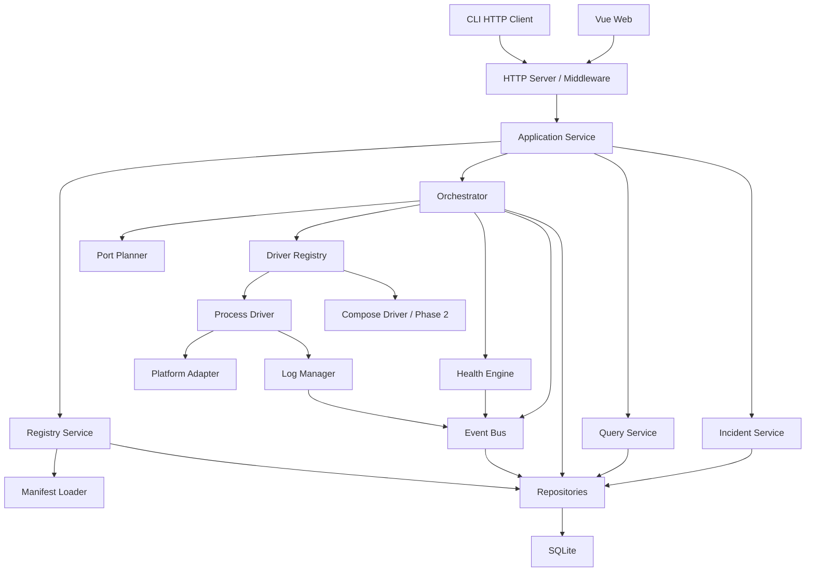
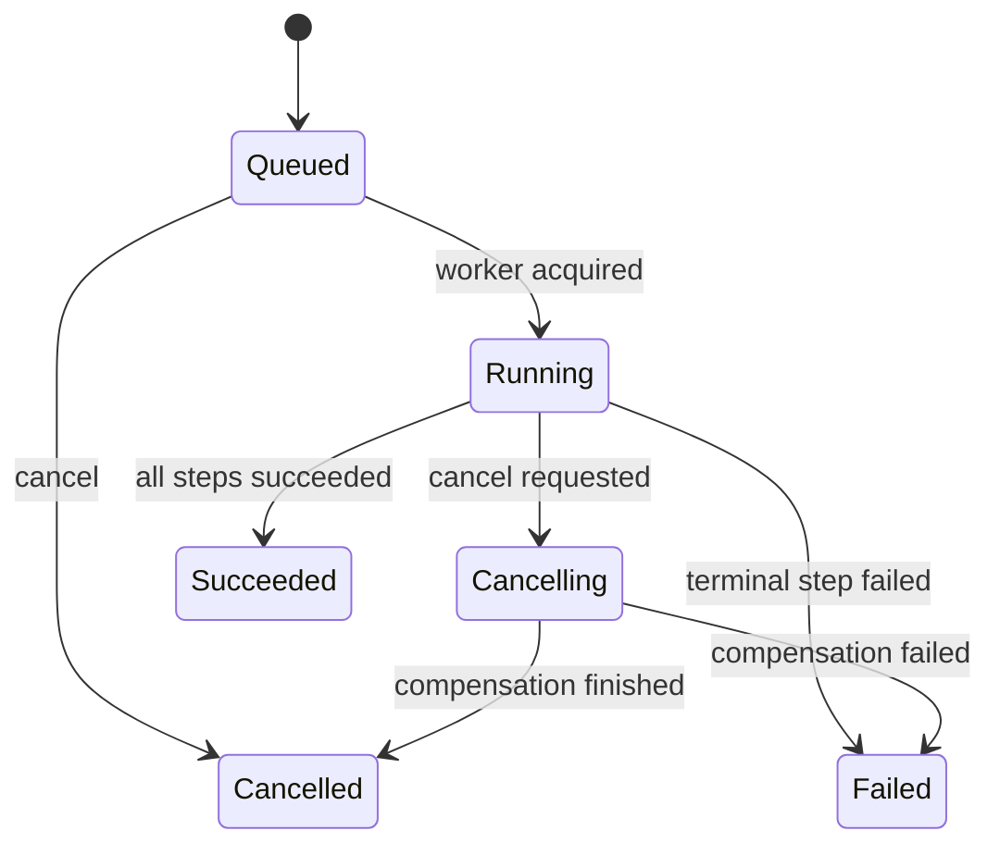
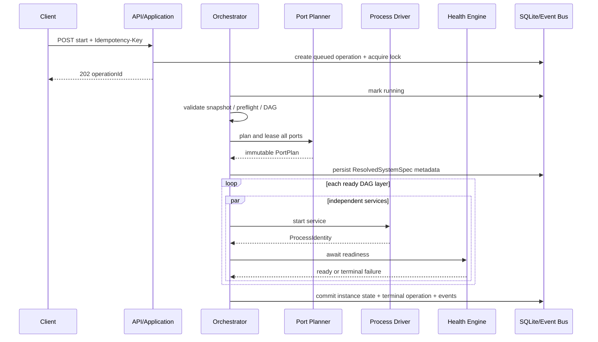
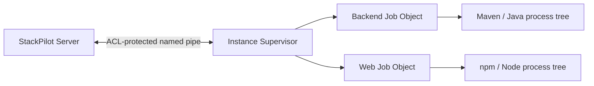

# StackPilot 详细设计方案

> 状态：Phase 3C 设计基线
> 日期：2026-08-31
> 上游文档：[总体设计方案](./overall-design.md)
> 交互基线：[Web 交互原型](./stackpilot-prototype.html)
> 首发范围：Phase 0、Phase 1（Windows-first）；兼顾 Phase 2 扩展边界

## 1. 文档目的

本文把总体设计中的架构决策细化为可编码、可测试、可验收的实现契约，供后端、前端、CLI、测试和 PMS/AIWS/BTC 接入共同使用。

本文重点回答以下问题：

1. 各模块负责什么，允许依赖什么，不允许绕过哪些边界。
2. 系统清单如何解析、校验、快照和展开为运行时规格。
3. 启动、停止、取消、重启、恢复核对如何落到事务和状态迁移。
4. 进程、端口、健康、日志、事件和 SQLite 如何保持一致。
5. REST、SSE、CLI 和 Web 使用什么稳定契约。
6. Phase 1 如何形成 BTC 的最小闭环，Phase 2 如何在不推翻核心设计的前提下扩展。

本文不重新讨论已在总体设计中确认的产品目标。若两份文档冲突，以总体设计中的范围和原则为准，以本文中的字段、时序和错误语义为实现基线；冲突必须先通过设计评审消除，不由实现自行选择。

## 2. 范围与关键约束

### 2.1 Phase 1 必须实现

- 单用户、本机、回环地址访问。
- 工作区注册、清单刷新和 Schema 校验。
- Windows 原生进程启动、进程树监管、优雅停止和强制终止。
- Process Driver 的 `daemon` 模式、统一 RunnerResolver 抽象，以及 Maven、npm、Java Runner 的可用解析实现；Python venv 只保留接口和 capability gate。
- 服务 DAG、HTTP/TCP/process readiness、系统启停和服务重启。
- 启动前整套端口规划、粘性复用、请求覆盖和租约。
- Operation、OperationStep、取消、幂等和实时事件。
- stdout/stderr 持久日志、历史读取和 SSE 跟随。
- StackPilot 重启后的实例核验与重新接管。
- BTC Backend/Web 的真实接入。
- 原型中 Phase 1 对应的系统总览、系统详情、服务详情、操作中心和基础配置页面。

### 2.2 Phase 1 明确不实现

- 远程监听、用户体系、RBAC、多 Agent。
- 任意命令执行和 Web 编辑启动命令。
- 自动执行诊断建议。
- 资源趋势、全文索引、Prometheus/OpenTelemetry 导出。
- Linux/macOS 的完整进程监管与正式运行承诺。
- 删除 Compose 数据卷或自动修改业务源码。

### 2.3 Phase 2 分阶段启用

Phase 1 只预留 Phase 2 契约而不提供半实现路径。Phase 2A 至 Phase 2E 已依次启用 Secret Provider/注入、`oneshot`、`completed`、Windows Python venv Runner、Compose Driver、AIWS/PMS 正式接入、liveness、有限自动重启和事故规则诊断。运行时通过 `phase2.secret`、`phase2.oneshot`、`phase2.python-venv`、`phase2.compose`、`phase2.liveness`、`phase2.auto-restart` 和 `phase2.incidents` capability 明确公布已启用边界。

预留的含义是领域模型、接口枚举和数据库迁移可兼容，不是 Phase 1 创建空包或不可验证的占位实现。

## 3. 设计追踪关系

| 总体设计能力 | 详细设计落点 | Phase 1 验证 |
|---|---|---|
| 声明式系统清单 | 第 7 章 | Schema、语义校验、BTC 清单测试 |
| 服务 DAG 与 readiness | 第 8、10 章 | 慢启动、超时、循环依赖测试 |
| 原生进程监管 | 第 9 章 | Windows Job Object 进程树测试 |
| 端口规划与替换 | 第 11 章 | 双系统争用、模板传播测试 |
| Operation 与 SSE | 第 8、14 章 | 幂等、取消、断线续传测试 |
| 日志 | 第 13 章 | stdout/stderr、滚动、重连测试 |
| SQLite | 第 15 章 | migration、事务、崩溃恢复测试 |
| Web 控制台 | 第 17 章 | BTC 启停端到端测试 |
| 安全与 Secret | 第 18 章 | 命令边界、脱敏、令牌测试 |
| 重启恢复 | 第 16 章 | 服务运行中重启 StackPilot 测试 |

## 4. 进程内架构与模块边界

### 4.1 组件关系



### 4.2 包职责

| 包 | 核心职责 | 禁止事项 |
|---|---|---|
| `internal/domain` | 领域实体、值对象、状态枚举、领域错误 | 不访问数据库、文件、网络或 OS API |
| `internal/application` | 用例编排、事务边界、DTO 映射 | 不直接执行进程或拼 SQL |
| `internal/manifest` | YAML 读取、Schema/语义校验、模板编译 | 不启动服务，不保存运行状态 |
| `internal/orchestrator` | DAG、Operation、状态迁移、取消和补偿 | 不依赖 HTTP DTO，不直接调用平台 API |
| `internal/driver` | 统一 Driver 接口和具体驱动 | 不决定系统级启动顺序 |
| `internal/platform` | 进程树、信号、身份核验、系统数据目录 | 不理解 System/Service 业务语义 |
| `internal/ports` | 候选生成、占用检测、租约和运行时端口计划 | 不修改业务项目文件 |
| `internal/health` | 检查执行、阈值聚合和调度 | 不自行改变系统期望状态 |
| `internal/logs` | 捕获、脱敏、落盘、滚动和读取游标 | 不把完整日志写入 SQLite |
| `internal/events` | 领域事件发布、持久化、订阅和 SSE 恢复 | 不承载无限原始日志正文 |
| `internal/storage` | migration、repository、事务实现 | 不包含用例决策 |
| `internal/api` | HTTP 路由、中间件、请求校验和响应编码 | 不绕过 application 层调用 driver |
| `internal/security` | 本地令牌、脱敏、路径约束；Phase 2 增加 Secret Provider | 不记录 Secret 明文 |
| `web` | 展示、用户意图采集、SSE 状态同步 | 不推测服务状态，不实现启动逻辑 |

### 4.3 依赖规则

依赖方向固定为：`api -> application -> domain/ports/orchestrator interfaces`，基础设施实现通过构造函数注入。`domain` 不依赖任何内部基础设施包。

平台相关文件使用 Go build tags 隔离，例如 `process_windows.go`、`process_unix.go`。公共包的 Windows/Linux/macOS 交叉编译由 CI 强制执行，禁止通过运行时 `GOOS` 分支直接引用平台专属符号。

### 4.4 后台协程所有权

所有长生命周期协程都必须归属一个可取消的根上下文：

```text
server root context
├── reconciliation loop
├── health scheduler
├── log retention worker
├── event retention worker
└── per-operation context
    └── per-service start/stop/check tasks
```

Windows 上另有每个活动 SystemInstance 一个的内部 Supervisor 子进程。Supervisor 不属于 HTTP Server 根上下文，负责跨控制面重启持有 Job Object 和进程句柄，详见 9.3。

应用关闭顺序为：停止接收变更请求、取消未完成 Operation、停止调度新检查、等待数据库写入完成、关闭订阅者、关闭 SQLite。已监管业务进程和 Supervisor 默认不随 StackPilot Server 普通退出被终止，以便重启后接管；显式 `server --shutdown-managed` 才执行系统停止流程。

## 5. 运行目录与启动配置

### 5.1 数据目录

数据根目录记为 `DATA_DIR`。根据 ADR-0003，Phase 1 只提供当前用户后台进程模式，通过 HKCU 登录启动注册激活，默认值为 `%LOCALAPPDATA%\StackPilot`；安装文件位于独立的 `%LOCALAPPDATA%\Programs\StackPilot`。不可变版本保存为 `versions/<sha256>/stackpilot.exe`，严格 `installation.json` marker 记录当前版本、规范安装/数据根、注册名、端口、安装 ID 和 SHA-256。升级先暂存新版本，再原子切换 marker 与 HKCU 注册；失败时恢复旧版本和原运行状态。自卸载只删除经 marker 与 canonical path 双重验证的安装根，独立数据根和业务工作区始终保留。Phase 1 支持通过服务端参数 `--data-dir` 覆盖，路径在启动时转为绝对规范路径。未来 Windows Service 的 `%ProgramData%\StackPilot` 数据目录和用户数据迁移必须通过新的安全决策启用，不属于 Phase 1。

```text
DATA_DIR/
├── stackpilot.db
├── stackpilot.db-wal
├── config.yaml
├── auth/
│   └── token.meta
├── runtime/
│   ├── operations/<operation-id>/resolved-spec.json
│   └── instances/<instance-id>/
│       ├── identity.json
│       └── supervisor.json
├── logs/
│   └── <system-id>/<instance-id>/<service-id>/YYYY-MM-DD.NNN.ndjson
├── incidents/<incident-id>/context.json
└── stackpilot/
    └── YYYY-MM-DD.NNN.ndjson
```

`resolved-spec.json` 不包含 Secret 值，只记录 Secret 名称和版本。运行目录采用仅当前用户或服务账号可写权限。

目录按需创建；Phase 1 不创建 `incidents/`，启用 Phase 2 规则诊断后才创建。

### 5.2 服务端配置

```yaml
server:
  listenAddress: 127.0.0.1
  port: 32100
  shutdownTimeout: 15s
database:
  busyTimeout: 5s
events:
  retention: 24h
  heartbeatInterval: 15s
logs:
  segmentMaxBytes: 20971520
  totalMaxBytes: 2147483648
  retentionDays: 14
  flushInterval: 250ms
operations:
  maxConcurrentSystems: 4
  defaultStartTimeout: 10m
  defaultStopTimeout: 2m
health:
  maxConcurrentChecks: 16
security:
  allowRemote: false
```

配置优先级为：命令行参数、允许的环境变量、`config.yaml`、内置默认值。安全边界字段如 `allowRemote` 不允许由被管理系统清单覆盖。未知配置字段启动时报错，避免拼写错误被静默忽略。

### 5.3 产品版本与构建身份

仓库根 `VERSION` 是 StackPilot 产品版本的唯一源码事实来源，使用无前导零的 `MAJOR.MINOR.PATCH` 三段数字。一次准备交付或合并的产品变更集默认通过 `scripts/version.ps1 -Action Bump` 自动计算 PATCH +1；普通 build、check、测试和重复 CI 只读取版本，禁止隐式递增或改写 Git 历史。`prompt/`、`plan/`、历史 evidence 和生成物不单独触发产品版本变更。

构建脚本和 GoReleaser 把 `VERSION` 注入 `internal/buildinfo.Version`，commit 与 UTC build time 作为独立构建身份注入。运行中二进制不读取源码 `VERSION`；CLI `stackpilot version` 和根 `GET /version` 都只返回当前 exe 内编译的同一 buildinfo。正式 release tag 必须精确为 `v<VERSION>`，tag、归档名和归档内 exe 不一致时发布失败。产品版本与 API version、清单 apiVersion、migration version、Secret version 和 Supervisor protocol version 相互独立。

## 6. 核心领域对象

### 6.1 标识与时间

- `systemId`、`serviceId`：清单内稳定、小写 kebab-case，正则为 `^[a-z][a-z0-9-]{0,62}$`。
- `workspaceId`：注册时生成带 `ws_` 前缀的 ULID，对用户展示可附别名。
- `instanceId`、`operationId`、`incidentId`：分别使用 `si_`、`op_`、`inc_` 前缀的 ULID。
- `eventId`：SQLite 自增 64 位整数，用作 SSE `id`。
- 所有持久化时间为 UTC RFC 3339 纳秒字符串；前端按浏览器时区显示。
- 运行时耗时使用单调时钟计算，持久化 `started_at`、`finished_at` 和最终 `duration_ms`。

### 6.2 定义、解析规格与实例

必须区分三层对象：

1. `SystemDefinition`：清单解析后的声明，保留模板，不含机器相关解析结果。
2. `ResolvedSystemSpec`：一次启动操作的不可变快照，包含绝对路径、Runner 解析结果、端口计划、展开后的非敏感环境变量和健康检查地址。
3. `SystemInstance`/`ServiceInstance`：实际运行身份和观测状态。

`internal/domain` 类型不携带 JSON、YAML 或 SQL 标签。API DTO、清单结构和持久化模型必须在各自边界显式映射，避免外部契约反向污染领域对象。

定义刷新不影响已经运行的实例。运行中的实例继续引用启动时 `manifestDigest` 和 `resolvedSpecDigest`；新定义只对下一次启动或显式重启生效。界面需要显示“运行实例使用旧清单”。

### 6.3 关键类型

```go
type OperationType string // start, stop, restart, service-restart, port-plan, refresh, analyze
type OperationState string // queued, running, cancelling, succeeded, failed, cancelled

type ServiceState string // stopped, waiting_dependency, starting, waiting_ready,
                         // ready, degraded, completed, stopping, failed, unknown

type DependencyCondition string // ready, completed
type DriverKind string           // process, compose
type ProcessMode string          // daemon, oneshot

type ProcessIdentity struct {
    PID            int
    StartedAt      time.Time
    ExecutablePath string
    CommandDigest  string
    PlatformToken  string // Supervisor/Job identity; opaque outside platform package
}
```

`ServiceInstance` additionally persists its resolved `processMode`. This value is part of the immutable launch snapshot used during recovery; reconciliation must not infer daemon/oneshot semantics from a subsequently refreshed manifest.

运行时持久标识采用 ULID 前缀：SystemInstance 为 `si_`，ServiceInstance 为 `svi_`。两者与清单中的稳定 `serviceId` 分离，避免多次启动复用同一运行身份。

`unknown` 只用于恢复核对期间无法确认实际身份的实例。它不是正常启动路径中的状态，也不能满足任何依赖。

### 6.4 系统聚合状态

系统状态由后端聚合并随事件发送，前端不得自行合成。优先级如下：

| 条件 | 系统状态 |
|---|---|
| 停止 Operation 正在执行 | `stopping` |
| 任一必需服务为 `failed` 或 `unknown` | `failed` |
| 启动 Operation 未结束且必需服务未全部满足条件 | `starting` |
| 必需服务已满足，但存在 `degraded` 或可选服务失败 | `degraded` |
| 所有必需服务为 `ready`/`completed` | `running` |
| 所有 daemon 服务为 `stopped` 且没有活动 Operation | `stopped` |

### 6.5 不变量

- 同一 `workspaceId` 在 MVP 同时最多存在一个非终止 SystemInstance。
- 同一工作区同时最多有一个变更型 Operation；只读查询和 SSE 不受限制。
- Operation 进入终态后不可回到非终态。
- ServiceInstance 的状态变化和对应状态事件在同一数据库事务提交。
- 只有 `ready` 可满足 daemon 的 `ready` 依赖，`degraded` 不释放尚未启动的下游。
- `completed` 实例没有活跃 PID，不执行停止信号，只参与依赖判断。
- 已占用 PortLease 必须归属于一个活动 Operation 或非终止实例。

## 7. 系统清单详细契约

### 7.1 文件发现与注册

工作区运行定义仍必须落在 `.stackpilot/system.yaml`。已有清单的注册流程：

1. 将输入路径解析为绝对路径，解析符号链接/目录联接后的真实路径。
2. 验证目录存在且当前服务账号可读。
3. 读取固定相对路径 `.stackpilot/system.yaml`，不允许请求指定其他清单文件。
4. 限制清单大小为 1 MiB，拒绝重复 YAML key、未知顶层字段和多文档 YAML。
5. 执行 JSON Schema 校验、语义校验和安全校验。
6. 对规范化内容计算 SHA-256 digest。
7. 在事务中写入 workspace、system 和 service 摘要及最后成功快照。

刷新失败时保留上一次成功快照，但将 `manifest_status` 标为 `invalid` 并记录错误。新启动被拒绝；已运行实例不被自动停止。

首次接入缺少固定清单时使用 ADR-0007 定义的导入流程：只读探测返回
`initialization_required`，BAT 子集分析产生有证据和确认状态的结构化草案，持久化的
规范路径作用域 Operation 在文件写入前建立。应用只通过强类型 Manifest、Schema、
语义和 capability 校验生成固定清单；BAT 不成为运行入口。预注册 Operation 使用独立
表保持现有运行期 Operation 的 workspace/system 非空外键不变量。

### 7.2 顶层结构

```yaml
apiVersion: stackpilot.io/v1alpha1
kind: System
metadata:
  id: btc
  name: BTC
  description: Bid Travel Cloud local development
spec:
  capabilities: {}
  policies: {}
  ports: {}
  services: {}
```

`apiVersion` 和 `kind` 必填且必须精确匹配。`metadata.id`、`metadata.name`、`spec.services` 必填。至少包含一个服务。

### 7.3 系统策略

```yaml
spec:
  policies:
    failFast: true
    cleanupOnFailure: false
    keepReadyServices: true
    stickyPorts: true
    startTimeout: 10m
    stopTimeout: 2m
```

| 字段 | 默认值 | 约束 |
|---|---:|---|
| `failFast` | `true` | 必需服务失败后不再调度新的下游 |
| `cleanupOnFailure` | `false` | 为 true 时仅清理本次启动创建的资源 |
| `keepReadyServices` | `true` | 与 cleanup 同时为 true 时，保留不依赖失败链的已就绪服务 |
| `stickyPorts` | `true` | 优先复用最近成功端口 |
| `startTimeout` | `10m` | 1s 至 30m，单服务超时仍由服务配置决定 |
| `stopTimeout` | `2m` | 1s 至 10m |

### 7.4 端口声明

```yaml
ports:
  backend:
    protocol: tcp
    preferred: 8081
    fallbackRange: 8200-8399
    conflictPolicy: auto
    exposure: loopback
```

端口名使用与 serviceId 相同的命名规则。端口范围为 1024 至 65535；范围起点不得大于终点，单个范围最多 2000 个候选。MVP 仅支持 `tcp`；`exposure` 仅允许 `loopback`，其他值在远程能力设计完成前拒绝。

### 7.5 服务声明

```yaml
services:
  backend:
    displayName: Backend
    required: true
    driver: process
    mode: daemon
    runner: maven
    workingDirectory: ./bidtravel-backend
    arguments: [spring-boot:run]
    environment:
      SERVER_PORT: "${ports.backend}"
    dependsOn: {}
    readiness:
      type: http
      url: "http://127.0.0.1:${ports.backend}/actuator/health"
      timeout: 180s
      interval: 2s
      successThreshold: 1
      failureThreshold: 1
    stop:
      gracefulTimeout: 15s
    restart:
      policy: never
      initialBackoff: 1s
      maxBackoff: 1m
      maxAttempts: 3
      stableWindow: 5m
```

| 字段 | 规则 |
|---|---|
| `required` | 默认 true；可选服务失败使系统降级但不阻止 Running 条件 |
| `driver` | Phase 1 仅 `process`；Phase 2 增加 `compose` |
| `mode` | 默认 `daemon`；`oneshot` 在 Phase 2 启用 |
| `workingDirectory` | 必须为工作区内相对目录；解析后仍须位于工作区真实路径内 |
| `arguments` | 字符串数组，逐项传递，不经过 shell 二次拼接 |
| `environment` | key 必须匹配平台安全变量名；value 支持受限模板 |
| `dependsOn` | key 必须引用同一清单服务，禁止自依赖和环 |
| `readiness` | daemon 必填；oneshot 禁止配置 readiness |
| `liveness` | Phase 2 可选；语法与 readiness 相同 |
| `restart` | Phase 2E 仅允许 daemon 使用；默认 `never`，自动重启必须使用有限次数和有界退避 |

readiness/liveness 省略 `timeout` 时语义上继承 `spec.policies.startTimeout`，省略 `interval` 时使用 `2s`。这些语义默认值不写回规范化清单，避免仅因默认字段 materialize 而改变既有清单摘要；Resolved Spec 必须持久化展开后的具体时长。

`restart.policy` 支持 `never/on-failure/always`。`on-failure` 在进程异常退出、身份丢失或 liveness 进入 degraded 时触发；`always` 还覆盖 daemon 的正常退出。第 N 次尝试等待 `min(initialBackoff * 2^(N-1), maxBackoff)`，`maxAttempts` 是同一连续故障序列允许创建的内部 `service-restart` Operation 数。服务连续 ready 达到 `stableWindow` 后清零尝试计数。默认值分别为 `never/1s/1m/3/5m`；`initialBackoff` 范围 100ms-1m，`maxBackoff` 不小于初始值且不超过 10m，`stableWindow` 不小于 `maxBackoff` 且不超过 24h。达到上限后停止重启并创建 Incident；自动重启 Operation 仍服从工作区活动 Operation 唯一性、乐观并发和审计规则。

服务依赖对象写法为：

```yaml
dependsOn:
  backend: ready
```

Phase 1 只接受 `ready`；P2A-04/P2A-05 已依次启用 `oneshot` 与 `completed`。`completed` 只能引用上游 `oneshot` 服务，`ready` 只能引用上游 `daemon` 服务，非法组合必须在注册时拒绝，不能延迟到启动期失败。未启用这些 capability 的构建仍须返回明确的 `FEATURE_NOT_ENABLED`。

TCP readiness 使用显式本机目标，避免把健康检查变成任意网络探测入口：

```yaml
readiness:
  type: tcp
  host: 127.0.0.1
  port: "${ports.backend}"
  timeout: 180s
  interval: 2s
```

`host` 必填且仅允许 loopback；`port` 必填，可使用已声明逻辑端口的完整模板，或使用 1024 至 65535 的固定整数。HTTP readiness 继续使用必填 `url`，注册时解析替换后的 URL 并执行相同的 loopback 限制。

### 7.6 Runner 解析

Runner 接口：

```go
type RunnerResolver interface {
    Resolve(ctx context.Context, req ResolveRunnerRequest) (ResolvedCommand, error)
}

type ResolvedCommand struct {
    Executable      string
    ArgsPrefix      []string
    Version         string
    ResolutionKind  string // path, workspace, venv
    ExecutableDigest string
}
```

解析顺序：服务端受信任配置中的显式工具路径、工作区工具、服务账号 PATH。Phase 1 清单和 Web/API 不提供工具路径字段；若部署配置显式指定工具，路径必须位于工作区或服务端配置的允许根目录内。各 Runner 的启用阶段如下：

| Runner | Windows 解析 | 最低校验 | 启用阶段 |
|---|---|---|---|
| `maven` | Maven Wrapper `mvnw.cmd`，否则 `mvn.cmd` | `--version` 可执行 | Phase 1 |
| `npm` | `node_modules/.bin` 不直接作为 npm；解析 `npm.cmd` | `--version` 可执行 | Phase 1 |
| `java` | `JAVA_HOME/bin/java.exe`，否则 PATH | `-version` 可执行 | Phase 1 |
| `go` | 服务端显式允许路径，否则 PATH 中 `go.exe` | `go version` 且输出符合 `go<version> windows/amd64` | AgentHub 集成专项 |
| `python-venv` | `<virtualEnvironment>/Scripts/python.exe` | 路径位于工作区，`--version` 可执行 | Phase 2A |

P2A-06 已启用 Windows `python-venv`。`virtualEnvironment` 只允许且必须用于该 Runner；它是工作区相对目录，注册时 join、canonicalize 并验证符号链接/junction 后仍位于真实工作区内。启动预检重复边界验证，只解析固定的 `<virtualEnvironment>/Scripts/python.exe`，不搜索 PATH、不调用 activation 脚本，也不回退到全局 Python。解析结果使用 `venv` resolution kind，执行固定 `--version`、解析 `Python <version>` 并记录可执行文件 SHA-256；缺失、越界和版本失败继续映射既有稳定 Runner 错误码。

`go` 使用内部 capability gate `go`，对外公布 `workspace.runner.go`。它不搜索工作区
脚本或 wrapper，不调用 shell，也不接受清单/API 提供工具路径。解析器只选择服务端配置
允许根内的显式普通文件或服务账号 PATH 中的规范化 `go.exe`，通过固定 `go version`
探针后记录版本与 SHA-256。服务参数仍来自已登记清单数组；`go run` 的代码执行授权等同于
用户显式登记并启动该工作区，不扩展远程 API 命令面。

`.cmd` Runner 由平台适配器使用系统命令解释器执行，但 HTTP 请求和用户输入不能控制解释器参数。最终命令摘要记录可执行路径和参数散列，不记录 Secret 展开值。

### 7.7 模板语法与展开

允许的模板仅包括：

- `${ports.<name>}`
- `${workspace.root}`
- `${instance.id}`
- `${system.id}`
- `${secret.<name>}`

禁止任意环境变量读取、函数、条件、文件包含和命令替换。模板在 YAML 解析后按字符串值处理，不对 key 展开。未定义引用、循环引用和 Secret 用于非环境字段均为校验错误。

`${secret.<name>}` 是 Phase 2 的受限语法，只允许作为一个环境变量的完整值，例如 `DATABASE_PASSWORD: "${secret.database-password}"`；前后拼接、参数/路径/readiness 使用和非法名称均在注册时拒绝。展开分两步：先形成只含占位符和 `environmentName -> secretName` 引用的可持久化 `ResolvedSystemSpec`，再在进程创建前解析并注入一次性内存环境。注入值必须是 UTF-8、无 NUL/CR/LF 且不超过 16 KiB；Provider 仍可保存最多 64 KiB 的非进程用途值。日志、错误和 DTO 始终使用安全引用或脱敏标记。

### 7.8 语义校验清单

- 服务 DAG 无环且至少有一个根节点。
- 所有依赖条件与上游 mode 匹配。
- 所有端口引用存在，每个监听端口有唯一逻辑所有者。
- readiness 地址中的端口与服务声明的端口传播关系完整。
- 工作目录、wrapper、venv、Compose 文件解析后位于工作区内。
- daemon 必须有 readiness；若只使用 `process` 检查，界面标记为弱 readiness。
- timeout、interval、阈值在安全范围内，`interval * failureThreshold <= timeout`。
- 环境变量不能覆盖 StackPilot 保留变量和 Windows 危险启动变量。
- `metadata.id` 与同一工作区已注册系统一致；变更 id 视为新系统，需重新注册。

## 8. Operation 与编排器

### 8.1 Operation 生命周期



Operation 的取消是协作式取消。已经创建的进程是否停止由操作类型和补偿策略决定：启动操作被取消时，默认停止本次操作创建且尚未在操作前存在的服务；用户可在请求中选择保留已就绪服务。停止操作一旦开始不能通过 API 取消，避免停到一半形成更难理解的状态。

### 8.2 锁、并发与幂等

- 变更型 Operation 以 `workspaceId` 为锁键，数据库唯一条件保证跨协程互斥。
- 锁在创建 Operation 的同一事务获取，Operation 到终态时释放。
- 服务级重启与系统启停争用同一工作区锁。
- 不同工作区可并行；全局并行数受 `maxConcurrentSystems` 限制。
- `Idempotency-Key` 在调用主体、路由语义和 workspace 范围内唯一，保留 24 小时。
- 同 key、同请求摘要返回原 Operation；同 key、不同摘要返回 `409 IDEMPOTENCY_KEY_REUSED`。
- 未提供 key 时服务端仍接受请求，但 CLI/Web 必须总是提供。

### 8.3 OperationStep

步骤必须是结构化数据而非日志文本：

```text
validate-manifest
acquire-lock
preflight-runners
build-dag
plan-ports
resolve-spec
start:<service-id>
wait-ready:<service-id>
aggregate-state
```

每个步骤记录 `state`、`attempt`、`startedAt`、`finishedAt`、`durationMs`、`errorCode`、`detailRef`。步骤状态为 `pending/running/succeeded/failed/skipped/cancelled`。同一 Operation 内步骤使用递增序号，供前端稳定排序。

### 8.4 启动算法



详细步骤：

1. 从最后成功清单快照创建本次解析上下文，拒绝 invalid/stale workspace。
2. 获取工作区锁；若实例已经 Running/Degraded 且请求清单摘要相同，创建成功的幂等 Operation，所有步骤记为 `skipped`，保留原 SystemInstance，且不重新执行已 Completed 的 oneshot。若有效清单已变化则返回 `MANIFEST_CHANGED`；若存在其他非终止实例则返回 `OPERATION_INVALID_STATE`。显式系统重启不适用此跳过规则。
3. 执行所有 Runner、目录、权限和能力预检。预检必须在任何业务进程创建前完成。
4. 构建 DAG，计算拓扑层、下游闭包和逆拓扑顺序。
5. 规划全部端口并写入 `reserved` 租约。
6. 生成 `ResolvedSystemSpec`，计算摘要并安全落盘。
7. 创建 SystemInstance，将根服务置为 `starting`，其他服务置为 `waiting_dependency`。
8. 同一拓扑层中的可运行服务通过有界并发组启动。
9. Driver 返回身份后，事务写入 ServiceInstance 和状态事件，再开始 readiness。
10. readiness 成功后把服务置为 `ready` 并激活下游；失败时按失败策略冻结未启动下游。
11. 所有必需 daemon 服务 ready、所有必需 oneshot 服务 completed 后写入粘性端口历史，将 Operation 置为 `succeeded`；没有端口声明时端口计划为空且跳过租约与粘性历史写入。
12. 失败时记录第一个主错误和所有并发子错误；按策略执行补偿，再结束 Operation。

### 8.5 失败策略精确定义

| 配置 | 行为 |
|---|---|
| `failFast=true` | 首个必需服务终态失败后，不再调度新服务；正在启动的同层服务允许完成或响应取消 |
| `cleanupOnFailure=false` | 保留已创建进程、日志和租约，Operation 为 failed |
| `cleanupOnFailure=true, keepReadyServices=false` | 逆拓扑停止本次创建的全部 daemon |
| `cleanupOnFailure=true, keepReadyServices=true` | 停止失败服务及依赖它的本次服务，保留与失败链无关的 ready 服务 |

端口租约只在对应进程确认停止或身份确认消失后释放，不能因为 Operation failed 就无条件删除。

### 8.6 停止算法

1. 获取工作区锁并创建 stop Operation。
2. 从运行实例快照读取逆拓扑顺序，不使用可能已刷新的新清单。
3. 按逆拓扑层执行；同层服务可并行停止。
4. 每个进程先重新核验 PID、启动时间、可执行路径和命令摘要。
5. 身份不匹配时不发送终止信号，标记 `unknown` 并返回 `PROCESS_IDENTITY_MISMATCH`。
6. 发送优雅停止，等待 `gracefulTimeout`；超时后终止完整进程树。
7. 关闭日志 writer、完成 segment 元数据、停止健康调度。
8. 确认端口不再由目标进程监听后释放租约。
9. 所有服务停止后将 SystemInstance 置为 stopped，结束 Operation。

部分停止失败时继续尝试停止其他独立服务，最终 Operation 为 failed，并返回未停止服务列表。重复 stop 必须安全：已停止服务步骤记为 skipped。

### 8.7 重启语义

系统重启是同一 Operation 内的 `stop -> fresh start`，使用最新有效清单，并重新规划端口；sticky 使其尽量复用原端口。停止失败时不进入 start。

服务重启仅允许目标服务及其传递下游：

1. 计算目标服务的下游闭包。
2. 逆拓扑停止下游和目标。
3. 保留不受影响的上游服务。
4. 正拓扑启动目标和下游，复用实例的端口计划。

若新清单摘要与运行实例不同，服务级重启返回 `409 MANIFEST_CHANGED`，要求用户执行系统重启，避免混合两份规格。

## 9. Process Driver 与 Windows 监管

### 9.1 Driver 接口

```go
type Driver interface {
    Preflight(context.Context, ResolvedServiceSpec) error
    Start(context.Context, StartRequest) (RuntimeIdentity, error)
    Stop(context.Context, StopRequest) error
    Inspect(context.Context, RuntimeIdentity) (RuntimeObservation, error)
    Recover(context.Context, RuntimeIdentity) (RecoveredRuntime, error)
}
```

Driver 只处理单个服务，不更新系统聚合状态。状态持久化由 Orchestrator 在 Driver 调用前后完成。

### 9.2 创建进程

- `workingDirectory` 使用已校验绝对路径。
- 环境为服务账号基线环境加清单允许项；Windows 环境 key 按大小写不敏感去重。
- 参数使用参数数组传入。除受控 `.cmd` Runner 外不调用 shell。
- 创建时隐藏窗口，不为每个服务打开控制台。
- Supervisor 把 stdout/stderr 分别连接到受限 spool 文件，Server 的 Log Manager 持续 tail；进程创建失败时关闭全部句柄。
- Windows 上由实例 Supervisor 以 suspended 状态创建服务进程，加入该服务专属 Job Object 后再恢复线程，避免子进程在入 Job 前逃逸。
- Job Object 使用 `KILL_ON_JOB_CLOSE`，句柄由独立 Supervisor 持有而不是 HTTP Server 持有。控制面普通退出不关闭 Job；Supervisor 自身异常退出时，Windows 自动终止其监管的服务树，避免产生无法证明所有权的孤儿进程。

### 9.3 Windows Supervisor

Supervisor 是同一发布二进制的内部子命令 `stackpilot internal-supervisor`，不属于公开 CLI。每个活动 SystemInstance 启动一个 Supervisor，并为每个 daemon 服务持有独立 Job Object、主进程句柄和 spool 文件句柄。

Supervisor 以隐藏、脱离 Server 生命周期的进程创建，且自身不加入任何被管服务的 Job Object；否则 Server 退出或停止某个服务可能错误地连带终止 Supervisor。



通信使用随机命名的 Windows Named Pipe，ACL 只允许当前用户或服务账号及 SYSTEM。`supervisor.json` 记录 Supervisor PID、创建时间、pipe 名和协议版本。Server 与 Supervisor 分别核验对端 PID、创建时间、可执行文件路径和运行账号；单用户本机模式不再增加 HMAC challenge 和第二份 secret 文件，因为同账号进程本就处于同一信任边界。

协议只允许固定消息：`hello`、`start-service`、`inspect-service`、`stop-service`、`shutdown-if-empty`。请求采用长度前缀 JSON，限制为 1 MiB。它不接受任意 shell 字符串；`start-service` 只接受 Server 已校验的结构化可执行文件、参数数组、工作目录和一次性环境块。

Supervisor 生命周期规则：

- Server 正常退出或崩溃时继续运行，业务进程不受影响。
- 新 Server 核验 Supervisor PID/创建时间后重新连接，并逐项核对服务身份。
- 安装模式升级后，新 Server 与旧 Supervisor 的可执行路径必然不同。跨版本控制连接仅在 Windows 账号相同、候选位于旧 Supervisor 同一安装根的直接 `versions/<sha256>/stackpilot.exe` 路径、严格 `installation.json` 当前选中该路径且文件真实 SHA-256 同时匹配 marker 与目录名时允许；非安装模式继续要求精确可执行路径。
- Supervisor 在恢复服务主线程前先原子写入 `identity.json`，Server 随后持久化数据库状态，以覆盖“进程已创建但 Server 尚未提交”的崩溃窗口。
- 所有服务停止后，Supervisor 响应 `shutdown-if-empty` 并退出。
- Supervisor 异常退出时 Job Object 的 kill-on-close 终止服务树；Server 恢复时将实例标记 failed 并记录 `SUPERVISOR_EXITED`。
- 协议版本不兼容时不得接管或终止现有进程；实例置 unknown，要求用户显式处理。
- 仓库专用 `start-stackpilot.bat` 是显式冷启动例外：它先优雅停止已登记控制面，再按精确映像名清理所有残留 `stackpilot.exe`（包括 Supervisor），确认旧进程全部退出后才启动新控制面。该入口会触发 Supervisor 的 kill-on-close 并终止相应业务进程树；需要跨控制面重启保持业务进程时必须使用公共 `service start/upgrade` 生命周期。

这里的两个异常场景没有冲突：Server 崩溃时 Job 句柄仍由 Supervisor 持有；只有 Supervisor 自身退出时才触发 `KILL_ON_JOB_CLOSE`。若省略 Supervisor 而由 Server 直接持有带 kill-on-close 的最后一个 Job 句柄，“关闭后再启动”之间的空档会终止业务进程，不能满足 P1-06。除非技术验证证明可用更简单的可靠句柄交接，否则不采用该简化。

Linux/macOS 后续可使用常驻 Agent 或可重连的进程组监管实现同一语义，不复用 Windows Named Pipe 细节。

### 9.4 Windows `.cmd` Runner

Windows Maven/npm wrapper 需要通过 `%COMSPEC% /d /s /c`。实现必须使用固定解释器开关和经过 Windows 命令行规则引用的参数，禁止拼接来自 HTTP 的原始字符串。清单参数仍是数组；测试覆盖空格、中文路径、引号和尾随反斜杠。

### 9.5 进程身份

创建成功后记录：PID、创建时间、规范化 executable path、非敏感 command digest、工作目录摘要。恢复或停止时四项必须匹配；权限不足导致无法读取时标记 Unknown，不以 PID 单独判断。

`identity.json` 使用临时文件写入、flush、原子替换，数据库记录其摘要。数据库与文件不一致时以实时 OS 核验为最终事实，并生成 reconciliation 事件。

### 9.6 日志接管限制

普通匿名 pipe 无法在 StackPilot 重启后重新连接。因此 Phase 1 启动服务时采用“子进程直接追加到持久 spool 文件 + 当前进程 tail”的方式，或使用可恢复的命名管道实现；首选 spool 文件方案：

```text
child stdout/stderr -> per-stream spool file -> tailer -> redact -> NDJSON segment/SSE
```

spool 文件按实例保留，tail offset 定期写入 segment 元数据。重启后从已提交 offset 继续读取，允许最多一次重复投递，由 `serviceId + stream + sequence` 去重。

### 9.7 终止流程

1. 再次核验身份。
2. 尝试对受控控制组发送优雅中断；不支持时调用 Runner 可配置 stop hook（仅允许清单 Schema 定义的受控类型）。
3. 等待主进程和 Job 内活跃进程归零。
4. 超时后调用 Job Object 终止整个树。
5. 记录退出码、终止原因和是否强制终止。

不能只终止 Maven/npm 父进程；测试必须验证 Java/Node 子进程和孙进程均退出。

`oneshot` 由同一 Supervisor 和独立 Job Object 监管。Orchestrator 在 `startTimeout` 内轮询经身份核验的 Supervisor 状态；主进程退出后先确认或清空整个 Job、排空 stdout/stderr 管道并关闭日志捕获，再提交终态。退出码 `0` 进入 `completed`，非零进入 `failed` 并持久化退出码；超时强制终止完整 Job，取消沿标准补偿路径进入 `stopped`。`completed` 清除活动进程身份，后续 stop 只迁移状态而不发送进程信号。

## 10. 健康检查引擎

### 10.1 检查接口

```go
type Checker interface {
    Check(context.Context, ResolvedHealthSpec) HealthResult
}
```

`HealthResult` 包含检查类型、开始时间、耗时、成功标志、稳定错误码、脱敏摘要和可选状态码。原始 HTTP 正文不落库，最多保留经裁剪和脱敏的 2 KiB 摘要。

### 10.2 检查类型

| 类型 | 成功条件 | 主要错误码 |
|---|---|---|
| `process` | 身份匹配且进程未退出 | `PROCESS_EXITED`、`PROCESS_IDENTITY_MISMATCH` |
| `tcp` | 在单次 timeout 内完成 TCP connect | `TCP_REFUSED`、`TCP_TIMEOUT` |
| `http` | 状态码在允许范围，且可选 body 断言成立 | `HTTP_STATUS_MISMATCH`、`HTTP_BODY_MISMATCH`、`HTTP_TIMEOUT` |
| `compose` | Phase 2：容器运行且 health 为 healthy | `CONTAINER_UNHEALTHY` |

HTTP 默认只接受 200-299，不跟随跨主机重定向，响应体上限 64 KiB。MVP 只允许 loopback/清单声明的本机地址，防止健康检查成为任意网络探测接口。

### 10.3 Readiness 调度

- 进程创建后立即执行第一次检查，后续按 `interval` 加小幅随机抖动。
- 单次检查 timeout 不得大于 interval；未完成检查不会并发重入。
- 在总 `timeout` 前达到 `successThreshold` 即 ready。
- 进程提前退出立即终止 readiness，不等待总 timeout。
- 启动期默认 `failureThreshold=1` 仅用于记录，不提前失败；明确不可恢复错误除外。
- Operation 取消时检查上下文立即取消。

### 10.4 Liveness 与抖动控制

Phase 2 启用 liveness。Ready 后连续 `failureThreshold` 次失败进入 degraded，连续 `successThreshold` 次成功恢复 ready；单次相反结果会清零当前连续计数。每个服务最多存在一个由控制面持有的 liveness monitor，monitor 随运行实例结束、服务停止或控制面退出而取消。状态变化通过 `state_version` 乐观并发校验，并与领域事件在同一事务提交；每次检查写入有界 `health_results`。后台保留每个实例最近 1000 条和最近 24 小时明细，较旧数据按小时写入聚合后小批量清理，避免无限增长。

## 11. 端口规划器

### 11.1 输入与输出

输入：工作区、清单 digest、全部端口需求、请求覆盖、工作区覆盖、sticky 历史、当前有效租约和 OS 监听状态。

输出为不可变 `PortPlan`：

```json
{
  "planId": "pp_01...",
  "workspaceId": "ws_01...",
  "assignments": {
    "backend": {"port": 8081, "source": "preferred", "replaced": false},
    "web": {"port": 32201, "source": "fallback", "replaced": true, "conflictPort": 32102}
  },
  "expiresAt": "2026-08-17T08:30:00Z"
}
```

### 11.2 候选优先级

每个逻辑端口按以下顺序生成去重候选：请求覆盖、工作区覆盖、仍适用的 sticky 值、preferred、fallbackRange 从小到大。`strict` 只允许请求覆盖或 preferred；`override-only` 只允许请求/工作区覆盖。

覆盖值即使可用也必须满足端口范围和暴露策略。一个系统内两个逻辑端口不能得到同一宿主机端口。

### 11.3 事务与 OS 探测

SQLite 无法独占 OS 端口，因此采用数据库租约与绑定探测双重校验：

1. `BEGIN IMMEDIATE`，读取未过期活动租约。
2. 对候选创建独占 TCP listener；Windows 禁止地址复用。
3. 保持所有 probe listener，直到整套候选选定。
4. 同一事务插入 `reserved` leases；唯一索引冲突则重选。
5. 提交事务并返回计划。
6. 启动对应服务前才关闭该端口 probe，紧接着创建进程。
7. 进程报告端口绑定失败时，整个启动按 `PORT_CONFLICT` 失败并执行既定失败策略，不做局部重规划。用户重试时重新生成整套计划，避免在同一实例中混用两份运行时规格。

同一 StackPilot 进程内 Port Planner 持有 probe listener；服务端崩溃后 listener 自动释放，数据库 reserved 租约通过短 TTL（默认 60 秒）在 reconciliation 后清理。

### 11.4 租约状态

`reserved -> bound -> released/expired`。服务 readiness 首次证明端口由目标服务监听后标记 `bound`。进程退出不立即假定端口释放，需 OS 复查；确认后才标记 released。

### 11.5 端口传播验证

模板展开器输出反向引用表，记录每个逻辑端口传播到哪些字段。接入测试必须断言：

- Backend 监听变量。
- Web 监听参数。
- Web API proxy URL。
- readiness URL。
- 最终访问入口。
- Phase 2 的 CORS、OIDC 和 Compose host mapping。

端口声明存在但没有监听所有者，或服务引用未声明端口，均拒绝注册。

## 12. Docker Compose Driver（Phase 2）

### 12.1 运行时文件

Compose 服务使用独立的驱动分支，不复用 Process Runner 或参数入口：

```yaml
infrastructure:
  driver: compose
  mode: daemon
  compose:
    file: ./infrastructure/compose.yaml
    services: [postgres, keycloak, minio]
    buildPolicy: never
    readiness:
      postgres: healthy
      keycloak: healthy
      minio: healthy
    ports:
      postgres:
        service: postgres
        target: 5432
    environment:
      postgres:
        POSTGRES_PORT: "${ports.postgres}"
  readiness:
    type: compose
```

`compose.file` 是工作区相对普通文件，注册时必须 join、canonicalize 并验证符号链接/junction 后仍位于真实工作区内。`compose.services` 为非空、唯一且有界的 Compose service 名称列表。Compose 分支只支持 daemon 和 `readiness.type: compose`，禁止携带 `runner`、`virtualEnvironment`、`workingDirectory` 或 `arguments`，从而不形成任意命令入口。`compose.buildPolicy` 为闭合的 `never|always`，语义默认值为 `never`；`always` 额外要求 `compose-build` validator gate，对外能力名为 `phase2.compose-build`。`compose.readiness` 必须覆盖全部受管 Compose service，值仅允许 `healthy|running`；省略时保持历史上的全 `healthy` 语义。

StackPilot 在 `runtime/operations/<op>/` 生成 `compose.override.yml`。`compose.ports` 将已声明逻辑端口映射到固定 Compose service 和容器目标端口；`compose.environment` 只允许为已声明 service 设置非 Secret 模板值。生成内容只包含：

- 宿主机端口映射覆盖。
- 必要的非敏感环境覆盖。
- StackPilot 实例标签。

原 compose 文件不修改。端口统一使用 long syntax，将规划后的宿主端口绑定到 `127.0.0.1`，协议固定为 TCP。生成文件先写入同目录临时文件、flush 后原子发布；同一 Operation 重试必须得到相同内容，已有不同内容返回 `COMPOSE_OVERRIDE_CONFLICT`。发布前后均校验 canonical 数据目录边界，写入后以 `KnownFields` 严格重解析并比对结构；非法请求或产物返回 `COMPOSE_OVERRIDE_INVALID`，不允许通过 override 添加特权模式、宿主根目录挂载、Secret 或任意额外命令。

### 12.2 项目标识

项目名为 `sp-<system-id>-<workspace-short>-<instance-short>`：两个 runtime short ID 均取去除前缀后的前 8 个 ULID 字符并转小写；若完整名称超过 63 字符，system ID 部分截断并附加原 system ID 的 SHA-256 前 10 个十六进制字符。该算法确定、满足 Compose 字符限制并降低截断碰撞风险。所有容器增加标签：`stackpilot.system`、`stackpilot.workspace`、`stackpilot.instance`、`stackpilot.service`。持久项目身份同时包含项目名、三个领域 ID、canonical 工作区/数据目录、两个 Compose 文件、排序后的受管服务、build policy、排序后的 build services、逐服务 readiness、启动/停止超时和定义摘要；观察、构建或停止前必须重新核验摘要、路径边界及 override 标签。旧身份缺少启动超时时按历史默认值恢复，且因该字段使用省略式编码而保持旧 token 摘要兼容。

### 12.3 调用与停止

- 预检：Windows 解析 canonical `docker.exe`，最低支持 Docker CLI/Server `24.0.0` 与 Compose v2 `2.20.0`。固定命令依次检查 `docker --version`、`docker compose version --format json`、`docker version --format {{json .}}`，再从 Compose 文件目录执行 `docker compose --file <canonical-file> config --format json --no-interpolate`。若 CLI 与 Compose 插件可用但 daemon 不可达，预检仅从 `%ProgramFiles%\Docker\Docker\Docker Desktop.exe` 或 `%LOCALAPPDATA%\Programs\Docker\Docker\Docker Desktop.exe` 中解析 canonical 普通文件，以当前用户、无参数、脱离控制台方式启动 Docker Desktop，并串行化并发启动尝试后轮询 daemon；非 Compose 路径不触发该行为。每条命令通过参数数组直接创建进程，禁止 shell 和 HTTP 命令入口；包含 Docker Desktop 冷启动的总预检 deadline 默认 2 分钟，轮询间隔默认 500 毫秒，stdout/stderr 各自最多 4 MiB。受信工作区基础 Compose 文件可以包含固定容器 `command`，但不得覆盖 `entrypoint`、使用特权模式/宿主根目录挂载或依赖未声明服务；运行时 override 仍禁止添加 `build`、`command` 或 `entrypoint`，详见 ADR-0005、ADR-0006 和 ADR-0008。
- 受控 build：只有 `buildPolicy: always` 可使用工作区内本地 context 与默认或工作区内 Dockerfile；远程/Git context、越界路径、args、Secret、SSH、target、network、entitlements、cache 和其他高级 build 字段全部拒绝。context/Dockerfile 在导入和 Start 预检时均重新 canonicalize。config JSON 只在内存中解析；结果仅保留 Docker/Compose 版本、排序后的受管服务/build 服务和逐服务 readiness，不持久化完整 config 或 stderr。
- 预检和构建错误稳定区分 `DOCKER_NOT_FOUND`、`DOCKER_VERSION_UNSUPPORTED`、`COMPOSE_NOT_FOUND`、`COMPOSE_VERSION_UNSUPPORTED`、`DOCKER_DAEMON_UNAVAILABLE`、`COMPOSE_CONFIG_INVALID`、`COMPOSE_BUILD_CONFIG_INVALID`、`COMPOSE_BUILD_FAILED`、`COMPOSE_BUILD_TIMEOUT` 和 `COMPOSE_PREFLIGHT_TIMEOUT`。
- 启动：显式系统 Start/Restart 在 policy 为 `always` 时先固定执行 `docker compose ... build <sorted-build-services...>`；成功后固定执行 `docker compose ... up -d --wait --no-deps --no-build --wait-timeout <seconds> <sorted-services...>`。build 失败、超时或取消不得进入 up。用户或自动 `service-restart` 一律跳过 build；所有依赖服务必须显式列入 `compose.services`，不得由 Compose 隐式带起未受管服务。
- 观察：优先使用 `docker compose ps --format json` 的结构化输出。
- 日志：`docker compose logs --no-color --timestamps --follow <declared-services...>` 通过固定无 shell 子进程持续写入数据目录内两个受控 spool；既有 Log Manager 负责尾随、行边界、脱敏、sequence、NDJSON segment、SQLite 索引和 SSE 发布。spool 创建前后必须核验 canonical 数据目录边界，follow 会话取消时终止 Docker 子进程并 flush 文件。
- 停止：用户发起的 Stop/Restart 在 Compose 停止阶段复用受控预检，因此 daemon 未运行时会按 ADR-0006 拉起 Docker Desktop。若持久化 `compose_project_token` 为空，则在停止前使用 resolved spec 和严格的 system/workspace/instance 标签发现项目；发现成功时将 opaque 身份与 `stopping` 状态在同一事务提交，再执行 `docker compose stop`。严格标签下项目确实不存在时直接收敛为 `stopped`；发现失败、身份不匹配或 daemon 失败不得伪造已停止。普通停止禁止 `down -v`。

Compose 命令的 stdout/stderr 也进入 OperationStep 日志，但需区分工具日志和容器服务日志。

生命周期调用使用固定参数数组且不经过 shell，stdout/stderr 各自有界。`ps` 同时兼容 Compose v2 的 JSON array 和早期 NDJSON 输出，只接受匹配项目名及已声明 service 的容器。普通停止固定使用 `docker compose ... stop --timeout <seconds> <declared-services...>`，不得调用 `down` 或删除 volume。生命周期错误稳定区分 `COMPOSE_LIFECYCLE_INVALID`、`COMPOSE_LIFECYCLE_TIMEOUT`、`COMPOSE_START_FAILED`、`COMPOSE_INSPECT_FAILED`、`COMPOSE_STOP_FAILED`、`COMPOSE_PROJECT_IDENTITY_MISMATCH` 和 `COMPOSE_PROJECT_NOT_FOUND`。

Compose readiness 复用结构化项目观察并逐服务执行：`healthy` 要求容器为 `running` 且 Docker health 为 `healthy`；`running` 只要求严格身份下容器为 `running`，且仅允许 Compose config 确实没有 healthcheck 的服务使用。已有 healthcheck 不得降级为 `running`。starting/unhealthy、容器退出、项目缺失或观察失败均产生 `CONTAINER_UNHEALTHY`。项目身份以严格、带定义摘要的 opaque token 交给 Health Engine；Engine 沿用 success/failure threshold、取消和 timeout，并把每次 `kind=compose` 结果写入 `health_results`。现有表无需迁移，`000013_compose_health_results.sql` 的闭合集合已经能承载这些结果。

恢复时优先严格解码持久项目身份并重新执行结构化观察。若发生容器创建后、数据库身份提交前的崩溃窗口，则固定以 `stackpilot.system/workspace/instance` 三个 label filter 执行 `docker ps --all --quiet --no-trunc`，容器数量上限 64；随后对只包含十六进制完整 ID 的集合执行一次有界 `docker inspect`。完整 inspect 仅在内存解析，不得进入日志、SQLite、Operation、DTO 或错误；重建前必须逐容器核对三个 StackPilot 身份标签、`stackpilot.service`、`com.docker.compose.project` 和 `com.docker.compose.service`。运行态恢复仅在状态允许时将身份与 `waiting_ready` 原子提交；用户停止失败态现场时将发现身份与 `stopping` 原子提交。恢复日志 follow 使用上次持久时间戳作为 `--since`，Log Manager 再按 spool offset/sequence 去重续写。

## 13. 日志子系统

### 13.1 统一事件格式

```json
{
  "timestamp": "2026-08-17T07:30:00.123456Z",
  "systemId": "btc",
  "instanceId": "si_01...",
  "serviceId": "backend",
  "stream": "stderr",
  "level": "error",
  "message": "Failed to bind to port 8081",
  "operationId": "op_01...",
  "sequence": 1024,
  "truncated": false
}
```

`sequence` 在单个 ServiceInstance 内严格递增。时间戳优先使用采集时间；若解析出应用时间，可作为 `sourceTimestamp` 附加字段但不影响排序。

### 13.2 行处理

- stdout/stderr 独立读取，按到达顺序分配 sequence，不保证两个流的源端绝对顺序。
- 单行最大 256 KiB；超出后分块并标记 truncated，防止 scanner 卡死。
- 支持 `\n`、`\r\n`；末尾无换行内容在流关闭时提交。
- level 只做保守识别：明确 JSON level 字段或行首常见级别；无法判断为 `unknown`。
- 脱敏在写入最终日志文件和发送 SSE 之前执行，原始 spool 位于受限目录并按最短周期清理。

### 13.3 脱敏

Phase 1 脱敏器依次使用 Authorization/cookie/query 参数规则、连接串规则和用户配置规则；Phase 2 启用 Secret Provider 后，再增加已加载 Secret 的精确值匹配。替换文本统一为 `[REDACTED:<type>]`，保留足够上下文用于诊断。

Secret 值不得写入错误日志。脱敏器本身发生异常时采用 fail-closed：该日志事件不向客户端发送，只记录不含正文的安全告警。

### 13.4 文件与索引

最终 NDJSON segment 先写 `.active`，达到大小或跨日后 flush、关闭、原子改名并写 `log_segments`。SQLite 只保存路径、sequence/time 范围和大小，不为本地开发日志计算逐段 SHA-256。

历史查询通过 segment 元数据缩小文件范围，再流式读取；Phase 1 支持 service、时间范围、level、cursor 和 limit，不承诺任意全文搜索性能。原型中的当前日志筛选可在前端对已加载窗口执行。

保留 `log_segments` 和 sequence 范围是为了让游标跨文件轮转后仍可定位；单一“当前文件字节 offset”在文件改名、截断或清理后会失效。Phase 1 只保留定位与清理所需的最小元数据，不做内容完整性校验。

### 13.5 背压与保留

- 每个 SSE 客户端有有界缓冲；慢客户端超过阈值时断开并发送最后可恢复 cursor。
- 落盘路径不因 SSE 客户端变慢而阻塞。
- 磁盘达到高水位时先执行已关闭 segment 清理，仍不足则暂停新启动并返回 `LOG_STORAGE_PRESSURE`，但不杀死已运行服务。
- 删除只处理数据库已登记且位于 `DATA_DIR/logs` 内的关闭 segment。

## 14. 事件与 SSE

### 14.1 两类流

1. `/events`：低频、持久化的状态、Operation、健康状态变化和审计事件，支持 `Last-Event-ID`。
2. `/log-stream`：高频日志流，以 `instanceId/serviceId/sequence` cursor 恢复，不把每行日志写入 `events` 表。

### 14.2 领域事件 envelope

```json
{
  "id": 1842,
  "type": "service.state.changed",
  "occurredAt": "2026-08-17T07:30:00.123Z",
  "systemId": "btc",
  "workspaceId": "ws_01...",
  "instanceId": "si_01...",
  "operationId": "op_01...",
  "data": {
    "serviceId": "backend",
    "from": "waiting_ready",
    "to": "ready",
    "reasonCode": "READINESS_PASSED"
  }
}
```

事件类型使用过去式稳定命名。事件 payload 有版本字段或保持向后兼容；删除/改名需提升 API 版本。

### 14.3 事务提交与实时通知

状态表更新与 `events` 插入在同一事务完成。事务提交后，当前写入方以非阻塞方式把 event id 通知内存订阅者；不设置 `dispatched_at`，也不运行常驻 outbox 轮询器。SSE 订阅者始终以数据库事件为事实来源：收到通知后按 id 读取，慢消费者缓冲溢出时断开并用 `Last-Event-ID` 恢复。

若 Server 在提交后、通知前崩溃，现有 SSE 连接也会同时断开；客户端重连后从 `events` 表补读，因此不会丢事件。客户端仍应按 event id 去重。

### 14.4 SSE 协议

```text
id: 1842
event: service.state.changed
data: {...single-line JSON...}

```

- `Content-Type: text/event-stream`，禁用代理缓冲。
- 每 15 秒发送注释心跳 `: heartbeat`。
- `Last-Event-ID` 优先于 query cursor。
- cursor 早于保留窗口时返回 `409 EVENT_CURSOR_EXPIRED`，客户端重新拉取 REST 快照后再订阅。
- 先建立订阅水位，再查询数据库补历史，最后切换实时流，避免快照与订阅间丢事件。

## 15. SQLite 详细设计

### 15.1 连接与 migration

- 启动执行 `PRAGMA journal_mode=WAL`、`foreign_keys=ON`、`busy_timeout=5000`、`synchronous=NORMAL`。
- 单进程写入使用受控连接池；写事务保持短小，绝不在事务内等待进程或网络。
- migration 使用单调版本号和 checksum，启动时自动向前执行；checksum 不一致拒绝启动。
- 生产数据不支持自动降级 migration。

### 15.2 Phase 1 核心表

| 表 | 关键字段 | 索引/约束 |
|---|---|---|
| `systems` | `id`, `name`, `current_digest`, `created_at`, `updated_at` | PK `id` |
| `workspaces` | `id`, `system_id`, `root_path`, `canonical_path`, `manifest_status`, `last_valid_digest`, `last_error_code` | unique `canonical_path` |
| `manifest_snapshots` | `digest`, `system_id`, `api_version`, `normalized_yaml`, `parsed_json`, `created_at` | PK `digest`; 内容不含 Secret 值 |
| `services` | `workspace_id`, `service_id`, `driver`, `mode`, `required`, `definition_digest` | PK `(workspace_id, service_id)` |
| `system_instances` | `id`, `workspace_id`, `manifest_digest`, `resolved_spec_digest`, `state`, `started_at`, `stopped_at`, `last_reconciled_at` | partial index on active workspace |
| `service_instances` | `id`, `system_instance_id`, `service_id`, `driver`, `process_mode`, `state`, process identity columns, `compose_project_token`, `exit_code`, `graceful_timeout_ms`, `state_version` | unique `(system_instance_id, service_id)`; process and Compose identities remain separate |
| `operations` | `id`, `workspace_id`, `type`, `state`, `idempotency_key`, `request_digest`, `error_code`, timestamps | partial unique active workspace; idempotency unique |
| `operation_steps` | `operation_id`, `step_no`, `step_key`, `state`, `attempt`, timestamps, `error_code`, `detail_ref` | PK `(operation_id, step_no)` |
| `port_leases` | `id`, `workspace_id`, `instance_id`, `operation_id`, `logical_name`, `protocol`, `host`, `port`, `state`, `expires_at` | partial unique `(protocol, host, port)` for active leases |
| `health_results` | `id`, `service_instance_id`, `kind`, `success`, `duration_ms`, `error_code`, `summary`, `checked_at` | index instance/time |
| `log_segments` | `id`, `service_instance_id`, `stream`, `path`, seq/time bounds, `size_bytes`, `closed_at` | unique path; index instance/sequence |
| `events` | `id`, `event_type`, scope ids, `payload_json`, `occurred_at` | PK autoincrement; indexes on operation/system/time |
| `auth_tokens` | `id`, `token_hash`, `created_at`, `last_used_at`, `revoked_at` | 不保存明文 |
| `auth_token_rotation` | `token_id`, `token_hash`, `created_at` | 单例 pending journal；不保存明文 |
| `audit_events` | `id`, `subject_type`, `action`, `target_type`, `target_id`, `result`, `trace_id`, `operation_id`, `client_type`, `error_code`, `occurred_at` | 单调 cursor；不保存请求体或凭据 |
| `secret_metadata` | `system_id`, `name`, `provider`, `version`, `updated_at` | Secret 值的非敏感投影；不保存明文/密文/digest |
| `service_instance_secret_versions` | `service_instance_id`, `environment_name`, `system_id`, `name`, `provider`, `version`, `resolved_at` | 实例启动版本投影；版本禁止回退；不保存值 |

Phase 1 migration 不创建事故分析或 Secret 空表。对应功能启用时再通过独立 migration 增加：

| Phase | 表 | 关键字段 |
|---|---|---|
| Phase 2 规则诊断 | `incidents` | `id`, `service_instance_id`, `kind`, `severity`, `state`, window, `fingerprint` |
| Phase 2 规则诊断 | `incident_analyses` | `id`, `incident_id`, `engine`, `schema_version`, `result_json`, `created_at` |
| Phase 2 Secret | `secret_metadata`, `service_instance_secret_versions` | Provider 元数据与实例实际使用版本；均不保存值 |

### 15.3 乐观并发

`service_instances.state_version` 每次状态迁移加一。更新使用 `WHERE id=? AND state_version=?`；影响行数为 0 表示并发状态已变化，编排器重新加载并判断，而不是覆盖。

workspace 锁只串行化用户发起的变更 Operation，不能覆盖健康检查调度器、进程退出回调、Supervisor 通知和 reconciliation 的并发状态更新。因此 Phase 1 保留 `state_version`，防止较旧的健康结果把已经进入 `stopping/failed` 的实例覆盖回 `ready`。

### 15.4 活动实例唯一性

SQLite partial unique index保证同一 workspace 只有一个 `state NOT IN ('stopped')` 的 SystemInstance。处于 `failed` 但仍有进程的实例仍是活动实例，必须先显式停止后才能新建。

### 15.5 数据保留

- Operation、事件和审计默认保留 30 天；活动事故引用的数据不清理。
- 健康明细默认保留 24 小时，之后只保留聚合（Phase 2）。
- manifest snapshot 只要被运行实例或 Operation 引用就不删除。
- 清理任务每次小批量事务执行，失败不影响主服务。

## 16. Reconciliation 与故障恢复

### 16.1 启动恢复

StackPilot HTTP 就绪前执行一次快速恢复扫描：

1. 将数据库中 `running/cancelling` 且没有活跃 worker 的 Operation 标记为 `failed`，错误码 `CONTROL_PLANE_RESTARTED`。
2. 查询活动 SystemInstance 及其 ServiceInstance。
3. Windows 上先核验 Supervisor PID、创建时间、可执行路径、运行账号和协议版本，再恢复受保护 Named Pipe 连接。
4. 通过 Driver `Inspect/Recover` 核验每个实际身份。
5. 仍运行且身份匹配：恢复日志 tail、健康调度和实例监管。
6. 已退出：记录退出码（可得时），置 failed/stopped 并形成事件。
7. 身份不确定：置 unknown，不自动停止任何 PID。
8. 核验租约，释放无实例、无监听者的过期 reserved lease。
9. 重新计算系统聚合状态。

快速扫描完成后 API 才报告 `ready`。耗时较长的健康检查可后台继续，初始展示 `reconciling` 标志。

### 16.2 周期核对

Phase 1 每 10 秒检查受管进程身份，每 30 秒核对活动租约；周期可配置但有下限。周期核对只修正观测状态，不自动重启。Phase 2 根据 restart policy 创建新的系统内部 Operation。

### 16.3 崩溃窗口处理

| 崩溃点 | 恢复策略 |
|---|---|
| Operation 已建、未启动任何进程 | Operation 标 failed，释放过期 reserved lease |
| 进程已创建、身份未写库 | 扫描 runtime identity 原子文件；匹配后补写，否则记录 orphan candidate，不自动终止 |
| 状态已提交、实时通知未发出 | SSE 随 Server 断开；客户端重连后按 event id 从数据库补读 |
| 日志已落 spool、offset 未提交 | 从旧 offset 重读，sequence 去重 |
| 进程已退出、租约仍 bound | OS 核验后释放并更新实例 |

任何无法证明所有权的进程都不得由自动恢复流程终止。

## 17. REST API 详细契约

### 17.1 通用规则

- 基础路径 `/api/v1`，JSON 使用 camelCase。
- `Content-Type: application/json; charset=utf-8`。
- 列表默认 `limit=50`、最大 200，使用不透明 cursor，不使用页码。
- 状态类接口使用 `Cache-Control: no-store`；Phase 1 不实现 ETag 和条件请求。
- 变更请求必须带认证、合法 `Origin`（浏览器）和 `Idempotency-Key`（客户端应带，服务端兼容不带）。
- 未知请求字段返回 `400 REQUEST_VALIDATION_FAILED`。

### 17.2 错误 envelope

```json
{
  "error": {
    "code": "PORT_CONFLICT",
    "message": "端口 32102 已被占用，且当前策略不允许替换。",
    "details": {"logicalPort": "web", "port": 32102},
    "operationId": "op_01...",
    "traceId": "tr_01..."
  }
}
```

`message` 可面向用户，程序判断只使用稳定 `code`。`details` 不包含命令全文、Secret、未脱敏日志或服务器任意路径；路径仅在本机受信任管理界面按需返回。

### 17.3 主要资源 DTO

系统摘要：

```json
{
  "id": "btc",
  "name": "BTC",
  "workspaceId": "ws_01...",
  "workspacePath": "E:\\BidTravelCloud\\BTC",
  "manifestStatus": "valid",
  "state": "stopped",
  "serviceSummary": {"ready": 0, "total": 2},
  "endpoints": [],
  "activeOperationId": null,
  "updatedAt": "2026-08-17T07:30:00Z"
}
```

Operation：

```json
{
  "id": "op_01...",
  "type": "start",
  "state": "running",
  "workspaceId": "ws_01...",
  "systemId": "btc",
  "progress": {"completed": 4, "total": 8},
  "steps": [],
  "error": null,
  "createdAt": "2026-08-17T07:30:00Z",
  "startedAt": "2026-08-17T07:30:00Z",
  "finishedAt": null
}
```

### 17.4 系统接口

| 方法与路径 | 说明 | 成功响应 |
|---|---|---|
| `GET /systems` | 筛选 `status/query/cursor/limit` | `200` 列表 |
| `GET /systems/{id}?workspaceId=` | 系统详情、服务和当前实例 | `200` |
| `POST /systems/{id}/refresh` | 重新读取清单 | `202 Operation` |
| `GET /systems/{id}/status` | 轻量状态快照 | `200` |
| `POST /systems/{id}/port-plan` | 预览，不创建长期 lease | `200 PortPlanPreview` |
| `POST /systems/{id}/start` | 异步启动 | `202 OperationRef` |
| `POST /systems/{id}/stop` | 异步停止 | `202 OperationRef` |
| `POST /systems/{id}/restart` | 异步系统重启 | `202 OperationRef` |

若同一 systemId 注册多个 workspace，所有变更请求必须显式传 `workspaceId`；只有一个时可省略。

启动请求：

```json
{
  "workspaceId": "ws_01...",
  "portOverrides": {"backend": 8081, "web": 32201},
  "failurePolicy": {
    "failFast": true,
    "cleanupOnFailure": false,
    "keepReadyServices": true
  }
}
```

请求只允许覆盖已声明端口和失败策略，不接受 command、arguments、workingDirectory 或任意 environment。

### 17.5 服务与日志接口

| 方法与路径 | 说明 |
|---|---|
| `GET /services/{systemId}/{serviceId}?workspaceId=` | 服务定义摘要、实例身份、安全命令摘要、健康状态 |
| `POST /services/{systemId}/{serviceId}/restart` | 重启目标及其下游 |
| `GET /services/{systemId}/{serviceId}/logs` | 历史窗口，支持 instance/cursor/limit/level/from/to |
| `GET /log-stream?instanceId=&serviceId=&afterSequence=` | 实时日志 SSE |

日志响应默认最新 500 行，最大 5000 行。前端向上加载旧日志使用 cursor，不以 sequence 猜文件位置。

### 17.6 Operation 接口

| 方法与路径 | 说明 |
|---|---|
| `GET /operations?workspaceId=&state=&cursor=` | 操作历史 |
| `GET /operations/{id}` | 完整步骤和错误 |
| `POST /operations/{id}/cancel` | 取消可取消 Operation；返回 202 |

取消成功表示请求已记录，不表示补偿已完成。客户端等待 Operation 进入 cancelled/failed 终态。

### 17.7 工作区接口

| 方法与路径 | 说明 |
|---|---|
| `POST /workspaces` | `{ "path": "..." }`，读取固定清单并注册 |
| `GET /workspaces` | 工作区和清单状态 |
| `DELETE /workspaces/{id}` | 仅无活动实例/Operation 时解除注册；不删除项目文件 |

解除注册属于管理操作，需二次确认。服务端在同一数据库写事务内确认无活动实例、生命周期 Operation 或工作区导入/编辑 Operation；冲突返回 `WORKSPACE_UNREGISTER_RUNTIME_ACTIVE`。成功后删除该工作区的历史控制面记录、注册信息和无引用缓存，不触碰工作区内容。

### 17.8 服务可用性接口

- `GET /health/live`：进程存活，不检查数据库写入。
- `GET /health/ready`：migration 完成、数据库可写、首次 reconciliation 完成。
- `GET /version`：返回当前运行 exe 的三段产品版本、commit、build time、API version 和启用能力；Web 将其中 `version` 显示为“系统版本”，不读取前端 package version 或静态构建常量。

## 18. 认证、安全与审计

### 18.1 本地认证

首次启动生成 256 bit 随机令牌，明文只写入 OS 安全存储，SQLite 保存带随机 salt 的 Argon2id 摘要。CLI 从安全存储读取并发送 `Authorization: Bearer`。

Web 使用短期 HttpOnly、SameSite=Strict 会话 cookie：`stackpilot open` 先以 CLI Bearer 请求 60 秒单次有效 bootstrap code，再把 code 放在 URL fragment；前端读取后立即用 `history.replaceState` 清除 fragment，并同源交换会话。会话采用 30 分钟滑动续期和 8 小时绝对上限，`GET /api/v1/auth/session` 在服务端同一原子临界区续期、轮换 CSRF 并更新 Cookie；页面刷新可依靠有效 Cookie 恢复仅存内存的 CSRF。bootstrap 只在 Server 内存保存摘要，浏览器只收到独立且与会话绑定的 CSRF 值。普通 API 不接受 query token。会话创建接口仅监听回环地址，并精确校验 Origin。具体决策见 ADR-0002。

会话的 `renewalExpiresAt` 和 `absoluteExpiresAt` 都以 UTC 服务端时钟判定，恰好到期即无效。续期结果是 `min(now + 30m, absoluteExpiresAt)`，任何过期、撤销、服务重启或令牌轮换后的会话都不能刷新复活。Cookie 的 `Expires`、`Max-Age` 与响应 `expiresAt` 使用 AuthManager 返回的同一时钟结果，不在 API 层另取系统时间。

服务端只保留当前 CSRF 摘要和一个前代摘要；前代最多宽限 5 分钟且不越过会话期限，用于收口刷新完成前已发送的 mutation。前端单标签刷新为单飞，刷新期间阻止新的 mutation 取得 header；已发送请求不重放。多标签通过同源 Web Lock 串行化 bootstrap/refresh，并用不持久化的 `BroadcastChannel` 发布新的 `csrf/expiresAt`；等待锁的标签收到新凭据后跳过重复刷新。REST 或 SSE 返回 `401 AUTH_SESSION_INVALID` 时发布同一类型化失效事件，幂等清除 CSRF、续期 timer、领域流和日志流，并要求重新执行 `stackpilot open`。其他 `4xx/5xx` 不进入会话失效状态。

### 17.9 Secret 接口（Phase 2A）

- `PUT /api/v1/secrets/{systemId}/{secretName}`：请求 JSON 的 `value` 使用 base64 byte 编码，边界解码后立即交给 Provider 并清零；响应只返回 metadata。
- `GET /api/v1/secrets/{systemId}/{secretName}`：只返回 `id/systemId/name/provider/version/updatedAt`，不存在返回 `SECRET_NOT_FOUND`。
- `DELETE /api/v1/secrets/{systemId}/{secretName}`：删除值和 metadata projection，响应仅回显被删除的 metadata 以供同步审计定位。

不存在返回 Secret 明文的 HTTP/CLI 接口。浏览器 PUT/DELETE 仍执行精确 Origin、CSRF 和 JSON Content-Type 校验；CLI 使用 Bearer。mutation audit 的 target 是 `system/name`，request body 和 value 不进入 audit capture。

令牌轮换通过 pending hash journal 协调 SQLite 与 DPAPI 原子文件替换：先持久化 pending hash，再替换安全存储，最后在单个 SQLite 事务中撤销旧 hash、激活新 hash 并清除 journal。启动恢复时，安全存储匹配 pending hash 则完成提交，仍匹配 active hash 则清除未开始 journal，二者均不匹配则拒绝启动。轮换成功后所有 browser bootstrap 和 session 立即失效。

### 18.2 CSRF 与本地恶意网页

回环监听并不能单独防止浏览器访问本机服务。所有浏览器变更请求必须满足：

- 已认证会话 cookie。
- `Origin` 精确匹配 StackPilot 地址。
- 自定义 CSRF header 与会话绑定值匹配。
- JSON Content-Type，不接受简单表单提交。

CLI Bearer 请求不使用 cookie，但仍受令牌认证和命令边界约束。

### 18.3 路径安全

- 所有清单相对路径先 join，再 canonicalize，再验证位于工作区根内。
- Windows canonicalize 必须通过已打开文件/目录句柄取得最终 DOS 路径，覆盖 junction；不得仅依赖字符串清理或 `filepath.EvalSymlinks`。
- 拒绝通过 `..`、符号链接、junction 或大小写差异逃逸。
- 输出文件只允许位于 DATA_DIR 的固定子目录。
- 删除前同时验证数据库登记路径、canonical path 前缀和文件类型。

### 18.4 Secret Provider（Phase 2）

Phase 1 不实现 Secret Provider；P2A-01 至 P2A-03 已依次启用 Provider、管理接口和受控进程注入。BTC 首个接入不依赖此能力。

Phase 2 启用后，统一接口只暴露 `Set`、`Resolve`、`Metadata`、`Delete`。ADR-0004 已关闭 D-12：Windows 使用当前用户范围 DPAPI 文件，固定目录为 canonical `DATA_DIR/secrets`，目录和文件 DACL 仅允许当前用户与 SYSTEM。Secret key 的 system/name 均使用 `^[a-z][a-z0-9-]{0,62}$`，值长度为 1–65536 bytes，文件名只使用 key 的 SHA-256，不使用用户输入路径片段。

加密记录是 Secret 值的事实来源，包含 schema、key、单调 version 与 UTC `updatedAt`；SQLite `secret_metadata` 只是无明文投影。写入先原子替换 DPAPI 文件，再推进元数据；读取时用受保护记录补齐缺失或较旧投影，确定文件不存在时删除陈旧投影。元数据版本禁止回退。删除前必须重新计算 hash 路径、验证 canonical 边界和普通文件类型。崩溃窗口、威胁边界和 Credential Manager 取舍以 ADR-0004 为准。

Secret 只在进程创建前解析，实际 provider/version 与环境变量名写入 `service_instance_secret_versions`。`Resolve` 返回调用方拥有的临时 byte buffer；控制面在 Driver 调用后清空解析 buffer、注入 map 和日志会话输入副本。任何 DTO 只可返回 key/`secretRef` 或省略环境，不返回 resolved value。

Process Driver 只把 Secret 环境变量名作为私有协议标记传给 Supervisor。Supervisor 从一次性环境 map 取得对应值，通过匿名管道接收子进程 stdout/stderr，并在写入原始 spool 前执行跨读取边界的精确值替换；Log Manager 在 NDJSON/SSE 边界再次执行同一实例的精确值脱敏。值不进入 identity、Operation、resolved spec、SQLite 日志或安全错误。控制面恢复日志捕获时重新解析当前值并与实例记录版本比较；版本已变化或缺失时返回 `SECRET_VERSION_CONFLICT`，拒绝在无法证明脱敏值正确的情况下恢复捕获。

### 18.5 审计事件

Phase 1 记录工作区注册/删除、清单刷新、系统/服务启停、取消、令牌轮换和高风险失败。Phase 2 增加 Secret 元数据变更。字段包括主体类型、动作、目标、结果、traceId、operationId、时间和客户端类型；不记录令牌、Secret 和完整命令。

审计查询使用 `GET /api/v1/audit-events` 的单调整数 cursor 和有界 page；`202` 变更响应记录为 `accepted`，不得伪装为 Operation 最终成功。同步成功、边界失败和已认证浏览器的 Origin/CSRF 拒绝分别记录为 `succeeded`、`failed` 和 `denied`。异步 Operation 的最终状态仍由同事务领域事件提供事实来源，并通过审计记录中的 `operationId` 关联。

## 19. 事故与规则诊断（Phase 2）

本章固定 Phase 2E 已启用的事故边界；它不属于 Phase 1 实现清单。Migration 15 已增加事故、规则分析、健康聚合和重启尝试表，服务端通过 `phase2.incidents` capability 公布能力。事故内容仍受预算和脱敏约束，不生成可执行诊断包。

### 19.1 事故触发

- 进程异常退出。
- readiness 超时。
- liveness 连续失败进入 degraded。
- 自动重启达到上限。
- 端口绑定失败或身份不匹配。

相同服务、相同规则分类和滑动窗口内的事件按 fingerprint 合并，防止告警风暴。

### 19.2 IncidentContext

上下文生成器使用显式预算：时间窗默认异常前 2 分钟、后 1 分钟；日志最多 500 行/256 KiB；相邻重复行折叠计数。所有内容先脱敏，再写 `context.json`。

证据引用必须可追溯到 event id、health result id 或日志的 instance/sequence，不复制无法定位的结论。

### 19.3 规则接口与优先级

```go
type DiagnosticRule interface {
    ID() string
    Match(IncidentContext) (RuleResult, bool)
}
```

首批规则：端口已占用、进程异常退出、readiness 连接拒绝、HTTP 状态异常、依赖未就绪、已知 Java/Node/Python 启动错误。规则结果按证据特异性和置信度排序，同一证据不重复生成相同建议。

所有建议默认 `automatic=false`。`POST /api/v1/incidents/{incidentId}/analyze` 返回 `202` 并创建持久化、可幂等恢复的 `analyze` Operation；该 Operation 只重新读取有界健康、事件和脱敏日志证据并运行确定性规则，不调用 restart、命令执行或文件修改路径。分析失败使用 Operation 领域码 `INCIDENT_ANALYSIS_FAILED`，达到自动重启上限的 Incident 使用触发码 `RESTART_LIMIT_REACHED`。

## 20. Web 控制台详细设计

### 20.1 前端结构

```text
web/src/
├── api/               typed client、error mapping、SSE client
├── router/            route definitions 和 guards
├── stores/            systems、operations、logs、settings、session
├── views/             Dashboard、System、Service、Operations、Settings
├── components/        状态、步骤、日志、端口计划等领域组件
├── composables/       useEventStream、useLogStream、useOperation
└── types/             与 OpenAPI 对齐的 DTO
```

Phase 1 路由：

```text
/                         系统总览
/systems/:systemId        系统详情；workspaceId query
/systems/:systemId/services/:serviceId
/operations               操作中心
/operations/:operationId  操作详情
/settings/workspaces
/settings/ports
/settings/security
```

### 20.2 状态管理原则

- REST 快照是页面初始事实，SSE 是增量更新。
- Store 保存 `lastEventId`，只接受更新版本更高的实例状态。
- SSE 断开显示非阻塞连接状态并指数退避重连；超过保留窗口后重新拉 REST 快照。
- 按钮可用性由服务端能力字段和活动 Operation 决定，不能只按视觉状态推断。
- 页面离开不取消 Operation；Operation 属于服务端持久任务。
- 系统版本通过独立的只读 `GET /version` 加载并显示在侧边栏控制面状态附近；加载失败只显示未知占位，不阻断认证、REST 快照或领域 SSE。

### 20.3 系统总览

与原型一致展示系统名、工作区、聚合状态、服务就绪数、访问入口和快捷操作。筛选在服务端支持 status/query，前端对当前页即时过滤。

快捷启动先调用端口计划预览，再打开确认对话框。若无冲突可直接展示首选/粘性结果；有替换时明确显示原端口、占用原因和新端口。

### 20.4 系统详情

包含四个页签：概览、服务与端口、服务配置、清单摘要。

- 概览：依赖图、当前 Operation、服务状态。
- 服务与端口：实际端口计划、来源、冲突替换和访问入口。
- 服务配置：只读展示 Driver、Runner、mode、工作目录相对路径、依赖、健康和已脱敏环境引用。
- 清单摘要：展示来源、digest、校验状态和规范化只读内容。

启动/停止确认框提交后立即关闭，页面定位到 Operation 进度。重复点击由本地 disabled 和服务端锁双重保护。

### 20.5 服务详情与日志

- 顶部展示服务状态、PID、端口、readiness 和最近检查。
- 初次加载最近 500 行，滚动到顶部按 cursor 加载历史。
- “暂停”只暂停 UI 追加，客户端继续有界缓存；恢复后批量追加。缓存溢出时提示并重新请求窗口。
- level 和关键字筛选不改变后端运行状态。
- 复制/下载只包含用户当前选中或当前查询范围内已脱敏日志。
- 日志区使用固定高度和虚拟列表，避免长日志导致页面抖动。

### 20.6 操作中心

左侧历史列表，右侧步骤时间线。Operation 失败时显示稳定错误消息、失败步骤、技术详情引用和可执行的安全下一步。取消按钮只在服务端返回 `cancellable=true` 时启用。

### 20.7 基础配置

- 工作区：添加、刷新、解除注册，展示清单状态。
- 端口：全局默认 sticky/auto 策略；清单 strict 仍不能被全局 auto 放宽。
- 安全：只展示令牌创建时间、最近使用和轮换操作，不显示明文。

### 20.8 可访问性与错误处理

- 状态不只依赖颜色，使用文字和图标。
- 对话框管理焦点，Esc 只关闭未提交对话框。
- SSE 更新通过适度的 live region 汇报，不逐行朗读日志。
- 所有请求错误映射到页内错误或 toast；Operation 失败不能只用短暂 toast。
- 破坏性操作使用明确对象名和影响范围，不用泛化“确定吗”。

## 21. CLI 详细设计

CLI 是 API 客户端，退出码稳定：`0` 成功、`2` 参数/配置错误、`3` 服务端不可达、`4` Operation 失败、`5` 认证失败、`6` 冲突。

`stackpilot up --wait` 流程：发现当前工作区、提交 start、订阅 Operation 事件、终端显示步骤；SSE 不可用时回退轮询。Ctrl+C 第一次只停止等待并询问/按参数决定是否取消 Operation，不直接杀业务进程。

支持 `--output table|json`；JSON 模式 stdout 只输出机器可读结果，进度写 stderr。CLI 不打印本地令牌和 Secret。

## 22. 错误码

### 22.1 分类

| 前缀 | 含义 | 示例 |
|---|---|---|
| `MANIFEST_` | 清单解析/语义 | `MANIFEST_CYCLE_DETECTED` |
| `WORKSPACE_` | 工作区 | `WORKSPACE_PATH_OUTSIDE_TRUST` |
| `RUNNER_` | 工具解析/预检 | `RUNNER_NOT_FOUND` |
| `PORT_` | 端口规划/绑定 | `PORT_CONFLICT` |
| `PROCESS_` | 进程创建/身份/退出 | `PROCESS_IDENTITY_MISMATCH` |
| `HEALTH_` | readiness/liveness | `HEALTH_READINESS_TIMEOUT` |
| `OPERATION_` | 锁、取消、状态 | `OPERATION_ALREADY_ACTIVE` |
| `AUTH_` | 认证/会话 | `AUTH_TOKEN_INVALID` |
| `LOG_` | 日志存储/游标 | `LOG_CURSOR_EXPIRED` |
| `INTERNAL_` | 未分类内部错误 | `INTERNAL_ERROR` |

每个错误码在 `docs/error-codes.md` 或 OpenAPI components 中维护 HTTP 状态、用户消息模板、是否可重试和允许暴露的 details。未知内部错误统一返回 500 和 traceId。

### 22.2 HTTP 映射

- 400：请求或清单字段错误。
- 401/403：未认证/无权执行本地管理操作。
- 404：资源不存在。
- 409：活动 Operation、端口、幂等 key 或状态冲突。
- 422：请求结构正确但当前系统定义无法执行。
- 429：全局 Operation/检查并发限制。
- 500：内部一致性错误。
- 503：恢复未完成、数据库不可写或日志存储压力阻止新启动。

## 23. 可观测性

StackPilot 自身使用结构化 `slog`，字段至少包括 `trace_id`、`operation_id`、`workspace_id`、`instance_id`、`service_id` 和 `error_code`。禁止默认记录 HTTP Authorization、请求完整 body、子进程完整环境和未脱敏日志。

每个入站请求生成请求级 traceId，并传播到由该请求直接创建的 Operation 及其结构化日志。领域事件以 event id、operationId 和实例标识关联，不强制重复携带 traceId。Phase 1 不要求 OpenTelemetry，但内部 context 传播要兼容后续接入。

关键内部指标先以状态端点或结构化日志记录：活动 Operation 数、健康检查队列、SSE 客户端数、日志写入错误、数据库 busy 次数和 reconciliation 结果。

## 24. 测试设计

### 24.1 测试夹具

`tests/fixtures` 提供可控小程序，而不是依赖真实 Maven/npm 完成所有边界测试：

- `slow-ready`：延迟监听端口。
- `exit-immediately`：指定退出码和 stderr。
- `child-tree`：创建子进程和孙进程。
- `ignore-terminate`：验证强制停止。
- `flapping-health`：按序列返回成功/失败。
- `large-log`：长行、高速和 Secret 模式。
- `bind-race`：模拟探测后抢占端口。

真实 BTC 作为端到端验收，不替代可重复的夹具测试。

### 24.2 单元测试

- YAML 重复 key、未知字段、模板非法引用、路径逃逸。
- DAG 拓扑排序、循环、下游闭包、可选服务聚合。
- 所有服务与 Operation 合法/非法状态迁移。
- 端口候选优先级、范围耗尽、sticky、事务冲突。
- Windows 参数引用和 Runner 解析。
- readiness 阈值、timeout、取消和进程提前退出。
- 日志分行、长行、level、脱敏和 cursor。
- DTO 校验、错误码映射和幂等摘要。

### 24.3 存储集成测试

- 空库 migration 到最新版本。
- 每个历史 migration 升级路径和 checksum。
- 活动 workspace/port unique constraint。
- 状态和持久事件的事务原子性。
- 并发 `BEGIN IMMEDIATE` 与 busy retry。
- retention 不删除活动引用数据。

### 24.4 Windows 集成测试

- Maven/npm `.cmd` 在含空格和中文路径下启动。
- 无可见终端窗口。
- Job Object 覆盖子孙进程并在超时后全部终止。
- PID 复用/身份不匹配时拒绝停止。
- StackPilot 重启后核验和日志续读。
- 探测后端口被抢占时启动以 `PORT_CONFLICT` 失败，重试后生成新计划。

### 24.5 API/SSE 契约测试

- OpenAPI 请求/响应示例可解析。
- Idempotency-Key 同请求复用、异请求冲突。
- SSE 心跳、事件顺序、重复容忍、过期 cursor。
- 日志 SSE 慢消费者断开，不阻塞落盘。
- 浏览器 Origin/CSRF 和 CLI Bearer 两条认证路径。

### 24.6 Web 端到端测试

1. 添加 BTC 工作区并看到有效清单。
2. 打开启动确认，32102 冲突时显示替代端口。
3. Backend 未 ready 前 Web 保持 waiting dependency。
4. Operation 时间线随 SSE 更新，成功后入口可点击。
5. 服务详情持续接收、筛选、暂停和下载日志。
6. 停止系统后二者逆序退出，无遗留进程。
7. 刷新页面或断开 SSE 后状态恢复一致。
8. readiness 失败时保留现场并展示明确错误。

### 24.7 质量门槛

- Go：格式、静态检查、race test（适用包）、Windows 测试、多平台公共核心编译。
- Web：type-check、lint、组件测试、生产构建。
- OpenAPI 与前端 DTO 差异检查。
- migration checksum 检查。
- Phase 1 主流程端到端测试必须在发布前通过。

## 25. BTC 首个接入纵切面

### 25.1 服务定义

| 服务 | Runner | 端口 | 依赖 | Readiness |
|---|---|---:|---|---|
| `backend` | Maven | preferred 8081，fallback 8200-8399 | 无 | `/actuator/health` HTTP 2xx |
| `web` | npm | preferred 32102，fallback 32200-32399 | backend ready | Web 根路径 HTTP 2xx |

### 25.2 业务项目一次性改造要求

- Backend 读取 `SERVER_PORT`。
- Vite 启动端口从 Runner 参数接收，不能被配置文件硬编码覆盖。
- Vite proxy 读取 `VITE_API_TARGET`。
- Backend health endpoint 不依赖需要较长初始化的非关键外部系统，或明确返回可解释状态。
- CORS 允许来源由规划后的 Web 地址注入，不能只写死 32102。

### 25.3 验收证据

- BTC 清单 Schema 和语义校验报告。
- 启动 Operation 的步骤、耗时和最终 resolved spec 摘要。
- 8081/32102 被占用时的端口计划及传播断言。
- Backend -> Web 的 readiness 时序记录。
- 停止前后进程树快照和端口释放结果。
- StackPilot 重启前后的同一实例身份和日志 sequence 连续性。

## 26. 分阶段实施顺序

### 26.1 Phase 0 工程基线

1. 建立 Go module、Vue/Vite、构建嵌入和 CI。
2. 固化领域枚举、错误 envelope、OpenAPI 和清单 Schema。
3. 建立 SQLite migration、repository 测试基座。
4. 建立平台接口和公共核心多平台编译门槛。

退出条件：空服务可启动、Web 静态资源可访问、migration 可重复执行、Schema 示例通过、CI 产出 Windows 二进制。

### 26.2 Phase 1A 注册与只读控制面

1. Workspace 注册/刷新。
2. 清单解析、验证、快照。
3. Systems/Services 查询 API。
4. Web 总览、系统配置和清单只读页。

退出条件：BTC 清单可注册，非法路径/模板/DAG 被稳定拒绝，前端只读信息与清单一致。

### 26.3 Phase 1B 单服务运行

1. Runner 解析与 Windows Process Driver。
2. 日志 spool、脱敏、segment 和历史查询。
3. process/TCP/HTTP readiness。
4. 单服务 start/stop Operation 和事件。

退出条件：测试夹具与 BTC Backend 可无窗口启动、查看日志、ready、停止且无遗留子进程。

### 26.4 Phase 1C 系统编排

1. DAG、有界并发、失败策略和取消。
2. 端口整套规划、sticky、租约和传播。
3. 系统/服务重启。
4. BTC Backend/Web 完整接入。

退出条件：BTC 端到端和端口冲突场景通过。

### 26.5 Phase 1D 恢复与体验收口

1. 启动 reconciliation、身份文件和日志续读。
2. 操作中心、SSE 恢复、错误呈现。
3. 本地认证、CSRF 和审计。
4. 安装/升级/卸载与发布验证。

退出条件：总体设计 26.1 的十项验收标准全部有自动化或可重复验收记录。

### 26.6 Phase 2

Phase 2A 至 Phase 2E 已启用 Secret Provider、oneshot/completed、Windows Python venv Runner、Compose Driver、AIWS、PMS、liveness、有限自动重启和事故规则诊断。Phase 2.1 三系统 Gate、Phase 2.0 数据库升级到 Migration 15、规则故障 Gate 和事故中心浏览器验收均已通过；能力继续由 capability flag 明确公布，未公布能力不接受对应清单。

## 27. 验收追踪矩阵

| 编号 | 验收要求 | 设计机制 | 主要测试 |
|---|---|---|---|
| P1-01 | 不依赖项目脚本启停 BTC | Runner + Process Driver | BTC E2E |
| P1-02 | 异步操作和实时步骤 | Operation + 持久事件 SSE | API/SSE E2E |
| P1-03 | Backend ready 后才启动 Web | DAG 条件释放 | slow-ready 集成测试 |
| P1-04 | 启动前发现端口冲突 | PortPlan + probe + lease | 双实例/占用测试 |
| P1-05 | 端口完整传播 | ResolvedSpec 反向引用 | BTC 配置断言 |
| P1-06 | 重启后接管 | identity + reconciliation | 控制面重启测试 |
| P1-07 | 不遗留子进程 | Job Object | child-tree 测试 |
| P1-08 | 日志实时与续读 | spool + segment + cursor | 重连/重启测试 |
| P1-09 | 无任意命令接口 | 清单信任边界 + DTO allowlist | 安全契约测试 |
| P1-10 | 清单唯一事实来源 | digest snapshot + refresh | 刷新一致性测试 |

## 28. 评审前待确认项

以下事项不阻塞工程基线，但必须在对应纵切面开发前确认：

1. BTC Backend 的实际 readiness 路径、响应约定及健康端点是否需要认证。
2. BTC Vite 当前端口和 proxy 配置读取方式已统一以清单解析后的端口为准。
3. Windows 首发后台模式已由 ADR-0003 确认为带 HKCU 登录启动注册和自有控制通道的当前用户进程；Windows Service 和用户数据迁移延后到跨平台后台服务阶段。
4. Windows Supervisor 的 Named Pipe ACL、Server 崩溃接管和 Supervisor 崩溃 kill-on-close 行为需要在 Phase 1B 前完成技术验证。
5. 前端首次认证已由 ADR-0002 确认为 `stackpilot open` 一次性 fragment bootstrap，不采用安装器隐式创建会话，也不使用 URL query token。

第 3 项后台模式决策见 ADR-0003，第 4 项技术验证结论见 ADR-0001，第 5 项 Web bootstrap 决策见 ADR-0002。若 Windows 实测行为与本文假设不符，必须先更新监管架构，不得退化为仅凭 PID 终止进程。

已确认的范围决策：Phase 1 只保留 Python venv Runner 接口和 capability gate，生产实现归入 Phase 2A；P2A-06 已完成该实现与真实 Windows venv 验证。

## 29. 完成定义

详细设计对应功能只有同时满足以下条件才算完成：

- 实现与本文件及 OpenAPI/Schema 契约一致。
- 状态迁移、事务边界和错误码有自动化测试。
- 不记录或返回 Secret、令牌、未脱敏日志和任意命令输入。
- Windows 进程树、端口冲突、SSE 重连和控制面恢复通过集成测试。
- BTC 主流程通过 Web 和 CLI 两条入口验证，最终状态一致。
- 相关设计变更同步更新总体设计、详细设计、OpenAPI、Schema 和验收记录。

## 30. 工作区导入与管理专项

固定清单缺失时，`POST /api/v1/workspaces/probe` 返回正常状态 `initialization_required` 和有界 BAT 候选，不再把首次接入强制终止在 `WORKSPACE_MANIFEST_UNAVAILABLE`。分析器只读取工作区内的规则文件，支持受控变量、目录、嵌套 BAT 引用及 Maven/npm/Java/Node 工具命令；固定 BAT -> PS1 -> Compose 来源图只额外接受紧随已识别 Compose 调用的三行 `$LASTEXITCODE` 失败保护块，块内只能包含单个受限字面量 `throw`。引用图有深度、文件数、字节数和循环限制。其他 PowerShell 变量或脚本块、危险 shell、下载、管道、注册表操作和非回环服务形成阻断项，BAT 与 PowerShell 永不执行。

导入草案保存证据、置信度、来源图摘要和确定性 Manifest 预览。API 使用显式 DTO，不返回 BAT 全文、内部 Manifest 对象或服务环境。结构化修正只允许系统名称/描述、服务显示名和已发现端口。Node 由受信任 `node.exe` Runner 直接监管；Cocos 候选仅展示并保持 `workspace.runner.cocos` capability 阻断。

首次应用、结构化编辑和重关联使用 `workspace_import_operations` 的路径级数据库锁与幂等索引。首次导入采用同目录暂存、flush、原子发布再注册；编辑同时核验 base digest 与磁盘当前 digest；重关联在应用时重新验证新路径清单、相同 System ID、停止状态和无活动 Operation，仅原子更新控制面登记，不修改或删除旧路径文件。详细决策见 ADR-0007，机器契约以 OpenAPI、Schema 和 migration 16 为准。

## 31. AgentHub 声明式接入专项

AgentHub 通过已登记的 `.stackpilot/system.yaml` 管理一套完整系统，不执行其历史 BAT 或
PowerShell 启动器。`infrastructure` 是 Compose daemon，显式列出 PostgreSQL、Redis、
RabbitMQ、对象存储和 KMS，并要求每个容器 `healthy`；依赖与 API 端口为严格 loopback，
托管 Redis 固定使用 6380 以避免复用或停止系统 Redis；Web 优先 5173 并在冲突时使用
5174-5199，以保持 GNMarket 等并行工作区可运行。

`bootstrap` 是 Go oneshot，只在基础设施 ready 后运行。AgentHub 自有 bootstrap 负责规范化
并限制配置路径位于仓库内、校验 migration 注册表和 SHA-256、幂等应用 migration/fixture、
协调本地应用角色及内容密钥。它直接连接声明端口，不调用 Docker、PowerShell、BAT 或通用
shell。API 和 Worker 等待 `bootstrap: completed`；Web 等待 npm install completed、API ready
和 Worker ready。启动失败保持真实 Operation/step 状态，普通 Stop 逆拓扑停止进程与 Compose
容器但不删除命名卷。

专项能力组合为 `phase2.compose`、`phase2.oneshot` 与 `workspace.runner.go`；AgentHub 当前
Compose 文件没有本地 build，因此不要求 `phase2.compose-build`。验收必须覆盖清单加载与语义
校验、Runner 解析、Compose config、bootstrap 空库与重复运行、API/Worker/Web readiness、
完整 Stop 后端口/进程释放以及命名卷保留。任何绕过 `WORKSPACE_SCRIPT_DANGEROUS`、新增 shell
Runner、执行脚本或普通停止删除 volume 的方案均不属于该专项。

## 32. 可观测性、System Revision、ChangePlan 与 Verified Restart

### 32.1 能力与交付 Gate

三个外部能力固定为 `phase3.resource-monitoring`、`phase3.change-planning` 和
`phase3.verified-restart`，由单一 Go 注册源供 `/version`、Manifest 内部门控、API 装配和测试
使用。Web 仅消费 `/version`。任一能力在生产实现和真实 Gate 通过前不得广告；对应路由应缺席
或统一返回 `FEATURE_NOT_ENABLED`。Milestone A 依赖 RO-02/03/04，B 依赖 RO-02/03/05，C
依赖 RO-03/05/06；RO-00/01 是共同前置。

### 32.2 RuntimeMetricSample

指标样本记录来源、可用状态、UTC 观测时间、采样间隔和有类型的数值字段；缺失值使用 null 和稳定
安全原因，禁止以 0 表示不可用。Process 指标只能由 Supervisor 对 Job Object 做全树统计；CPU
百分比由连续累计内核/用户时间差值按墙钟时间和逻辑处理器数归一化。Compose 指标只能按持久化
project 身份、StackPilot label 和精确 container ID 聚合，禁止按名称模糊匹配。

Supervisor protocol v2 增加封闭的 `observe-service` 请求；v1 的 inspect/stop/recover 协议和
身份校验保持兼容，指标状态为 unsupported，不得为了采样替换仍持有服务的旧 Supervisor。默认
采样 30 秒，可配置范围 10 秒至 5 分钟；明细 24 小时、小时聚合 30 天、每小时小批量清理。
全局最多 4 个 worker、队列 128、单服务仅一个在途请求、超时 5 秒。查询最多 100 个服务、31 天、
2,000 点。采样和清理不得阻塞生命周期、健康、日志或 reconciliation。

### 32.3 Health Coverage

健康覆盖投影固定为 business、container、process-only 和 unavailable，并携带最新安全结果。
RO-03 复用已完成的 Phase 2E liveness 引擎，不重新评审历史 Gate，只在五个真实系统上完成显式
liveness 启用和验证。readiness 不得推导为 liveness，进程身份检查只能形成 process-only。
任何必需 daemon 为 process-only 或 unavailable 时，Verified Restart 必须阻断；必需 oneshot
只有达到 Completed 才满足覆盖。

`health_results` 必须显式保存 `readiness|liveness` purpose，覆盖摘要只读取最新 liveness 结果。
旧 schema 无法区分的历史结果统一按 readiness 迁移，禁止根据检查类型或时间顺序倒推为 liveness。
系统 status API 将覆盖投影为按 service instance 关联的安全列表，仅包含 readiness/liveness 类型、
覆盖等级、是否满足验证以及最近检查的成功、错误码和 UTC 时间；不得返回健康响应正文。新 Web
连接尚未升级的控制面时必须把缺失字段视为 unavailable，不得乐观推断。

### 32.4 SystemRevisionSnapshot

running 与 workspace 快照使用版本化规范 JSON 和 SHA-256，内容不可变，相同规范输入可复用。
running 快照只取启动时 Manifest/ResolvedSpec、运行身份和 Secret metadata version，不从当前工作
区回填。workspace 快照绑定登记后的 canonical root，只允许严格 Manifest 和 Runner 解析、固定的
Git 只读命令、登记 Compose 身份以及依赖/迁移文件白名单摘要。

Git 探针必须固定 `git.exe`、argv、canonical 工作目录、3 秒超时、每流 256 KiB 上限和最小环境，
不经 shell。文件收集最多 256 个、单文件 1 MiB、总计 32 MiB，并再次验证 regular file 与真实根
边界。快照及 DTO 禁止包含 Secret、普通环境值、完整 argv、原始 Git/Docker 输出和绝对路径。

### 32.5 ChangePlan

`change-plan` 是持久化异步 Operation，步骤固定为 collect-running、collect-workspace、compare、
classify-risk、persist-plan。它没有 PortLease、Secret 解析、进程、构建、拉取、oneshot 或工作区
写入副作用。计划只比较两个完整快照，以 `change-risk/v1` 生成稳定排序的类型化差异，风险为
info、low、medium、high 或 blocked，聚合风险取最高项；未知事实不得降级为低风险。

收集过程中源发生变化时 Operation 失败且不得保存混合计划。计划终态成功后不可变；只有 from、
to 和规则摘要完全相同时才能复用，同时仍保留 Operation 审计和幂等语义。

### 32.6 Verified Restart

`verified-restart` 是独立持久化 Operation。输入仅含工作区/系统归属、ChangePlan ID 以及既有幂等
和认证元数据。在停止前重新收集 workspace revision，要求与计划 toDigest 完全一致，并重查阻断项、
capability 和活动 Operation；不一致返回 `CHANGE_PLAN_STALE`，有阻断项返回
`CHANGE_PLAN_BLOCKED`。

校验通过后组合现有逆拓扑 stop 与 fresh start/port-plan/readiness，不复制状态机。旧实例停止使用
旧 ResolvedSpec，新实例启动使用新候选。所有必需 daemon 必须在 30 秒窗口保持 Ready 且符合
liveness 成功，必需 oneshot 必须 Completed。失败只保留真实运行状态和有界 Operation/Incident
证据，不执行 Git、源码、数据库、镜像或 volume 自动回滚。

验证失败 Incident 使用现有 JSON Context 表达，不新增 verification 表。Context 可选携带
Operation、ChangePlan、候选 Revision 和新 System Instance ID，Evidence 引用失败 Operation event
及各服务最近的持久 liveness result；引用必须有界，不复制命令、环境、路径、响应正文或原始日志。

### 32.7 存储、API 与恢复

Migration 000017 扩展 Operation 类型约束，并增加修订快照、变更计划、服务指标明细和小时聚合；
000018 增加 Compose 容器指标明细；000019 为健康明细与小时聚合增加 readiness/liveness purpose。
容器明细必须通过外键和数据库约束绑定到可用 Compose 父样本，
不得挂接到 process-job 或 unavailable 样本。只有 RO-06 证明 Operation、health_result 和 Incident 无法无损表达验证事实时才增加专用
verification 表。JSON 字段必须具备 json_valid、schema version、字节上限和归属/摘要唯一约束；
指标使用有类型列。

错误码族固定为 `METRIC_*`、`REVISION_*`、`CHANGE_PLAN_*` 和 `VERIFICATION_*`。REST 列表和
时间窗口必须有硬上限；新 Operation 继续以数据库事件为事实来源支持 SSE 恢复。控制面重启时，
planning 只可从完整持久快照恢复或失败；verified restart 必须沿用既有 stop/start ownership 和
reconciliation，不得猜测已发生的生命周期步骤。完整决策见
[ADR-0010](./adr/0010-observability-revisions-change-plans-and-verified-restart.md)。
