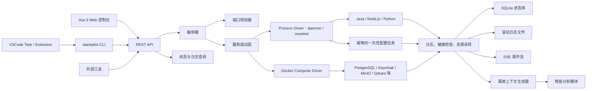
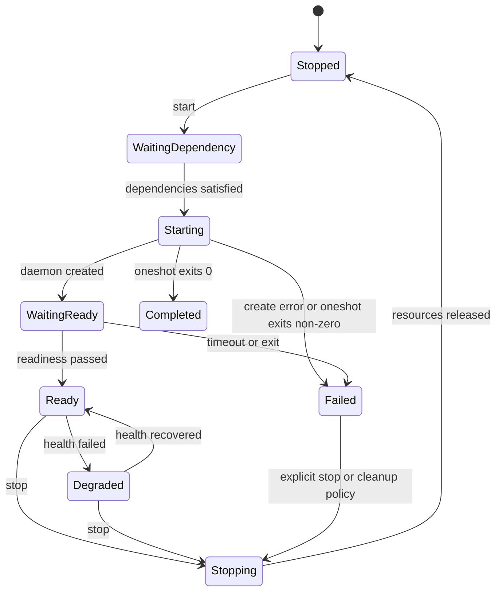

# StackPilot 总体设计方案

> 状态：Phase 3C 设计基线
> 日期：2026-08-31
> 技术栈：Go + Vue 3 + SQLite + REST/SSE + Docker Compose

## 1. 背景

PMS、AIWS、BTC 等系统由多个前端、后端、Python 服务和基础设施组件组成。当前主要通过 BAT 或 PowerShell 脚本启动，存在以下问题：

- 每个服务打开独立 CMD 窗口，运行状态分散且难以管理。
- 启动耗时较长，固定延时无法准确表示服务是否真正可用。
- 多个系统之间缺少统一的依赖编排、端口规划和冲突处理。
- 标准输出、错误输出和容器日志分散，故障现场难以还原。
- VSCode、命令行和人工操作没有统一的启动接口。
- 服务异常后主要依赖人工收集日志、判断原因和执行恢复操作。

StackPilot 的目标是提供一个跨平台的本地开发与集成环境控制平面，统一管理系统、服务、端口、日志、健康状态和异常分析。项目自己的 BAT/PowerShell 启动器不再作为正式入口。

## 2. 建设目标

### 2.1 核心目标

1. 产品架构支持 Windows、Linux、macOS，核心能力不依赖单一操作系统；实施采用 Windows-first，按阶段补齐其他平台实现。
2. 将 PMS、AIWS、BTC 等应用定义为“系统”，将前端、后端、运行时和基础设施定义为“服务”。
3. 通过服务依赖图控制顺序启动、并行启动、就绪等待、失败终止和逆序停止。
4. 直接监管 Java、Node.js、Python 等开发进程，不再调用项目启动 BAT。
5. 将 Docker Compose 作为可选服务驱动，管理适合容器化的基础设施。
6. 启动前完成整套端口规划，支持首选端口、自动替换和调用方覆盖。
7. 统一采集进程日志、容器日志、健康检查和资源使用情况。
8. 提供 Web、CLI、REST API 和 SSE，对 VSCode 和其他开发工具开放。
9. 异常发生时自动形成事故上下文，先由确定性规则给出基础诊断，后续由可选模型适配器提供增强分析。

### 2.2 非目标

- 第一阶段不替代 Kubernetes、Nomad 等生产级集群调度平台。
- 第一阶段不提供任意远程命令执行能力。
- MVP 仅支持单用户本机模式，不提供远程控制、多用户、RBAC 或多 Agent。
- 不要求所有业务服务容器化。
- 不负责让原本依赖特定操作系统的业务代码自动获得跨平台能力。
- 第一阶段不自动执行高风险修复，不直接修改业务项目源码或提交配置。
- MVP 不包含系统托盘、完整资源趋势、全文日志检索、Prometheus/OpenTelemetry 导出和模型调用。

## 3. 设计原则

- **声明式配置**：服务如何启动、依赖谁、占用哪些端口、如何判断就绪，均由版本化清单声明。
- **单一控制面**：Web、CLI、VSCode 均调用同一套 REST API，不各自实现启动逻辑。
- **就绪优先**：依赖条件使用 `ready` 或 `completed`，不以“进程已创建”代表服务可用。
- **跨平台核心、平台适配边缘**：编排器保持平台无关，进程树和系统服务安装由适配层实现。
- **运行时不修改源码**：端口和运行参数通过环境变量、命令参数及生成的 Compose override 注入；业务项目可进行一次性接入改造以读取这些变量。
- **可恢复**：StackPilot 重启后能够核对并重新接管仍在运行的服务。
- **默认最小权限**：API 默认只监听回环地址，只允许启动已登记的服务定义。
- **证据驱动诊断**：智能分析必须引用日志、状态、指标或配置证据，不以模型猜测替代监控事实。

## 4. 总体架构



### 4.1 运行拓扑

第一阶段采用单机一体化部署：

```text
stackpilot
├── server                 REST API、SSE、Web 静态资源
├── orchestrator           系统启停和依赖编排
├── local agent            本机进程与 Compose 管理
├── monitor                健康检查与资源采样
├── log manager            日志采集、滚动和查询
├── incident analyzer      规则诊断；模型适配器后续启用
└── sqlite                 本机持久化
```

MVP 为单用户本机模式。后续确有多机器需求时，再将本地 Agent 独立出来，Control Plane 与 Agent 之间使用双向认证的 gRPC 通信；这部分不进入首发范围。

## 5. 技术选型

| 层次 | 技术 | 用途 |
|---|---|---|
| 核心服务 | Go | 跨平台守护进程、编排、API、CLI |
| HTTP 路由 | `chi` | 轻量 REST 路由和中间件 |
| API 契约 | 手写 OpenAPI 文档 | 固化对外接口；MVP 不引入代码生成步骤 |
| 实时事件 | SSE | 启动进度、状态变化和日志流 |
| 配置格式 | YAML + `yaml.v3` | 系统与服务声明 |
| 状态存储 | SQLite + `modernc.org/sqlite` | 无 CGO 的跨平台本地数据库 |
| 平台日志 | Go `slog` | StackPilot 自身结构化日志 |
| 日志滚动 | `lumberjack` 或等价实现 | 被管服务日志文件轮转 |
| 前端 | Vue 3 + TypeScript + Vite | Web 管理控制台 |
| UI 组件 | Element Plus | 与现有三个系统前端技术经验保持一致 |
| 前端状态 | Pinia | 页面状态和会话状态 |
| 图表 | ECharts（后续按需） | 资源和启动耗时趋势，不进入 MVP |
| 容器管理 | Docker Compose v2 | 可选的多容器基础设施驱动 |
| 系统服务 | `kardianos/service` 或平台适配 | Windows Service、systemd、launchd |
| 构建发布 | GoReleaser | 多平台、多架构制品和校验和 |

SSE 是首选实时协议，因为它适合服务端持续推送、支持浏览器自动重连，且比 WebSocket 更容易穿过代理。需要双向交互时仍通过 REST 发起命令。MVP 手写服务端 DTO 和前端类型，API 稳定且出现真实第三方客户端后再评估 `oapi-codegen`。

## 6. 代码仓库结构

```text
StackPilot/
├── cmd/
│   └── stackpilot/              单一可执行文件入口
├── internal/
│   ├── api/                     REST、SSE、OpenAPI 实现
│   ├── domain/                  系统、服务、操作、端口等模型
│   ├── orchestrator/            DAG、状态机、重试和取消
│   ├── driver/
│   │   ├── process/             daemon 和 oneshot 原生进程驱动
│   │   └── compose/             Docker Compose 驱动
│   ├── platform/
│   │   ├── windows/             Job Object、Windows Service
│   │   ├── linux/               Process Group、systemd、cgroup
│   │   └── darwin/              Process Group、launchd
│   ├── ports/                   端口检测、规划和租约
│   ├── health/                  Process、TCP、HTTP、Compose 检查
│   ├── logs/                    捕获、滚动、流式查询
│   ├── incident/                事故上下文和规则诊断
│   ├── storage/                 SQLite migrations 和 repository
│   └── security/                身份验证、密钥、脱敏、审计
├── web/                         Vue 3 应用
├── api/                         OpenAPI 文档
├── schemas/                     清单 JSON Schema
├── examples/                    PMS、AIWS、BTC 示例清单
├── docs/                        设计与使用文档
├── migrations/                 SQLite 迁移
└── tests/                       单元、集成和端到端测试
```

Vue 构建结果使用 Go `embed` 嵌入最终二进制。正式安装只需要一个 StackPilot 可执行文件和数据目录；开发阶段前后端可以分别热更新。

上述目录表示责任边界，不要求 Phase 0 一次创建全部包。只有出现对应实现和测试时才建立目录，避免空层和转发式抽象。

## 7. 核心领域模型

### 7.1 系统与服务

- `SystemDefinition`：系统静态定义，例如 PMS、AIWS、BTC。
- `ServiceDefinition`：服务启动方式、进程模式、工作目录、依赖、端口和健康检查。
- `ServiceDependency`：依赖服务及条件。常驻服务使用 `ready`，一次性进程使用 `completed`。
- `PortRequirement`：端口名称、首选值、备用范围、协议和暴露范围。
- `SystemInstance`：某系统在某工作区、某 Agent 上的一次运行实例。
- `ServiceInstance`：某服务的实际进程或 Compose 实例。

### 7.2 操作与状态

- `Operation`：启动、停止、重启、端口规划或诊断等长时间操作。
- `OperationStep`：操作中的具体步骤及耗时、重试和错误。
- `PortLease`：操作或运行实例占用的端口租约。
- `HealthResult`：一次健康检查结果。
- `Incident`：连续失败、异常退出或资源异常形成的事故。
- `IncidentAnalysis`：规则和智能分析生成的结构化结论。

### 7.3 服务状态机



`ready` 表示常驻进程或容器已经通过 readiness；`completed` 表示 `mode: oneshot` 的进程以退出码 0 完成。MVP 的 BTC 接入只实现和使用 `ready`，`completed` 在 AIWS 接入幂等配置任务时启用。`started` 不作为依赖条件，避免下游在依赖尚未就绪时过早启动。

`Failed` 是可观测终态，不会自动进入 `Stopping`。只有用户显式停止，或系统启用了 `cleanupOnFailure`，才进行清理。这与默认保留失败现场的策略保持一致。

系统状态按以下优先级聚合，命中后不再评估较低项：

1. 正在执行停止操作时为 `Stopping`。
2. 任一必需服务为 `Failed` 或身份无法确认时为 `Failed`。
3. 启动操作尚未结束且必需服务未全部满足依赖条件时为 `Starting`。
4. 必需服务均为 `Ready`/`Completed`，但任一服务为 `Degraded`，或可选服务为 `Failed` 时为 `Degraded`。
5. 所有必需服务为 `Ready`/`Completed` 且没有降级项时为 `Running`。
6. 所有常驻服务均为 `Stopped` 时为 `Stopped`。

## 8. 声明式系统清单

每个项目根目录保存 `.stackpilot/system.yaml`，路径全部相对工作区。该文件是系统定义的唯一事实来源，清单必须包含 `apiVersion`，并通过 JSON Schema 校验。SQLite 只保存清单路径、内容摘要、最后成功解析快照和运行状态，不作为可编辑的第二份系统定义。注册/刷新操作的语义是读取并校验文件后更新缓存；Web 和 API 不直接编辑数据库中的服务定义。

首次接入可通过受控导入生成该文件：控制面只读分析工作区内 BAT、固定 `-File` 引用的受限 PowerShell 和直接引用的 Compose/Dockerfile 来源图，用户确认结构化服务、端口、依赖、逐服务 readiness 和本地 build opt-in 后，由持久化 Operation 原子发布并重新加载清单。导入不执行 BAT/PowerShell，不提供 raw command/YAML 编辑入口；详细边界与恢复协议见 ADR-0007 和 ADR-0008。

```yaml
apiVersion: stackpilot.io/v1alpha1
kind: System

metadata:
  id: pms
  name: PMS

spec:
  ports:
    backend:
      protocol: tcp
      preferred: 8080
      fallbackRange: 8000-8099
      conflictPolicy: auto
    rag:
      protocol: tcp
      preferred: 8100
      fallbackRange: 8100-8199
      conflictPolicy: auto
    web:
      protocol: tcp
      preferred: 32102
      fallbackRange: 32400-32599
      conflictPolicy: auto

  services:
    backend:
      driver: process
      runner: maven
      workingDirectory: ./pmsystem-backend
      arguments: [spring-boot:run]
      environment:
        SERVER_PORT: "${ports.backend}"
        PM_KNOWLEDGE_RAG_BASE_URL: "http://127.0.0.1:${ports.rag}"
      readiness:
        type: http
        url: "http://127.0.0.1:${ports.backend}/actuator/health"
        timeout: 300s
        interval: 2s

    rag:
      driver: process
      runner: python-venv
      virtualEnvironment: ./pmsystem-rag/.venv
      workingDirectory: ./pmsystem-rag
      arguments: [-m, app.main]
      environment:
        RAG_PORT: "${ports.rag}"
      readiness:
        type: http
        url: "http://127.0.0.1:${ports.rag}/health"
        timeout: 180s

    web:
      driver: process
      runner: npm
      workingDirectory: ./pmsystem-frontend
      arguments: [run, dev, --, --host, 127.0.0.1, --port, "${ports.web}"]
      environment:
        VITE_API_TARGET: "http://127.0.0.1:${ports.backend}"
      dependsOn:
        backend: ready
        rag: ready
      readiness:
        type: http
        url: "http://127.0.0.1:${ports.web}"
        timeout: 120s
```

清单中的环境变量模板只能引用平台允许的数据，例如端口、工作区、系统实例和密钥引用。API 调用方不能通过启动请求注入任意命令或任意环境变量。

### 8.1 Runner 抽象

清单使用 `runner`，避免把平台命令名写死：

| Runner | Windows | Linux/macOS |
|---|---|---|
| `maven` | `mvn.cmd` | `mvn` |
| `npm` | `npm.cmd` | `npm` |
| `go` | `go.exe` | `go` |
| `python-venv` | `.venv/Scripts/python.exe` | `.venv/bin/python` |
| `java` | `java.exe` | `java` |
| `docker-compose` | `docker.exe compose` | `docker compose` |

Runner 在预检阶段解析实际可执行文件、版本和路径。解析失败时操作在创建任何业务进程前终止。
`go` 仅表示受信工具链 Runner：Windows 从服务端显式允许路径或服务账号
`PATH` 解析规范化的 `go.exe`，执行固定 `go version` 探针并记录摘要；清单只提供
参数数组，HTTP/API 不接受可执行路径、shell 或启动命令字符串。

## 9. 启停编排

### 9.1 启动流程

1. 校验系统清单和调用权限。
2. 获取系统级操作锁，处理幂等键。
3. 检查 runner、工作目录、Docker 等前置条件。
4. 构造并校验服务依赖 DAG，拒绝循环依赖。
5. 为整套系统生成端口计划并建立租约。
6. 展开环境变量和运行时配置，生成操作快照。
7. 按拓扑层级启动服务；同层无依赖服务并行执行。
8. 常驻服务等待 readiness；一次性服务等待退出码 0，满足声明的依赖条件后才释放下游。
9. 所有必需常驻服务就绪且必需一次性服务完成后，将系统标记为 `Running`。
10. 记录最终访问地址、PID/容器标识、端口和配置摘要。

长时间启动以异步 Operation 表示，HTTP 启动请求立即返回 `202 Accepted`。操作支持超时、取消、有限重试和实时进度，不依赖客户端保持连接。

### 9.2 失败策略

每个系统可以配置：

- `failFast`：必需服务失败后不再启动新的下游服务。
- `cleanupOnFailure`：启动失败后是否停止本次操作已拉起的服务。
- `keepReadyServices`：失败时是否保留已经就绪的独立服务以便调试。
- `retry`：仅对明确可重试的启动或健康检查错误生效。

默认采用 `failFast=true`、`cleanupOnFailure=false`，保留现场供开发者查看。界面提供“停止本次已启动服务”的明确操作。

### 9.3 停止流程

停止顺序为依赖图的逆拓扑顺序：先停止调用方，再停止被依赖方。原生进程先发送优雅终止信号，超时后终止进程树；Compose 默认执行 `docker compose stop`，不删除数据卷。任何删除卷操作必须是独立、高风险、需确认的命令。

### 9.4 平台进程监管

- Windows：无可见窗口启动；使用 Job Object 约束和终止子进程树。
- Linux：使用 Process Group；优先 `SIGTERM`，超时后 `SIGKILL`；可选接入 cgroup v2。
- macOS：使用 Process Group，采用 POSIX 信号管理进程树。

进程身份至少由 PID、启动时间、可执行文件路径和命令摘要共同确认，避免 PID 复用导致误接管或误终止。

产品边界保持三平台，但交付采用 Windows-first：Phase 0 保证公共核心不引用 Windows 专属 API并建立多平台编译检查，Phase 1–2 完成 Windows 的真实进程监管和系统接入，后续阶段再补齐 Linux/macOS 的进程树、系统服务和端到端测试。平台接口不得以 Windows 行为作为默认语义。

## 10. Docker Compose 驱动

Docker Compose 是可选驱动，仅用于适合容器化的基础设施或已有 Compose 定义的服务组，不是 StackPilot 的必需运行方式。

典型用途：

- AIWS：PostgreSQL、Keycloak、MinIO、ClamAV、Qdrant、OpenTelemetry Collector。
- PMS/BTC：未来需要隔离的数据库、Redis 或其他中间件。

StackPilot 调用官方 Compose v2。普通 Compose 不构建；显式启用 `phase2.compose-build` 且清单声明 `buildPolicy: always` 时，系统 Start/Restart 先运行独立 build，再运行固定的无隐式构建 up：

```text
docker compose \
  --project-name <instance-name> \
  --file compose.yml \
  --file <runtime>/compose.override.yml \
  build <sorted-build-services>
docker compose \
  --project-name <instance-name> \
  --file compose.yml \
  --file <runtime>/compose.override.yml \
  up -d --wait --no-deps --no-build --wait-timeout <seconds> <sorted-services>
```

`compose.override.yml` 由端口规划器生成，只覆盖宿主机端口、必要环境变量和身份标签，不改写项目原文件，也不注入 build/command/entrypoint。受控 build 只允许工作区内本地 context/Dockerfile；远程 context、args、Secret、SSH、entitlements 和高级 build 字段拒绝。用户或自动 service-restart 不构建，普通 Stop 不删除 volume、镜像或 daemon cache。Compose 项目名必须包含系统和实例标识，避免多个工作区发生容器名、网络名或数据卷名冲突。

没有 Docker 的机器仍可运行不依赖 Compose 的系统。只有清单包含 Compose 服务时，Docker 才是该系统的前置条件。

## 11. 端口规划与替换

### 11.1 端口策略

每个端口支持三种冲突策略：

- `strict`：首选端口被占用时直接失败。
- `auto`：首选端口被占用时从备用范围自动分配。
- `override-only`：必须由启动请求或工作区配置明确提供。

优先级从高到低：

1. 本次 API/CLI 请求的 `portOverrides`。
2. 工作区级持久配置。
3. 开启 `sticky` 时，该工作区最近一次成功运行的端口计划。
4. 系统清单中的首选端口。
5. 清单中的备用范围。

`sticky` 默认开启。在端口仍可用且清单未改变时优先复用上次结果，避免书签、OAuth 回调和开发调试配置频繁变化；用户显式覆盖始终具有最高优先级。

### 11.2 规划流程

1. 收集系统所有宿主机端口需求。
2. 检查数据库中其他运行实例的有效租约。
3. 查询操作系统当前监听端口并尝试独占绑定候选端口。
4. 在同一事务中写入整套端口租约；任一端口失败则整套回滚。
5. 生成 `ResolvedSystemSpec`，统一展开所有引用位置。
6. 在子进程绑定前释放对应探测 socket，并立即创建进程。
7. 若发生竞争抢占，重新规划受影响端口或按策略失败。

### 11.3 端口传播

端口变更必须同时传播到：

- Spring Boot 的 `SERVER_PORT` 或系统专属端口变量。
- Vite 的监听端口和后端代理目标。
- Python 服务监听端口。
- Docker Compose 宿主机端口映射。
- CORS allowed origins。
- OAuth/OIDC issuer、redirect URI 和 logout URI。
- 服务间调用 URL。
- 健康检查 URL 和 Web 控制台访问入口。

仅替换监听端口而不替换依赖 URL 属于无效端口规划，清单校验和接入测试必须覆盖此问题。

### 11.4 当前系统建议端口域

| 系统 | 当前主要端口 | 建议备用范围 |
|---|---|---|
| PMS | Web 32102、Backend 8080、RAG 8100 | Web 32400-32599，服务 8000-8199 |
| BTC | Web 32102、Backend 8081 | Web 32200-32399，服务 8200-8399 |
| AIWS | Web 6173、Server 18080、Runtime 18090 及多项基础设施端口 | Web 6100-6199，服务 18000-19199 |

PMS 与 BTC 清单可声明相同的 Web preferred 端口 32102，StackPilot 必须在任何进程启动前解决该冲突。

## 12. 健康检查与监控

### 12.1 健康检查类型

- `process`：进程存在且身份匹配。
- `tcp`：目标端口可连接。
- `http`：HTTP 状态码、响应 JSON 字段或文本满足条件。
- `compose`：容器状态及 Compose healthcheck。

readiness 与 liveness 分开配置：

- readiness 决定是否允许下游启动。
- liveness 决定运行中的服务是否健康。

健康状态采用连续成功/失败阈值，避免一次瞬时超时造成状态抖动。示例：连续 3 次失败进入 `Degraded`，连续 2 次成功恢复 `Ready`。

### 12.2 资源采样

资源采样不进入 MVP。基础启停、健康状态、端口和日志稳定后，再按需采集：

- CPU 使用率。
- 常驻内存。
- 进程运行时长。
- 重启次数。
- 健康检查耗时和失败次数。
- 日志错误速率。

指标保留短周期明细和长周期聚合，不以 SQLite 保存高频无限时序数据。Prometheus/OpenTelemetry 导出属于后续可选能力，不进入 Phase 1–2。

## 13. 日志设计

### 13.1 日志来源

- 原生进程 stdout、stderr。
- Docker/Compose 容器日志。
- StackPilot 操作步骤日志。
- 健康检查和端口规划事件。
- 智能分析与人工处置记录。

统一日志事件：

```json
{
  "timestamp": "2026-08-17T15:30:00.123+08:00",
  "systemId": "pms",
  "systemInstanceId": "pms-local-01",
  "serviceId": "backend",
  "stream": "stderr",
  "level": "ERROR",
  "message": "Failed to connect to Redis",
  "operationId": "op-01",
  "sequence": 1024
}
```

### 13.2 存储策略

- SQLite 保存日志文件元数据和重要事件，不保存全部原始日志正文。全文索引在基础日志查询稳定后再评估。
- 原始日志按系统、实例、服务和日期写入 NDJSON 或文本滚动文件。
- 默认按单文件大小、总容量和保留天数联合清理，策略可配置。
- SSE 使用递增事件 ID，客户端通过 `Last-Event-ID` 断线续传。
- 日志输出前执行密钥、令牌、密码和连接串脱敏。

建议数据目录：

```text
data/
├── stackpilot.db
├── runtime/
│   └── <operation-id>/
├── logs/
│   └── <system>/<instance>/<service>/
└── incidents/
    └── <incident-id>/
```

实际根目录由平台规范决定：Windows 使用 ProgramData 或用户数据目录，Linux 使用 `/var/lib`/`~/.local/share`，macOS 使用 Application Support；同时允许通过受控配置覆盖。

## 14. SQLite 数据设计

第一阶段主要表：

| 表 | 用途 |
|---|---|
| `systems` | 已注册系统与清单版本 |
| `workspaces` | 系统在不同机器上的项目路径 |
| `services` | 解析后的服务定义摘要 |
| `system_instances` | 系统运行实例 |
| `service_instances` | driver、进程身份或 opaque Compose 项目身份、端口策略和运行状态 |
| `operations` | 启停、重启、诊断操作 |
| `operation_steps` | 操作步骤、耗时、错误和重试 |
| `port_leases` | 端口租约及所属实例 |
| `health_results` | 健康检查近期结果和聚合 |
| `log_segments` | 日志文件位置、范围和校验信息 |
| `events` | SSE 可恢复事件和审计事件 |
| `incidents` | 异常事件 |
| `incident_analyses` | 诊断结果与反馈 |
| `local_auth` | 单用户本地访问令牌摘要，不保存明文 |

SQLite 开启 WAL，所有 schema 变更通过版本化 migration 完成。端口租约、操作状态和实例状态更新必须使用事务。

## 15. REST API 与 SSE

API 统一使用 `/api/v1` 前缀并提供 OpenAPI 文档。

### 15.1 主要接口

```text
GET    /api/v1/systems
GET    /api/v1/systems/{systemId}
POST   /api/v1/systems/{systemId}/refresh
GET    /api/v1/systems/{systemId}/status
POST   /api/v1/systems/{systemId}/port-plan
POST   /api/v1/systems/{systemId}/start
POST   /api/v1/systems/{systemId}/stop
POST   /api/v1/systems/{systemId}/restart

GET    /api/v1/services/{systemId}/{serviceId}
POST   /api/v1/services/{systemId}/{serviceId}/restart
GET    /api/v1/services/{systemId}/{serviceId}/logs

GET    /api/v1/operations/{operationId}
POST   /api/v1/operations/{operationId}/cancel

GET    /api/v1/events
GET    /api/v1/log-stream

GET    /api/v1/incidents
GET    /api/v1/incidents/{incidentId}
POST   /api/v1/incidents/{incidentId}/analyze

POST   /api/v1/workspaces
GET    /api/v1/workspaces
```

`POST /workspaces` 接收工作区路径，读取其中的 `.stackpilot/system.yaml` 并完成注册；`refresh` 重新读取该文件。系统定义始终以文件为准，API 不提供直接修改服务命令或依赖关系的接口。

### 15.2 异步操作

启动请求：

```http
POST /api/v1/systems/pms/start
Idempotency-Key: vscode-pms-20260817-001
Content-Type: application/json

{
  "workspaceId": "pms-local",
  "portOverrides": {
    "web": 5175
  },
  "failurePolicy": "keep-ready-services"
}
```

响应：

```http
HTTP/1.1 202 Accepted

{
  "operationId": "op-20260817-001",
  "systemId": "pms",
  "state": "queued"
}
```

调用方可轮询 Operation，也可订阅：

```text
GET /api/v1/events?operationId=op-20260817-001
Accept: text/event-stream
```

### 15.3 API 约束

- 变更操作支持 `Idempotency-Key`。
- API 只接收系统、服务、工作区和允许覆盖的端口，不接收原始命令。
- 错误响应包含稳定错误码、用户信息、技术详情引用和关联操作ID。
- 所有时间使用 RFC 3339；数据库保存 UTC，界面按本地时区显示。
- SSE 必须发送心跳并支持客户端通过最后事件ID恢复。

## 16. CLI 与 VSCode 集成

同一个 `stackpilot` 二进制同时提供服务端和客户端子命令：

```text
stackpilot server
stackpilot service install
stackpilot service start
stackpilot workspace add <workspace>
stackpilot system refresh [system]
stackpilot up [system]
stackpilot down [system]
stackpilot restart <system/service>
stackpilot status [system]
stackpilot logs <system/service> --follow
stackpilot port-plan <system>
```

CLI 只调用 REST API，不直接创建业务进程。CLI 可通过当前目录向上查找 `.stackpilot/system.yaml` 自动识别系统。

VSCode `tasks.json` 示例：

```json
{
  "version": "2.0.0",
  "tasks": [
    {
      "label": "StackPilot: 启动当前系统",
      "type": "shell",
      "command": "stackpilot",
      "args": ["up", "--wait", "--open"],
      "options": { "cwd": "${workspaceFolder}" },
      "problemMatcher": []
    },
    {
      "label": "StackPilot: 停止当前系统",
      "type": "shell",
      "command": "stackpilot",
      "args": ["down"],
      "options": { "cwd": "${workspaceFolder}" },
      "problemMatcher": []
    }
  ]
}
```

后续 VSCode 扩展可在状态栏显示系统状态、打开日志、重启当前服务，但仍通过公开 API 工作，不引入第二套控制逻辑。

## 17. Web 控制台

Phase 1 只实现完成 BTC 闭环所需页面：

1. **系统总览**：已注册系统的状态、运行时长和访问入口。
2. **系统详情**：依赖图、服务状态、端口、启动进度和启停操作。
3. **服务详情**：实时日志、健康结果、PID和重启操作；容器详情与资源曲线后续增加。
4. **操作中心**：长操作步骤、耗时、错误、取消和历史结果。
5. **基础配置**：工作区、端口策略和本地令牌状态。

Phase 2 增加 Compose 容器详情和事故中心；日志全文搜索、资源趋势和高级保留策略放到 Phase 3。

界面不允许直接输入任意命令。危险操作需要清楚说明影响范围并二次确认。

## 18. 智能异常分析

### 18.1 分析流程

诊断分为两个阶段。Phase 2 先实现确定性规则，不依赖模型：

```text
异常触发
  → 规则分类
  → 收集事故时间窗
  → 关联依赖服务
  → 日志去重与脱敏
  → 形成 IncidentContext
  → 规则引擎匹配退出码、健康失败、端口和日志特征
  → 输出结构化证据、原因和建议
```

Phase 4 再增加可选模型增强：模型接收同一份脱敏后的 `IncidentContext` 和规则结果，补充关联分析；输出必须通过 JSON Schema 校验。模型不可用时，规则诊断仍可独立工作。

事故上下文包含：

- 异常服务、状态变化和退出码。
- 异常前后可配置时间窗的日志。
- readiness/liveness 失败详情。
- 端口占用者、依赖服务状态和 Compose 容器状态。
- 已启用资源采样时的 CPU、内存、磁盘摘要；MVP 不以此为前置条件。
- 本次启动的端口计划和环境变量名称；敏感值不进入上下文。
- 最近一次配置、版本或启动操作变化。
- 相同错误的历史处置记录。

### 18.2 分析结果

```json
{
  "summary": "PMS 后端无法连接 RAG 服务",
  "probableCauses": [
    {
      "cause": "RAG 服务未在规划端口监听",
      "confidence": 0.92
    }
  ],
  "evidence": [
    {
      "source": "pms/backend/stderr",
      "reference": "event-1024",
      "text": "Connection refused: 127.0.0.1:8100"
    }
  ],
  "recommendedActions": [
    {
      "action": "检查 RAG 启动日志并重新执行 readiness",
      "risk": "low",
      "automatic": false
    }
  ]
}
```

Phase 2 的规则诊断和 Phase 4 的模型增强均为只读分析，不自动重启、不修改配置。后续自动恢复必须建立动作白名单、风险等级、审批、审计和回滚机制。诊断模块独立于 AIWS 业务系统，避免 AIWS 故障导致 StackPilot 丧失诊断能力。

## 19. 安全设计

### 19.1 本地默认策略

- API 默认监听 `127.0.0.1`，默认端口可配置。
- 首次启动生成本地访问令牌，CLI 安全保存令牌。
- MVP 使用单用户本机令牌，不实现用户、角色或多令牌管理。
- 清单和工作区注册视为受信任管理操作，普通启动调用不能提交命令。
- 服务环境中的敏感信息使用 secret reference，不以明文写入日志或操作快照。

### 19.2 Secret 存储与生命周期

- 清单通过 `secret://<system>/<name>` 引用秘密，不保存明文。
- 使用 `stackpilot secret set/get-metadata/delete` 管理；`set` 从交互输入或标准输入读取，不接受会进入 shell 历史的明文参数。
- Windows-first 版本按 ADR-0004 使用当前用户 DPAPI 保护的数据文件和仅当前用户/SYSTEM 可访问的 DACL；macOS 使用 Keychain；Linux 优先使用 Secret Service，显式配置后才允许使用权限为 `0600` 的本地受保护文件。
- SQLite 只保存 Secret system/name、provider、单调版本和更新时间，不保存值；受保护文件是值的事实来源，元数据是可对账投影。
- Secret 仅在启动子进程前于内存中解析并注入其环境，使用后清理临时缓冲；不写入操作快照、SSE、日志或事故上下文。
- 更新 Secret 不自动重启服务，界面明确标记哪些运行实例仍使用旧版本。

### 19.3 远程访问（后续）

MVP 不开放远程监听。多用户、远程控制和多 Agent 获得明确需求后，才进入该阶段；开启时必须同时启用：

- TLS。
- 用户或机器身份认证。
- 基于系统和操作的权限控制。
- 操作审计。
- 请求速率限制。
- Agent 与 Control Plane 的双向认证。

### 19.4 命令边界

- 不提供 `/exec` 等任意命令接口。
- runner 和参数来自已登记、已校验的清单。
- 本地 Dockerfile 是独立的构建期执行信任面，必须同时由 `buildPolicy: always` 与 `phase2.compose-build` 显式开启；取消不承诺回滚 daemon cache。
- 路径解析后必须处于注册工作区或平台运行目录内；显式允许的系统工具除外。
- 停止操作在终止进程前重新核验进程身份。
- 删除数据卷、日志或运行数据属于独立高风险操作，不与普通停止绑定。

## 20. 跨平台设计

### 20.1 平台数据目录

- Windows：`%ProgramData%/StackPilot` 或用户级应用数据目录。
- Linux：`/var/lib/stackpilot` 或 `~/.local/share/stackpilot`。
- macOS：`/Library/Application Support/StackPilot` 或用户级 Application Support。

### 20.2 后台服务

- Windows Phase 1：带 HKCU 登录启动注册和 ACL 控制通道的当前用户后台进程，详见 ADR-0003。
- Windows Service：在需要机器级启动和多用户身份模型时另行启用，不以 LocalSystem 静默运行用户项目。
- Linux：systemd。
- macOS：launchd。

统一命令为 `stackpilot service install/upgrade/start/stop/status/uninstall`，内部调用平台实现。Windows Phase 1 将不可变版本保存到 `%LOCALAPPDATA%/Programs/StackPilot/versions/<sha256>/stackpilot.exe`，由严格安装 marker 和 HKCU 注册选择当前版本；旧 Supervisor 仅接受同账号且由该 marker 和真实 SHA-256 共同证明的新版本控制面。卸载仅删除已验证安装根并保留 `%LOCALAPPDATA%/StackPilot` 数据根。

### 20.3 被管理项目的边界

StackPilot 的跨平台能力不代表业务项目天然跨平台。当前项目仍需重点处理：

- Windows 绝对路径改为工作区相对路径。
- Python 虚拟环境目录差异由 runner 解析。
- PowerShell 生命周期脚本逐步转换为平台任务或跨平台程序。
- LibreOffice、OCR、浏览器等外部依赖需要平台级能力声明和预检。
- Docker Desktop 只适用于 Windows/macOS；Linux 使用 Docker Engine。

清单允许声明平台限制：

```yaml
capabilities:
  operatingSystems: [windows, linux]
  requires:
    - java>=21
    - node>=24
    - docker-compose>=2
```

## 21. PMS、AIWS、BTC、AgentHub 接入方案

### 21.1 PMS

| 服务 | 驱动 | 已知端口 | 接入处理 |
|---|---|---:|---|
| Backend | Process/Maven | 8080 | 注入 `SERVER_PORT`，增加 HTTP readiness |
| RAG | Process/Python venv | 8100 | 注入 `RAG_PORT`，增加健康检查 |
| Web | Process/npm | 32102 | Vite 监听端口和 API proxy 改为读取环境变量 |

现有 BAT 中的端口检测、后端等待和浏览器打开迁入 StackPilot；固定 `timeout` 不保留。启动顺序初期保持现状语义，待验证业务依赖后再决定 Backend 与 RAG 是否可以并行或调整顺序。

### 21.2 AIWS

| 服务 | 驱动 | 已知端口 | 接入处理 |
|---|---|---:|---|
| Infrastructure | Compose | 15432、18180、19000 等 | 生成 Compose override，等待容器健康 |
| Server | Process/Maven | 18080 | 使用现有端口变量和 readiness |
| Agent Runtime | Process/Python venv | 18090 | 使用运行时端口变量和 readiness |
| Web | Process/npm | 6173 | 动态监听端口、API proxy 和 OIDC 配置 |
| Keycloak Configure | Process/oneshot | - | 基础设施 ready 后执行；退出码 0 表示 `Completed` |

AIWS 现有 PowerShell 启动脚本可作为迁移行为基线，但不再作为正式入口。Keycloak Configure 必须是幂等 oneshot：每次系统启动都允许执行，成功退出后释放依赖，失败进入 `Failed`，是否重试由清单明确配置。需要特别处理 Keycloak issuer、redirect URI、allowed origins 与动态宿主机端口之间的一致性。

### 21.3 BTC

| 服务 | 驱动 | 已知端口 | 接入处理 |
|---|---|---:|---|
| Backend | Process/Maven | 8081 | 注入 `SERVER_PORT`，补充 readiness |
| Web | Process/npm | 32102 | 使用 BTC 独立 fallback 端口域，proxy 动态指向 Backend |

BTC 的历史临时启动脚本与 Vite 配置曾存在端口提示不一致。接入后以 `.stackpilot/system.yaml` 和 StackPilot 解析后的端口为唯一事实来源。

### 21.4 AgentHub

| 服务 | 驱动 | 已知端口 | 接入处理 |
|---|---|---:|---|
| PostgreSQL/Redis/RabbitMQ/Object Storage/KMS | Compose | 5432、6380、5672/15672、9000/9001、8200 | 使用登记的 Compose include 与容器 healthcheck；6380 避免复用系统 Redis |
| Database Bootstrap | Process/Go oneshot | - | 校验 migration checksum、幂等迁移/fixture、创建本地应用角色与内容密钥 |
| API | Process/Go | 28080 | bootstrap completed 后启动，等待 `/health/ready` |
| Worker | Process/Go | - | bootstrap completed 后启动，以 process readiness 管理 |
| Web Install/Web | Process/npm oneshot/daemon | preferred 5173，fallback 5174-5199 | 安装完成且 API/Worker ready 后发布 Web readiness |

AgentHub 的 BAT/PowerShell 启动器只作为历史人工入口，不进入受管生命周期，也不放宽
`WORKSPACE_SCRIPT_DANGEROUS`。登记后的 `.stackpilot/system.yaml` 是完整拓扑事实来源；
普通 Stop 使用 Compose stop 并保留命名卷。Go bootstrap 直接连接已 ready 的 loopback
PostgreSQL，不调用 Docker、PowerShell 或 shell。详细信任边界见 ADR-0009。

## 22. 故障恢复与一致性

### 22.1 StackPilot 重启恢复

启动时执行 reconciliation：

1. 读取数据库中状态为运行中的实例。
2. 核验原生进程身份或 Compose 项目标识。
3. 对仍存在的服务恢复日志跟踪和健康检查。
4. 对已消失的服务标记为 `Unknown`/`Failed` 并生成事件。
5. 清理确认失效的端口租约。

### 22.2 服务异常退出

重启策略支持：

- `never`。
- `on-failure`。
- `always`。

自动重启采用指数退避、最大次数和稳定运行窗口，防止无限重启。达到阈值后形成 Incident 并停止自动重试。

### 22.3 状态一致性

- `.stackpilot/system.yaml` 是期望系统定义的事实来源。
- 数据库是运行期望状态、解析快照和操作历史的事实来源，不允许独立编辑服务定义。
- 操作系统进程、端口和 Docker 状态是实际状态来源。
- Reconciliation 持续比较二者并修正展示状态，不假设一次 API 调用成功就代表实际成功。

## 23. 发布与安装

产品目标制品：

```text
stackpilot-windows-amd64.exe
stackpilot-linux-amd64
stackpilot-linux-arm64
stackpilot-darwin-amd64
stackpilot-darwin-arm64
```

发布流程：

1. 安装并锁定前端依赖。
2. 构建 Vue 静态资源。
3. 将前端资源嵌入 Go 二进制。
4. 对目标 OS/Arch 交叉编译。
5. 运行平台单元测试和可用平台的端到端测试。
6. 生成压缩包、校验和和变更说明。

Windows 是首个稳定发布目标。Phase 0 对 Linux/macOS 只做公共核心交叉编译检查，不宣称运行支持；对应进程监管和端到端测试通过后，才发布该平台的正式制品。

默认 Web 地址建议为 `http://127.0.0.1:32100`，实际端口可配置。CLI 通过配置文件或 `STACKPILOT_ENDPOINT` 定位服务端。

## 24. 测试策略

### 24.1 单元测试

- DAG 构造、循环依赖和拓扑排序。
- 服务与系统状态机。
- 端口优先级、冲突、事务回滚和模板展开。
- 清单 Schema、路径和命令约束。
- 日志脱敏和事故上下文裁剪。
- 智能分析 JSON Schema 校验。

### 24.2 集成测试

- 启动慢服务、立即退出服务、忽略终止信号服务。
- HTTP/TCP readiness 成功、失败、超时和抖动。
- 同时启动两个争用首选端口的系统。
- 取消启动操作和失败现场保留。
- StackPilot 重启后的进程重新接管。
- Compose up/stop/logs/health 和动态端口覆盖。
- SSE 重连和 `Last-Event-ID` 恢复。

### 24.3 端到端测试

- Web 启动系统、查看进度、查看日志、停止系统。
- CLI/VSCode Task 启动后 Web 状态同步。
- PMS、AIWS、BTC 的真实接入验收。
- Phase 1–2 完成 Windows 进程生命周期测试；Phase 3 补齐 Linux、macOS 测试矩阵。

## 25. 实施阶段

### Phase 0：工程基线

- 初始化 Go、Vue、OpenAPI、SQLite migration 和 CI。
- 建立核心领域模型、配置 Schema 和错误码规范。
- 建立 Windows 构建产物以及 Linux/macOS 公共核心交叉编译检查。

### Phase 1：本地进程控制 MVP

- 系统注册和工作区管理。
- 完成 Windows Process Driver、Runner 解析和无独立终端启动。
- DAG 启动、readiness、逆序停止和 Operation。
- 端口规划、租约和环境变量注入。
- stdout/stderr 日志、SSE 和基础 Web 页面。
- 首先接入 BTC，验证最小的前后端组合。

### Phase 2：复杂系统与 Compose

- Docker Compose Driver 和运行时 override。
- AIWS 基础设施、Keycloak oneshot 和并行服务接入。
- PMS RAG、长启动和依赖链接入。
- 自动重启和恢复核对。
- 事故上下文和退出码、端口、健康检查、日志关键字规则诊断。

### Phase 3：开发工具与可观测性

- 完整 CLI、VSCode tasks 和可选扩展。
- Linux/macOS Process Driver、后台服务适配和端到端测试。
- 日志全文搜索、保留策略、资源采样、操作中心和事故中心。
- OpenTelemetry/Prometheus 可选导出。

### Phase 4：智能诊断与多 Agent

- 可选模型适配器，在规则诊断结果之上提供增强分析。
- 分析反馈与历史案例检索。
- Control Plane/Agent 拆分、gRPC 和双向认证。
- 低风险恢复动作的审批机制。

## 26. 验收标准

### 26.1 Phase 1 Windows MVP

1. 无需项目 BAT/PowerShell 启动入口，可以从 Web、CLI 和 VSCode 启停 BTC。
2. 启动请求立即返回 Operation，前端可实时看到每一步耗时和日志。
3. 后端未就绪时前端不会提前启动；超时后状态和错误原因明确。
4. 端口冲突能在创建任何业务进程前发现，并按策略失败或自动分配替代端口。
5. 最终端口能正确传播到 Vite proxy、Spring Boot、健康检查和访问入口。
6. StackPilot 关闭并重新启动后，可以识别并重新接管仍在运行的服务。
7. 停止系统时能够终止完整进程树，不遗留 Maven、Java 或 Node 子进程。
8. 服务日志可以实时查看、按服务过滤，并在重连后继续读取。
9. API 不允许调用方提交任意命令，所有变更操作具有操作记录。
10. `.stackpilot/system.yaml` 是唯一系统定义，刷新后缓存与文件一致。

### 26.2 Phase 2 系统接入

1. PMS 与 BTC 同时启动时，Web preferred 端口冲突能自动解决，并尽量复用各工作区上次成功端口。
2. PMS 的 Backend、RAG、Web 按真实 readiness 编排，不使用固定等待时间。
3. AIWS Compose 基础设施可以通过 StackPilot 启停且不删除数据卷。
4. Keycloak oneshot 只有退出码 0 才释放 Server/Web 下游依赖，失败现场可观察。
5. 规则诊断可以对端口占用、进程异常退出、readiness 超时和已知日志错误生成结构化证据与建议。
6. Secret 不出现在数据库明文字段、日志、SSE、操作快照或事故上下文中。

## 27. 主要风险与待确认事项

| 风险/事项 | 影响 | 应对方向 |
|---|---|---|
| 端口探测释放后被其他进程抢占 | 动态端口启动偶发失败 | 租约、快速拉起、绑定失败重规划 |
| npm/maven 在 Windows 使用 `.cmd` 包装 | 严格意义可能经过 cmd.exe | 默认隐藏执行；后续提供直接 node/java runner |
| 业务项目存在硬编码 URL | 端口替换不完整 | 接入清单、配置改造和端到端测试共同验证 |
| OAuth issuer 对动态端口敏感 | AIWS 登录失败 | 将 OIDC 全链路列为同一端口传播组 |
| StackPilot 重启后丢失 stdout pipe | 无法继续读取既有原生进程输出 | 服务日志优先重定向到持久文件；接管后恢复文件跟踪 |
| 跨平台停止进程树语义不同 | 可能遗留子进程 | 平台适配层和各 OS 端到端测试 |
| Windows-first 实现渗入公共核心 | 后续平台适配成本上升 | 平台接口隔离、Phase 0 多平台编译检查、禁止核心包引用 Windows API |
| Docker Desktop 未运行、不可用或资源不足 | AIWS 基础设施无法启动 | Compose 预检按 ADR-0006 受控拉起已安装的 Docker Desktop 并等待 daemon；启动失败或超时返回明确错误，Compose 仍为可选能力 |
| 智能分析泄露敏感日志 | 安全风险 | 本地脱敏、最小上下文、Provider 权限和审计 |

评审后已确认的首发决策：

1. MVP 为单用户本机模式，不实现远程控制、RBAC 和多 Agent。
2. 产品保持跨平台架构，Phase 1–2 采用 Windows-first，Phase 3 补齐 Linux/macOS。
3. 自动端口默认启用粘性复用，优先保持同一工作区上次成功结果。
4. 启动失败默认保留现场，只有显式停止或清理策略才回收已启动服务。
5. Phase 2 先实现规则诊断，Phase 4 再接入可选本地或远程模型。
6. 系统托盘不进入 MVP；Phase 1 使用 ADR-0003 定义的当前用户后台任务，安装器按发布需要另行规划，Windows Service 留待独立安全和迁移决策。
7. 工作区首次接入先探测固定清单；缺少清单时可对 BAT 做只读、有界静态分析，由用户确认结构化草案后原子生成清单。BAT 永不作为运行入口。
8. 已注册工作区支持详情、结构化编辑和同 System ID 路径重关联；编辑/重关联均要求停止状态、无活动 Operation，并通过持久化 Operation 应用。

进入详细设计前仍需验证：

1. PMS、AIWS、BTC 的 readiness 接口是否足以替代现有固定等待。
2. AIWS Keycloak Configure 是否在重复执行、部分成功和版本升级场景下保持幂等。
3. Linux 与 macOS 的优先级及对应业务系统实际运行范围。

## 28. 可观测性、修订与验证式重启专项

本专项按 ADR-0010 和 `plan/plan-20260831-01-system-observability-and-change-planning.md`
执行，形成资源观测、只读变更规划和验证式重启三条独立受控能力：
`phase3.resource-monitoring`、`phase3.change-planning` 和
`phase3.verified-restart`。三项 capability 只有在各自生产实现和真实 Gate 通过后才公布；
此前新入口缺席或返回 `FEATURE_NOT_ENABLED`。

资源观测以 Windows Supervisor 持有的 Job Object 和已登记 Compose 身份为来源，不以根 PID
冒充进程树。默认 30 秒采样，明细保留 24 小时、小时聚合保留 30 天；采样失败、旧协议或
Docker 不可用不得阻塞启停、日志、健康检查和恢复。高频指标通过有界 REST 窗口查询，不进入
领域事件 SSE。

System Revision 将运行时事实与工作区候选事实保存为不同的不可变规范快照。工作区收集只允许
严格 Manifest、受信 Runner、固定只读 Git 命令、已登记 Compose 身份和文件白名单摘要；不得
读取 `.env`、递归扫描任意文件、接受调用方命令或产生构建、拉取、启动、写文件等副作用。
ChangePlan 只比较两个快照并按版本化确定性规则分级，不执行变更。

Verified Restart 在任何生命周期副作用前重新收集候选修订并核对计划摘要、阻断项、能力和活动
Operation，然后复用现有逆拓扑停止、全新端口规划、启动和 readiness 路径。成功要求所有必需
daemon 在 30 秒稳定窗口内保持 Ready 且显式 liveness 成功，必需 oneshot 达到 Completed。
首版不提供 Git、源码、数据库、镜像或 volume 自动回滚，也不新增任意脚本或通用 HTTP 验证入口。

2026-08-31 的只读登记基线为 5 个工作区、19 个服务，显式 liveness 覆盖为 0，自动重启均未
启用。因此 Phase 2E 引擎完成不等于真实健康覆盖完成；RO-03 是变更规划和验证式重启的硬 Gate。
完整口径、安全边界、容量默认值和协议兼容决策见
[ADR-0010](./adr/0010-observability-revisions-change-plans-and-verified-restart.md)。
