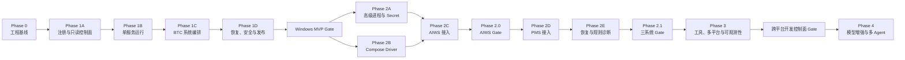
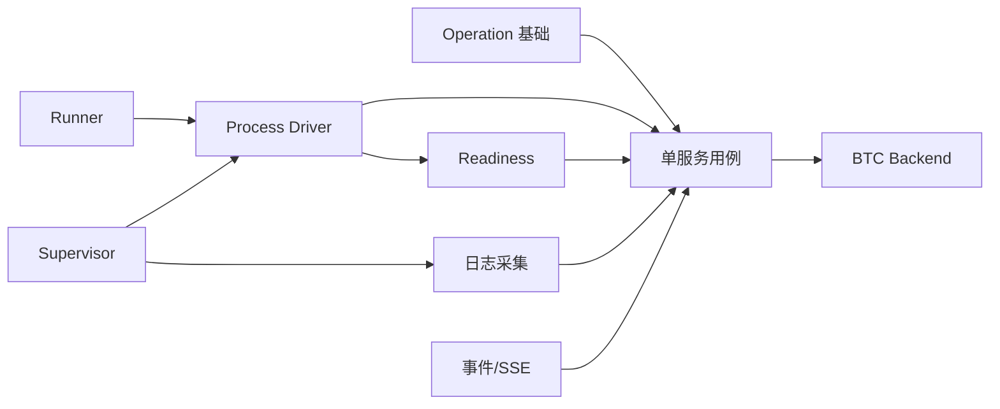
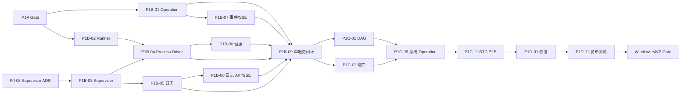

# StackPilot 总体分阶段开发计划

> 状态：评审修订稿（AI-native）
> 日期：2026-08-17
> 上游文档：[总体设计方案](./overall-design.md)
> 实现基线：[详细设计方案](./detailed-design.md)
> 交互基线：[Web 交互原型](./stackpilot-prototype.html)

## 1. 计划目的

本文把总体设计中的 Phase 0–4 和详细设计中的 Phase 1A–1D 转换为可执行的开发路线，明确每个阶段的：

- 业务目标与范围边界。
- 工作包、依赖关系和推荐顺序。
- 后端、前端、平台、测试和业务接入交付物。
- 质量门槛、验收证据和退出条件。
- 风险、待决策事项及最晚决策点。

本计划用于指导 AI 连续开发、建立阶段检查点和发布准入；需要接入项目管理工具时可再映射为 Epic。它不替代 OpenAPI、清单 Schema、数据库 migration 或具体代码任务。

## 2. 计划假设

### 2.1 交付假设

- 首个正式目标是 Windows 本机单用户模式。
- Phase 1 只接入 BTC Backend/Web，形成最小但完整的纵向闭环。
- PMS、AIWS、Secret Provider、oneshot、Compose 和规则诊断从 Phase 2 开始。
- Phase 3 才承诺 Linux/macOS 运行支持、完整开发工具和增强可观测性。
- Phase 4 必须由真实需求触发，不把模型、多 Agent 或自动修复作为基础启停的前置条件。
- 未完成能力必须通过 capability flag 或清单校验返回 `FEATURE_NOT_ENABLED`，不提供半实现路径。

### 2.2 AI-native 执行与周期假设

本计划不再按传统 4 人团队、周 Sprint 和跨角色交接估算，而按 AI 直接访问代码、终端、测试环境并连续跨层实现计算：

| 参与者 | 建议投入 | 主要职责 |
|---|---:|---|
| 人类决策/验收负责人 | 1 人，按需 | 范围决策、权限批准、真实体验验收、外部协调 |
| AI 编码代理 | 持续 | 设计核对、编码、测试、调试、文档和回归闭环 |
| BTC/AIWS/PMS 业务责任人 | 按需 | readiness、配置改造、测试账号和业务结果确认 |

“有效开发日”指 AI 可以连续读取/修改工作区、运行构建和测试，且所需依赖与环境已经可用的一天。以下时间不计入有效开发日，单独作为等待时间报告：

- 等待用户选择或批准高影响决策。
- 等待 BTC/AIWS/PMS 业务项目改造、测试账号或环境。
- 下载受限、机器故障、外部服务不可用。
- 必须由人工执行且尚未排期的真实体验验收。

AI 可以显著压缩编码、测试生成、跨层联调和文档同步，但不能用生成代码替代 Windows 进程语义、真实 OIDC、Compose 数据安全和进程树终止的实测 Gate。

### 2.3 AI 连续开发节奏

- 不按周切 Sprint；按最短可验证纵切面连续执行，通常每 0.5–2 个有效开发日形成一次可运行结果。
- AI 在同一工作包内完成“读取契约 -> 实现 -> 自动测试 -> 真实运行 -> 修复 -> 更新文档”，减少角色交接和等待。
- 人类只在 D 类决策、权限批准、业务语义确认和阶段 Gate 时介入。
- 每个阶段结束时执行 Gate Review；未满足退出条件不得把该阶段标记完成。
- 主干保持可构建，功能通过 capability flag 或路由可用性控制。
- 数据库 migration 只向前，已合入 migration 不修改，只新增后续版本。
- API、Schema、migration 和状态机变更必须在实现前或同一变更中更新契约。

## 3. 总体路线图



### 3.1 里程碑总览

| 里程碑 | 目标结果 | AI 有效开发日 | 发布属性 |
|---|---|---:|---|
| Phase 0 | 工程、契约、存储和 CI 可持续开发 | 1–2 日 | 内部基线 |
| Phase 1A | BTC 工作区可注册、校验和只读查看 | 1 日 | 内部演示 |
| Phase 1B | BTC Backend 可受管启停、就绪和看日志 | 2–4 日 | Alpha |
| Phase 1C | BTC Backend/Web 完整编排和端口替换 | 2–3 日 | Beta |
| Phase 1D | 可恢复、安全、CLI/VSCode 和可发布 | 2–3 日 | Windows MVP |
| Phase 2A | Secret、oneshot/completed、Python venv | 1–2 日 | Phase 2.0 内部基线 |
| Phase 2B | Compose Driver、动态 override、恢复与安全 | 2–4 日 | Phase 2.0 Alpha |
| Phase 2C | AIWS、Keycloak/OIDC 和 Compose 基础设施接入 | 2–4 日 | Phase 2.0 发布 |
| Phase 2D | PMS Backend/RAG/Web 接入与双系统冲突 | 1–3 日 | Phase 2.1 Beta |
| Phase 2E | liveness、自动重启、Incident 和规则诊断 | 2–4 日 | Phase 2.1 发布 |
| Phase 3 | 完整工具、多平台和增强可观测性 | 10–20 日 | 跨平台版本 |
| Phase 4 | 可选模型、多 Agent 和受控恢复 | 需求驱动 | 独立能力发布 |

Phase 0 至 Windows MVP 的基线为 8–13 个有效开发日，在依赖已安装、BTC 可直接修改且决策及时的情况下约 2–3 个日历周。Phase 2 为 8–17 个有效开发日，约 2–4 个无外部阻塞的日历周。Phase 0 至 Phase 2.1 总体约 4–7 个日历周；Keycloak 幂等、OIDC 传播、PMS DAG 或业务项目改造等待时间单独报告，不伪装成开发工时，也不因此跳过真实验收。

## 4. 交付管理规则

### 4.1 工作包状态

每个工作包使用以下状态：

```text
proposed -> ready -> in-progress -> verification -> done
                   \-> blocked
```

- `ready`：依赖已满足、验收条件明确、所需环境可用。
- `verification`：实现已完成，正在执行测试、文档和验收证据收集。
- `done`：代码、测试、契约、文档和演示均满足完成定义。
- `blocked`：存在明确外部依赖或待决策，必须记录责任人和下一次检查点。

### 4.2 工作包完成定义

一个工作包只有同时满足以下条件才可关闭：

1. 实现已合入主干且不依赖个人机器上的未提交配置。
2. 单元/集成测试覆盖成功、失败、取消或恢复等适用分支。
3. API、Schema、migration、错误码和文档与实现一致。
4. 日志、DTO、数据库和测试产物中不包含令牌或 Secret 明文。
5. Windows 构建及公共核心多平台编译检查通过。
6. 验收证据保存到约定位置，并可由他人重复执行。

### 4.3 变更控制

以下变更必须形成 ADR 或设计修订后再实施：

- 服务状态机、Operation 状态机或系统聚合优先级变化。
- Windows Process Driver/Supervisor 生命周期变化。
- 清单模板能力扩大、允许任意路径或命令的新入口。
- PortLease 所有权或端口传播规则变化。
- 认证方式、监听范围或远程访问能力变化。
- Phase 1 新增 PMS、AIWS、Secret、Compose、事故诊断等范围。

## 5. Phase 0：工程基线

### 5.1 阶段目标

建立可以持续开发、自动验证和发布 Windows 制品的工程底座，优先冻结跨模块契约，不实现业务进程启停。

### 5.2 进入条件

- 总体设计、详细设计和本计划已完成基线评审。
- 已准备 Windows 构建/测试环境和可用 CI Runner。
- 技术栈与许可证清单无阻断性问题。

### 5.3 范围

- Go 单一二进制工程和 Vue 3/Vite 前端工程。
- 静态 Web 资源嵌入 Go 二进制。
- 配置加载、数据目录、结构化日志和健康端点。
- 领域基础类型、错误 envelope、API/OpenAPI 骨架。
- 清单 JSON Schema v1alpha1 骨架。
- SQLite migration/repository 基座。
- CI、Windows 构建和公共核心跨平台编译。
- Windows Supervisor/Job Object 技术验证 ADR。

### 5.4 工作包

| ID | 工作包 | 核心任务 | 依赖 | 交付物 |
|---|---|---|---|---|
| P0-01 | 仓库与构建 | Go module、前端工程、统一开发命令、版本信息注入 | 无 | 可构建空应用 |
| P0-02 | Web 嵌入 | Vue 构建、Go embed、SPA fallback、开发代理 | P0-01 | 单二进制提供 Web 页面 |
| P0-03 | 领域基线 | ID、时间、状态枚举、领域错误、DTO 边界 | P0-01 | `internal/domain` 与测试 |
| P0-04 | API 与错误契约 | `/api/v1`、错误 envelope、health/version、OpenAPI 基座、错误码注册表 | P0-03 | 可验证 OpenAPI components 与错误码清单 |
| P0-05 | 清单 Schema | v1alpha1 顶层、端口/服务基本字段、示例与校验测试 | P0-03 | Schema 与最小样例 |
| P0-06 | SQLite 基线 | connection、PRAGMA、migration runner、repository 测试基座 | P0-01 | 空库升级测试 |
| P0-07 | CI 质量门槛 | Go test/static check、Web type-check/build、Windows 制品、跨平台编译 | P0-01/P0-02 | 自动化流水线 |
| P0-08 | Windows 监管 Spike | 验证 Job Object、Supervisor 脱离、Named Pipe 重连、kill-on-close | P0-01 | ADR 与可重复验证程序 |

### 5.5 Windows 监管 Spike 验证项

P0-08 必须给出实测结果，不只写理论说明：

1. Server 退出后 Supervisor 与业务子进程是否继续运行。
2. 新 Server 是否能核验并重新连接 Supervisor。
3. Supervisor 异常退出是否终止完整 Job 进程树。
4. 含 Maven/Java、npm/Node 父子进程时 Job 行为是否一致。
5. Named Pipe ACL 是否只允许预期账号和 SYSTEM。
6. 身份文件在“进程创建、数据库未提交”窗口是否足以恢复。

若 Spike 失败，Phase 1B 不得临时退化为仅按 PID 终止；必须先修订 ADR 和详细设计。

### 5.6 测试与验收

- 空数据目录首次启动成功，migration 可重复执行。
- `/health/live`、`/health/ready` 和 `/version` 契约通过。
- Vue 静态资源从最终 Windows 二进制加载。
- 清单有效/无效样例测试通过。
- Windows 产物可运行；Linux/macOS 公共核心可交叉编译。
- P0-08 ADR 已评审并选定 Phase 1 的监管实现。

### 5.7 退出条件

工程基线不依赖未锁定的本机工具；新开发者可按文档完成构建和测试；CI 稳定产出 Windows 二进制。

P0-08 未完成时允许开始 Phase 1A，也允许提前开展 P1B-01、P1B-02、P1B-07、P1B-10 以及 P1B-08 的 API 契约部分；P1B-03、P1B-04、P1B-05、P1B-06、P1B-09 和 P1B-11 必须保持 blocked。依赖以工作包表为准，不再使用“Process Driver 主实现”这类模糊门槛。

## 6. Phase 1A：注册与只读控制面

### 6.1 阶段目标

让 StackPilot 能安全地发现、注册、校验和展示 BTC 系统定义，建立 `.stackpilot/system.yaml` 作为唯一事实来源。

### 6.2 进入条件

- P0-01 至 P0-07 完成并通过 Phase 0 工程 Gate。
- P0-08 可以处于 verification，但其未完成不得影响本阶段的只读工作。
- BTC 工作区路径和项目负责人已确认，可进行只读盘点。

### 6.3 范围边界

本阶段不启动任何业务进程，不分配持久端口，不实现 Secret、oneshot、Compose 或事故诊断。

### 6.4 工作包

| ID | 工作包 | 核心任务 | 依赖 | 交付物 |
|---|---|---|---|---|
| P1A-01 | Workspace 注册 | canonical path、固定清单发现、注册/列表/解除注册 | P0-04/P0-06 | Workspace API |
| P1A-02 | YAML 安全解析 | 文件大小、重复 key、未知字段、多文档拒绝 | P0-05 | Loader 与错误码 |
| P1A-03 | 语义校验 | ID、路径边界、DAG、端口引用、模板白名单、feature gate | P1A-02 | Validator 与测试 |
| P1A-04 | 清单快照 | 规范化、digest、最后成功快照、刷新失败保留旧快照 | P1A-01/P1A-03 | Repository/migration |
| P1A-05 | 查询 API | systems/services/workspaces 查询、清单状态和定义摘要 | P1A-04 | REST DTO/OpenAPI |
| P1A-06 | Web 只读页面 | 系统总览、配置页、清单摘要、工作区设置 | P1A-05 | 可演示 Web 流程 |
| P1A-07 | BTC 清单草案 | Backend/Web、端口、依赖、readiness、环境模板 | P1A-03 | BTC `system.yaml` |
| P1A-08 | BTC 配置核验 | 确认 readiness、Vite 端口/proxy、CORS 注入点 | 可并行 | 接入核验记录 |

### 6.5 BTC 前置决策

本阶段结束前必须确认：

- Backend readiness 路径、响应码、启动阶段语义和是否需要认证。
- Backend 是否读取 `SERVER_PORT`。
- Vite 实际监听端口来源，消除 5173/5175 不一致。
- Vite proxy 是否读取 `VITE_API_TARGET`。
- 动态 Web 地址如何传播到 Backend CORS。

业务项目尚未完成改造时，可以注册清单草案，但 Phase 1B/1C 的真实接入任务必须标记 blocked，不能以测试夹具替代最终 BTC 验收。

### 6.6 验收场景

1. 注册有效 BTC 工作区后，Web 和 API 展示相同的系统/服务摘要。
2. 修改清单后 refresh 生成新 digest。
3. 无效刷新保留最后成功快照，同时禁止新启动。
4. 路径逃逸、循环依赖、未知端口和 Secret/oneshot 功能均被明确拒绝。
5. API 不提供修改 command、arguments、workingDirectory 的接口。

### 6.7 退出条件

BTC 清单可注册且 Schema/语义测试通过；原型中的只读页面可用；BTC readiness 与端口配置有明确结论；Phase 1B 所需 Runner 和工作目录已验证存在。

## 7. Phase 1B：单服务运行

### 7.1 阶段目标

以 BTC Backend 为首个真实服务，完成 Windows 原生进程从预检、启动、日志、readiness 到完整进程树停止的闭环。

### 7.2 进入条件

- Phase 1A 退出条件已满足。
- D-02 BTC readiness 已确认；否则 P1B-11 保持 blocked。
- P0-08 与 D-01 必须在 P1B-03 至 P1B-06 开始前完成；在此之前只启动 5.7 明确放行的独立工作包。
- Windows Maven/npm 测试工具链版本已锁定。

### 7.3 范围边界

- 只要求单服务 Operation，不实现多服务 DAG 调度。
- 先支持 `process/daemon` 和 Maven Runner；npm 在本阶段完成解析测试，为 Phase 1C 使用。
- 只实现 process/TCP/HTTP readiness。
- 日志支持追加、轮转、历史窗口和实时流，不实现全文索引。
- 不实现 Secret、liveness、自动重启和事故诊断。

### 7.4 工作包

| ID | 工作包 | 核心任务 | 依赖 | 交付物 |
|---|---|---|---|---|
| P1B-01 | Operation 基础 | queued/running/terminal、步骤、工作区锁、幂等、取消框架 | P0-03/P0-06 | Operation repository/service |
| P1B-02 | Runner 解析 | Maven/npm/Java、`.cmd` 参数引用、版本预检；Python venv 仅保留接口和 capability gate | P1A-03 | Runner registry |
| P1B-03 | Supervisor 实现 | Named Pipe ACL、结构化协议、身份文件、Job 所有权 | P0-08 | 内部 Supervisor |
| P1B-04 | Process Driver | suspended create、环境、工作目录、身份、优雅/强制停止 | P1B-02/P1B-03 | Windows Driver |
| P1B-05 | 日志采集 | stdout/stderr spool、tail、脱敏、NDJSON segment、cursor | P1B-03/P0-06 | Log Manager |
| P1B-06 | 健康检查 | process/TCP/HTTP checker、readiness timeout/cancel | P1B-04 | Health Engine |
| P1B-07 | 持久事件/SSE | 状态与事件同事务、内存通知、历史补读、心跳 | P1B-01/P0-04 | `/events` |
| P1B-08 | 日志 API/SSE | 历史查询、sequence cursor、慢消费者断开 | P1B-05/P0-04 | logs/log-stream API |
| P1B-09 | 单服务用例 | start/stop、失败现场、状态聚合、错误映射 | P1B-01..08 | Backend 闭环 |
| P1B-10 | 测试夹具 | slow-ready、exit、child-tree、ignore-terminate、large-log | 可并行 | 集成测试程序 |
| P1B-11 | BTC Backend 接入 | Maven 启动、端口变量、HTTP readiness、真实日志 | P1B-09/P1A-08 | BTC Backend 验收 |

### 7.5 推荐实现顺序



### 7.6 测试与验收

- `.cmd` Runner 在空格和中文路径下参数无失真。
- Backend 无可见终端窗口启动。
- 进程创建后 PID、创建时间、路径和命令摘要可核验。
- readiness 成功、超时、进程提前退出和取消均有稳定状态与错误码。
- stdout/stderr 可实时查看，断线后按 sequence 补读。
- 优雅停止失败时能终止 Maven/Java 子孙进程。
- PID 身份不匹配时拒绝终止。
- BTC Backend 真实启动、ready、查看日志、停止流程可重复。

### 7.7 退出条件

BTC Backend 和全部测试夹具通过单服务闭环；无遗留 Java/Maven 子进程；日志重连可恢复；Operation 与服务状态一致；Process Driver 不依赖 BAT/PowerShell 启动器。

## 8. Phase 1C：BTC 系统编排

### 8.1 阶段目标

把单服务能力扩展为 BTC Backend/Web 的完整系统启动、端口计划、依赖编排、系统停止和服务重启。

### 8.2 进入条件

- Phase 1B 退出条件已满足，BTC Backend 真实闭环稳定。
- D-03 BTC Vite 监听、proxy 和 CORS 传播方案已确认并完成必要业务改造。
- Backend/Web 的目标端口域和 fallback 范围已评审。

### 8.3 工作包

| ID | 工作包 | 核心任务 | 依赖 | 交付物 |
|---|---|---|---|---|
| P1C-01 | DAG 编排 | 拓扑层、依赖释放、有界并发、逆序停止 | P1B-09 | Orchestrator |
| P1C-02 | 失败策略 | failFast、保留现场、清理范围、并发错误聚合 | P1C-01 | 策略测试 |
| P1C-03 | 端口规划 | override/workspace/sticky/preferred/fallback、probe、lease | P1A-07/P0-06 | Port Planner |
| P1C-04 | 规格展开 | ResolvedSystemSpec、端口反向引用、运行快照 | P1C-03/P1A-03 | Resolved spec |
| P1C-05 | 系统 Operation | start/stop/restart、取消、端口失败后整次重试 | P1C-01..04 | 系统用例/API |
| P1C-06 | 服务重启 | 目标下游闭包、清单 digest 冲突保护 | P1C-01/P1C-05 | service restart API |
| P1C-07 | npm/Node 运行 | Web Runner、Vite 监听、日志和停止树 | P1B-02/P1B-04 | BTC Web 运行 |
| P1C-08 | 系统详情 Web | 依赖图、服务状态、Operation 进度、端口计划 | P1C-05/P1B-07 | 系统详情页 |
| P1C-09 | 服务详情 Web | PID、readiness、日志、暂停/筛选/下载、重启 | P1B-08/P1C-06 | 服务详情页 |
| P1C-10 | 操作中心基础 | 操作列表、步骤时间线、取消和失败详情 | P1C-05 | 操作中心 |
| P1C-11 | BTC 全量接入 | Backend -> Web readiness、动态 proxy/CORS、访问入口 | P1C-05/P1C-07/P1A-08 | BTC E2E |

### 8.4 端口策略验收

必须覆盖：

1. 8081/5173 均可用时使用 preferred。
2. 5173 被占用时从 5200–5299 分配替代端口。
3. 同一工作区重启优先复用 sticky 端口。
4. API 显式 override 高于 sticky 和 preferred。
5. strict/override-only 语义正确。
6. probe 后端口被抢占时本次启动以 `PORT_CONFLICT` 失败，不在实例内局部改写规格。
7. 最终端口传播到 Vite 监听、proxy、Backend 端口、CORS、readiness 和访问入口。

### 8.5 编排验收

- Backend 未 ready 时 Web 保持 `waiting_dependency`。
- Backend readiness 超时后 Web 不启动，默认保留 Backend 失败现场。
- 停止顺序为 Web 后 Backend。
- 启动取消只清理由策略指定的本次资源。
- 服务重启 Web 时不重启 Backend；重启 Backend 时按下游闭包重启 Web。
- 活动 Operation 冲突返回 409；相同幂等请求返回原 Operation。

### 8.6 退出条件

BTC 可从 Web 和 REST 完成启动、查看进度、访问、看日志、服务重启和逆序停止；端口冲突与失败策略测试通过；Phase 1 验收 P1-01 至 P1-05、P1-07 至 P1-10 已具备验证证据，P1-06 留到 Phase 1D。

## 9. Phase 1D：恢复、安全与发布收口

### 9.1 阶段目标

完成控制面重启接管、本地访问安全、CLI/VSCode 最小入口、错误体验和 Windows 发布，使 BTC MVP 达到可日常使用标准。

### 9.2 进入条件

- Phase 1C 退出条件已满足，BTC Web/REST 主流程稳定。
- D-04 在 P1D-10 安装工作开始前完成。
- D-05 在 P1D-04/P1D-05 Web 会话和 CSRF 实现开始前完成。
- 已准备干净 Windows 安装、升级和恢复测试环境。

### 9.3 工作包

| ID | 工作包 | 核心任务 | 依赖 | 交付物 |
|---|---|---|---|---|
| P1D-01 | 启动恢复 | Supervisor 重连、身份核验、Operation 收口、租约清理 | P1B-03/P1C-05 | reconciliation |
| P1D-02 | 日志续读 | tail offset 恢复、sequence 去重、segment 索引修复 | P1B-05/P1D-01 | 重启日志连续性 |
| P1D-03 | 周期核对 | 进程身份、端口租约、系统聚合状态修正 | P1D-01 | reconciliation loop |
| P1D-04 | 本地认证 | 随机令牌、摘要、CLI 读取、Web 短期会话 | P0-04/P0-06 | auth API/middleware |
| P1D-05 | 浏览器安全 | Origin、CSRF、自定义 header、no-store | P1D-04 | 安全契约测试 |
| P1D-06 | 审计 | 工作区、清单、启停、取消、令牌轮换事件 | P1D-04/P1B-07 | 审计查询/记录 |
| P1D-07 | CLI MVP | workspace add、up/down/status/logs、wait、JSON 输出 | P1C-05/P1D-04 | CLI 命令 |
| P1D-08 | VSCode Tasks | 当前工作区 up/down、等待和打开 Web | P1D-07 | 示例 tasks |
| P1D-09 | Web 错误收口 | SSE 重连、错误页、取消状态、失效清单和旧快照提示 | P1C-08..10/P1D-01 | 完整 MVP UI |
| P1D-10 | 安装与升级 | 数据目录、服务/用户模式决策、升级、卸载不删业务数据 | P0-07/P1D-01 | Windows 发布包 |
| P1D-11 | 安全与恢复测试 | 命令边界、路径逃逸、CSRF、重启、崩溃窗口 | P1D-01..10 | 发布测试报告 |

### 9.4 明确不进入 Phase 1D

- Secret Provider 和 `secret_metadata`。
- oneshot/completed。
- Docker Compose。
- liveness 与自动重启。
- incidents、incident analyses 和规则诊断。
- 全文日志检索、资源曲线和远程访问。

### 9.5 恢复验收

1. BTC 运行时停止 StackPilot Server，Supervisor 与 BTC 进程继续运行。
2. 重启 Server 后恢复同一实例、PID 身份、日志 sequence、健康检查和端口租约。
3. Server 在进程创建后、数据库提交前退出时，能够从身份文件恢复或安全标为 unknown。
4. Supervisor 异常退出时服务树被终止，恢复后实例标 failed 并产生明确事件。
5. 无法证明所有权的 PID 不被自动终止。
6. 已提交但未实时通知的事件在 SSE 重连后可补读。

### 9.6 安全验收

- API 默认只监听 `127.0.0.1`。
- 未认证请求不能读取状态或发起变更。
- 浏览器跨 Origin、无 CSRF header 和简单表单请求被拒绝。
- API 不接受 command、arguments、workingDirectory 或任意 environment 覆盖。
- 路径逃逸和非注册工作区被拒绝。
- 令牌、Cookie、Authorization 和连接串不进入日志、事件和错误 details。

### 9.7 退出条件

总体设计 26.1 的十项 Windows MVP 验收标准全部通过；发布候选在干净 Windows 环境安装、升级、启动 BTC、重启 StackPilot、停止 BTC 和卸载流程可重复；所有 P0–P1D 阻塞问题关闭或有正式发布豁免。

## 10. Windows MVP 发布 Gate

### 10.1 功能 Gate

| Gate | 必须满足 |
|---|---|
| 清单 | BTC 清单唯一事实来源，刷新和失败语义正确 |
| 启动 | Web、CLI、VSCode 均调用同一 API，Backend ready 后启动 Web |
| 端口 | 冲突启动前发现，替换完整传播，sticky 可复用 |
| 停止 | 逆序停止，无 Maven/Java/npm/Node 遗留进程 |
| 日志 | 实时、历史、过滤、重连和控制面重启续读 |
| 恢复 | StackPilot 重启后接管运行实例 |
| 安全 | 回环监听、认证、CSRF、命令/路径边界、审计 |

### 10.2 工程 Gate

- Go 单元/集成测试通过，适用包执行 race test。
- Web type-check、组件测试和生产构建通过。
- OpenAPI 示例、清单 Schema、migration checksum 检查通过。
- Windows 进程生命周期 E2E 通过。
- 公共核心 Linux/macOS 交叉编译通过，但不宣称运行支持。
- 发布包带版本、commit、构建时间和 checksum。

### 10.3 发布阻断条件

存在以下任一情况不得发布 MVP：

- 能误杀非 StackPilot 所有进程。
- 端口替换未传播到 proxy/readiness/CORS/访问入口。
- StackPilot 重启后无法判断受管进程身份。
- 日志、数据库、SSE 或错误响应泄露令牌。
- migration 不能从上一发布版本向前升级。
- 主流程仍需要 BTC BAT/PowerShell 启动器。

## 11. Phase 2：复杂系统与规则诊断

Phase 2 采用 2A–2E 分段交付，避免一次同时引入 Secret、oneshot、Compose、两个新系统和诊断引擎。

## 12. Phase 2A：高级进程能力与 Secret

### 12.1 阶段目标

补齐 AIWS/PMS 接入需要、但 BTC MVP 不需要的受控能力。参考工作量 1–2 个 AI 有效开发日。

### 12.2 进入条件

- Windows MVP Gate 已通过，Phase 1 回归集稳定。
- D-11 已确认 Python venv 生产实现归入本阶段。
- D-12 Secret 存储选型必须在 P2A-01 实现前完成。
- AIWS/PMS 已提供至少一组不含真实 Secret 的接入测试配置。

### 12.3 工作包

| ID | 工作包 | 核心任务 | 依赖 | 交付物 |
|---|---|---|---|---|
| P2A-01 | Secret Provider | Windows Credential Manager/DPAPI 选型、元数据 migration | MVP Gate | Secret 接口 |
| P2A-02 | Secret CLI | set/get-metadata/delete，stdin/交互输入，不接受明文参数 | P2A-01 | CLI 命令 |
| P2A-03 | Secret 注入 | 进程创建前内存解析、版本记录、DTO/日志排除 | P2A-01/P1B-04 | 受控环境注入 |
| P2A-04 | oneshot 模式 | 退出码、Completed 状态、超时、取消和日志 | P1B-04/P1C-01 | Process oneshot |
| P2A-05 | completed 依赖 | DAG 条件、失败策略、重复启动语义 | P2A-04 | 依赖编排 |
| P2A-06 | Python venv | Windows venv Runner、版本/路径预检 | P1B-02 | PMS/AIWS Runner |

### 12.4 退出条件

Secret 不出现在数据库明文、运行快照、日志、SSE 和错误中；oneshot 只有退出码 0 才进入 Completed 并释放下游；包含对应 capability 的清单从 `FEATURE_NOT_ENABLED` 切换为可执行。

## 13. Phase 2B：Docker Compose Driver

### 13.1 阶段目标

为 AIWS 基础设施提供受控 Compose v2 启停、健康、日志和动态宿主机端口覆盖。参考工作量 2–4 个 AI 有效开发日。

### 13.2 进入条件

- Windows MVP Gate 已通过，Process Driver 和日志/恢复契约稳定。
- 已准备固定版本的 Docker Desktop、Compose v2 和可销毁测试项目。
- Compose 安全边界和“普通停止不删除 volume”已纳入测试 Gate。

### 13.3 工作包

| ID | 工作包 | 核心任务 | 依赖 | 交付物 |
|---|---|---|---|---|
| P2B-01 | Compose 清单 | driver schema、文件/服务引用、路径和 capability 校验 | P1A-03 | Schema 扩展 |
| P2B-02 | Compose 预检 | Docker/Compose 版本、daemon、配置解析 | P2B-01 | Preflight |
| P2B-03 | Override 生成 | host ports、允许环境、标签、安全再解析 | P1C-03/P2B-01 | runtime override |
| P2B-04 | Compose 生命周期 | project name、up --wait、inspect、stop | P2B-02/P2B-03 | Compose Driver |
| P2B-05 | Compose 日志/健康 | logs follow、容器状态和 healthcheck | P2B-04/P1B-05 | 统一日志/健康 |
| P2B-06 | 恢复核对 | 标签发现、项目身份、StackPilot 重启恢复 | P2B-04/P1D-01 | Compose reconciliation |
| P2B-07 | 安全测试 | 禁止特权/根挂载/额外命令、stop 不删除 volume | P2B-03/P2B-04 | 安全测试报告 |

### 13.4 退出条件

测试 Compose 项目可启动、等待健康、查看日志、停止和恢复；动态端口只修改允许字段；普通停止不执行 `down -v`，无 Docker 的系统仍可运行非 Compose 工作区。

## 14. Phase 2C：AIWS 接入

### 14.1 进入条件

- Phase 2A Secret、oneshot/completed 可用。
- Phase 2B Compose Driver 可用。
- AIWS Compose 服务存在可靠 healthcheck。
- Keycloak Configure 已验证重复执行、部分成功和版本升级时幂等。
- D-06 已关闭，AIWS 业务验收责任人与测试环境已就绪。

参考工作量 2–4 个 AI 有效开发日。业务方改造未完成时，可以继续清单草案、fixture 和 UI/API 联调，但 P2C-03 至 P2C-07 的真实接入验收标记 blocked；不得用 mock 结果通过 Phase 2.0 Gate。

### 14.2 工作包

| ID | 工作包 | 核心任务 | 依赖 | 交付物 |
|---|---|---|---|---|
| P2C-01 | AIWS 现状盘点 | 服务、脚本、端口、Secret、OIDC、依赖与健康 | P2A/P2B | 接入矩阵 |
| P2C-02 | Infrastructure | Compose 服务组、动态 host ports、健康等待 | P2B | 基础设施定义 |
| P2C-03 | Keycloak Configure | 幂等 oneshot、日志、失败保留、completed | P2A-04/P2C-02 | 配置任务 |
| P2C-04 | Server/Runtime | Maven/Python、readiness、Secret 引用 | P2A/P2C-02 | 进程服务定义 |
| P2C-05 | Web/OIDC 传播 | Web port、API、issuer、redirect/logout URI、origins | P2C-03/P2C-04 | 完整端口传播 |
| P2C-06 | UI 扩展 | Compose 容器状态、oneshot Completed、入口展示 | P2C-02..05 | AIWS 页面 |
| P2C-07 | AIWS E2E | 首次/重复启动、冲突、失败、停止、恢复 | P2C-01..06 | 验收报告 |

### 14.3 退出条件

AIWS 不依赖原 PowerShell 启动入口；基础设施健康后才运行 Keycloak Configure；只有配置任务成功才释放下游；OIDC 全链路使用同一端口计划；停止不删除数据卷。

## 15. Phase 2D：PMS 接入

### 15.1 进入条件

- Phase 2.0 Gate 已通过，BTC/AIWS 回归稳定。
- Python venv Runner 可用。
- PMS Backend、RAG、Web 都有可验证 readiness。
- 业务方确认 Backend 与 RAG 的真实依赖方向。
- D-07 已关闭，PMS 业务验收责任人与测试环境已就绪。

参考工作量 1–3 个 AI 有效开发日。业务方改造未完成时，可以继续清单草案、fixture 和非阻塞平台工作，但 P2D-02 至 P2D-06 的真实接入验收标记 blocked；不得以固定延时或 mock readiness 通过 Gate。

### 15.2 工作包

| ID | 工作包 | 核心任务 | 依赖 | 交付物 |
|---|---|---|---|---|
| P2D-01 | PMS 现状盘点 | Backend/RAG/Web、脚本、端口、URL 与外部能力 | P2A-06 | 接入矩阵 |
| P2D-02 | Backend | Maven、SERVER_PORT、readiness | P1B/P1C | 服务定义 |
| P2D-03 | RAG | venv、RAG_PORT、健康和长启动 | P2A-06 | 服务定义 |
| P2D-04 | Web | npm、动态监听、proxy 和入口 | P1C | 服务定义 |
| P2D-05 | DAG 验证 | 真实依赖、可并行层、失败策略 | P2D-02..04 | PMS 清单 |
| P2D-06 | BTC/PMS 冲突 | 5173 冲突、sticky、同时启停与日志 | P2D-05 | 双系统 E2E |

### 15.3 退出条件

PMS 使用 readiness 而非固定延时；Backend、RAG、Web 的调用 URL 和健康地址随端口计划完整传播；PMS 与 BTC 可同时运行且端口稳定复用。

## 16. Phase 2E：运行恢复与规则诊断

### 16.1 阶段目标

在三系统运行数据稳定后，增加 liveness、受限自动重启、事故上下文和确定性规则诊断。参考工作量 2–4 个 AI 有效开发日。

### 16.2 进入条件

- Phase 2.0 Gate 已通过，Phase 2D PMS 接入退出条件已满足。
- BTC、AIWS、PMS 的失败样例和脱敏日志样本已准备。
- 自动重启策略默认保持 `never`，启用范围和上限已评审。

### 16.3 工作包

| ID | 工作包 | 核心任务 | 依赖 | 交付物 |
|---|---|---|---|---|
| P2E-01 | Liveness | 连续阈值、Ready/Degraded 恢复、检查保留 | P1B-06 | liveness engine |
| P2E-02 | 重启策略 | never/on-failure/always、退避、上限、稳定窗口 | P2E-01/P1D-01 | 内部 restart Operation |
| P2E-03 | Incident migration | incidents/analyses 表和按需目录 | P2E-01 | Phase 2 migration |
| P2E-04 | IncidentContext | 时间窗、日志预算、依赖/端口/健康证据、脱敏 | P2E-03/P2A-03 | 上下文生成器 |
| P2E-05 | 规则引擎 | 端口、异常退出、readiness、HTTP、已知日志规则 | P2E-04 | 结构化诊断 |
| P2E-06 | 事故中心 Web | 列表、证据、原因、建议和只读健康复查 | P2E-05 | 事故页面 |
| P2E-07 | 三系统故障 E2E | 真实/模拟故障、证据引用、无自动高风险动作 | P2C/P2D/P2E-06 | 验收报告 |

### 16.4 退出条件

端口占用、进程异常退出、readiness 超时和已知日志错误都能生成可追溯诊断；规则分析不依赖模型；自动重启达到上限后停止并形成 Incident；任何建议默认不自动执行。

## 17. Phase 2 发布 Gate

### 17.1 Phase 2.0 AIWS Gate

Phase 2.0 交付 Secret、oneshot/completed、Compose Driver 和 AIWS 闭环，必须满足：

1. AIWS Compose 基础设施可启停、恢复和查看日志，普通停止不删除数据卷。
2. Keycloak Configure 只有退出码 0 才释放 Server/Web 下游。
3. OIDC issuer、redirect/logout URI、allowed origins 和 Web/API 地址使用同一端口计划。
4. Secret 不出现在数据库明文、日志、SSE、运行快照或错误响应。
5. BTC Phase 1 回归全部通过；无 Docker 环境仍可运行非 Compose 工作区。
6. Phase 2A/2B migration 可从 Windows MVP 数据库直接升级。

### 17.2 Phase 2.1 三系统与诊断 Gate

Phase 2.1 继承 Phase 2.0 全部 Gate，并补齐总体设计 26.2 的剩余验收：

1. PMS 与 BTC 的 5173 冲突自动解决并 sticky 复用。
2. PMS 三服务使用真实 readiness 编排。
3. 规则诊断覆盖端口占用、进程异常退出、readiness 超时和已知日志错误，并引用可定位证据。
4. Secret 仍不进入事故上下文，规则诊断不可执行自动高风险动作。
5. BTC、AIWS、PMS 三系统回归通过，Phase 2E migration 可从 Phase 2.0 直接升级。

Phase 2.1 Gate 通过后，才算完整满足总体设计 26.2 的六项验收。

## 18. Phase 3：开发工具、多平台与可观测性

Phase 3 可拆成三个相对独立的轨道，但 Linux/macOS 正式发布必须等待平台轨道完成。

进入条件：Phase 2.1 Gate 已通过；D-08 已关闭；目标 Linux/macOS 版本、架构、CI Runner 和真实测试机器已准备。3A/3C 可以按容量先行，3B 的正式平台承诺必须满足全部环境条件。

### 18.1 Phase 3A：开发工具

| ID | 工作包 | 主要结果 |
|---|---|---|
| P3A-01 | CLI 完整化 | restart、port-plan、诊断、筛选、稳定机器输出 |
| P3A-02 | VSCode Tasks | 工作区自动识别、标准任务模板、错误导航 |
| P3A-03 | VSCode 扩展（可选） | 状态栏、日志入口、服务重启，仍只调用 API |
| P3A-04 | 开发者文档 | 接入指南、清单参考、故障排查、升级指南 |

### 18.2 Phase 3B：Linux/macOS

| ID | 工作包 | 主要结果 |
|---|---|---|
| P3B-01 | Unix Process Driver | process group、SIGTERM/SIGKILL、身份核验 |
| P3B-02 | 日志与恢复 | 平台 spool、控制面重启核对 |
| P3B-03 | 后台服务 | systemd、launchd 安装/启停/卸载 |
| P3B-04 | Secret Provider | Secret Service/Keychain 与安全降级策略 |
| P3B-05 | 平台测试矩阵 | x64/arm64、真实生命周期、路径和权限 |
| P3B-06 | 正式制品 | Linux/macOS 包、checksum、安装/升级说明 |

任何平台只有完成进程树、恢复、Secret、安装和真实 E2E 后才宣称支持；交叉编译成功不等于运行支持。

### 18.3 Phase 3C：增强可观测性

| ID | 工作包 | 主要结果 |
|---|---|---|
| P3C-01 | 日志全文检索 | 有界索引、查询语法、索引迁移/清理 |
| P3C-02 | 资源采样 | CPU、内存、运行时长、重启和健康耗时 |
| P3C-03 | 聚合与保留 | 短周期明细、长周期聚合、容量策略 |
| P3C-04 | 趋势页面 | 服务资源、启动耗时、错误速率 |
| P3C-05 | 标准导出（可选） | Prometheus/OpenTelemetry，默认关闭 |

### 18.4 Phase 3 退出条件

- CLI/VSCode 和 Web 状态完全一致，没有第二套启动逻辑。
- Linux/macOS 各自通过进程树、恢复、日志、安装和三系统适用范围测试。
- 资源采样不会使 SQLite 成为无限时序库。
- 全文索引损坏或禁用时不影响基础日志落盘和服务启停。

## 19. Phase 4：模型增强与多 Agent

Phase 4 不预设必须全部交付，按独立 capability 推进。

进入条件：Phase 2 规则诊断已有稳定事故集和质量基线；D-09 在 4A 前关闭，D-10 在 4B 前关闭；任何 Phase 4 工作不得阻塞或改变基础启停控制面的确定性语义。

### 19.1 Phase 4A：模型增强诊断

| ID | 工作包 | 主要结果 |
|---|---|---|
| P4A-01 | Provider 接口 | 本地/远程可选模型、超时、取消、权限 |
| P4A-02 | 结构化输出 | JSON Schema 校验、规则结果作为先验 |
| P4A-03 | 最小上下文 | 脱敏、预算、证据引用和审计 |
| P4A-04 | 反馈与案例 | 用户反馈、历史处置检索、版本隔离 |
| P4A-05 | 质量评估 | 固定事故集、正确性、引用率、泄露测试 |

模型不可用、超时或输出无效时，Phase 2 规则诊断必须继续工作。

### 19.2 Phase 4B：Control Plane/Agent 拆分

| ID | 工作包 | 主要结果 |
|---|---|---|
| P4B-01 | Agent 协议 | 注册、心跳、能力、命令和事件模型 |
| P4B-02 | gRPC/mTLS | 双向认证、证书轮换、重放保护 |
| P4B-03 | 所有权与租约 | Agent 断线、重复连接、操作归属和恢复 |
| P4B-04 | 数据同步 | 状态、日志 cursor、事件顺序和限流 |
| P4B-05 | 多 Agent UI | Agent 状态、系统位置、故障和权限边界 |

此阶段必须重新评审数据库一致性、幂等范围和 `state_version`；Phase 1 的单进程假设不能直接外推。

### 19.3 Phase 4C：受控恢复动作

只有规则和模型诊断质量有量化证据后才进入：

- 动作白名单和参数 Schema。
- low/medium/high 风险分级。
- 用户审批、超时、审计和回滚说明。
- 默认 dry-run，不允许模型生成任意命令。
- 首批仅考虑重新执行健康检查、重启明确单服务等可回退动作。

### 19.4 Phase 4 退出条件

- 模型结果必须引用可定位证据并通过结构化校验。
- Provider 不可用不影响基础控制面和规则诊断。
- Agent 间通信使用双向认证，断线恢复不导致重复启动。
- 自动动作只能来自白名单，所有执行有审批和审计。

## 20. 跨阶段测试计划

### 20.1 测试层次

| 层次 | 每次提交 | 每日/主干 | 阶段 Gate |
|---|---|---|---|
| 单元 | 相关包全量 | 全量 + race（适用） | 必须通过 |
| 存储 | repository/migration | 所有 migration 路径 | 必须通过 |
| 契约 | OpenAPI/Schema/DTO | 全量 | 必须通过 |
| Windows 集成 | 受影响夹具 | 核心生命周期 | 全矩阵 |
| Web E2E | 受影响流程 | BTC 主流程 | 阶段业务流程 |
| 真实系统 | 按接入任务 | 稳定主流程 | 对应系统全验收 |
| 多平台 | 编译 | 可用 Runner | Phase 3 真实矩阵 |

### 20.2 固定回归集

从 Phase 1B 开始，下列场景不得退出回归集：

- 慢 readiness、立即退出、忽略终止、子孙进程、长日志。
- 启动取消、停止幂等、活动 Operation 冲突。
- 端口 strict/auto/override/sticky 和竞争失败。
- SSE 断线、过期 cursor、慢消费者。
- 控制面重启、Supervisor 重连、身份不匹配。
- 路径逃逸、任意命令字段、Origin/CSRF 和日志脱敏。

### 20.3 验收证据格式

每个阶段至少保存：

- 构建版本、commit 和运行环境。
- 执行命令或自动化任务标识。
- 测试结果摘要和失败链接。
- Operation、端口计划、进程树和日志 cursor 等关键结构化结果。
- 已知限制、发布豁免及负责人。

截图只作为 UI 辅助证据，不能替代状态、日志、进程和端口的结构化断言。

## 21. 数据与兼容性计划

### 21.1 Migration 节点

| 阶段 | 数据能力 |
|---|---|
| Phase 0 | migration 元数据、基础配置 |
| Phase 1A | systems、workspaces、manifest snapshots、services |
| Phase 1B | instances、operations、steps、health、events、logs |
| Phase 1C | port leases、sticky 端口历史 |
| Phase 1D | auth tokens、审计所需字段 |
| Phase 2A | secret metadata |
| Phase 2E | incidents、incident analyses、健康聚合 |
| Phase 3 | 资源聚合、可选全文索引元数据 |

### 21.2 兼容原则

- 运行实例始终引用启动时 manifest/resolved spec digest。
- 清单新字段默认向后兼容；语义破坏需要新 apiVersion。
- API v1 内只增加可选字段，不改变已有枚举语义。
- SSE 新事件类型可被旧客户端忽略；已有事件字段不删除。
- capability 未启用时在注册期失败，不把错误延迟到启动期。

## 22. 发布计划

### 22.1 制品级别

| 级别 | 用途 | 最低条件 |
|---|---|---|
| Internal | 开发联调 | 构建与相关测试通过 |
| Alpha | 单服务真实运行 | Phase 1B Gate |
| Beta | BTC 全系统运行 | Phase 1C Gate |
| MVP | Windows 日常使用 | Phase 1D/MVP Gate |
| Phase 2.0 | AIWS、Secret、oneshot、Compose | Phase 2.0 Gate |
| Phase 2.1 / 1.0 Candidate | 三系统接入与规则诊断 | Phase 2.1 Gate |
| Cross-platform | 多平台正式支持 | Phase 3B Gate |

### 22.2 升级与回滚

- 发布前使用上一稳定版数据库副本执行升级测试。
- 二进制可回滚不代表数据库可降级；需要回滚时恢复升级前备份。
- 升级不停止被管服务，除非 migration 或 Supervisor 协议明确不兼容。
- Supervisor 协议变更必须支持当前稳定版到下一版的接管窗口，或在升级前要求明确停止系统。
- 卸载默认保留数据库、日志和被管项目，不删除业务数据卷。

## 23. 关键路径与可并行工作

### 23.1 Windows MVP 关键路径



### 23.2 可并行轨道

- Phase 0：前端壳、Schema/OpenAPI、SQLite、Supervisor Spike 可并行。
- Phase 1A：BTC 业务配置核验可与注册/查询开发并行。
- Phase 1B：P1B-10 测试夹具可直接并行；P1B-05 日志在 Supervisor 协议冻结后开始；P1B-06 健康在 Driver 身份/取消接口冻结后开始；P1B-07 SSE 在 Operation/事件模型冻结后开始。三者依赖点不同，不使用统一的“Driver 冻结”门槛。
- Phase 1C：Web 页面可在 DTO 固化后与编排实现并行。
- Phase 1D：认证/CSRF 可与恢复开发并行；发布包等待二者完成。
- Phase 2：2A 与 2B 可有限并行；PMS 盘点可在 Phase 2.0 期间先行，但真实接入按 2.0 Gate 后的 2D 计划收敛；AIWS 实现必须等待 2A/2B。
- Phase 3：开发工具、Unix 平台、可观测性三轨可并行。

并行不允许绕过契约依赖。DTO、状态事件或清单字段尚未冻结时，前端可以使用受版本控制的 mock，但必须在工作包进入 verification 前切回真实 API。

## 24. 风险与决策 Gate

| ID | 风险/决策 | 最晚完成点 | 影响 | 处理 |
|---|---|---|---|---|
| D-01 | Windows Supervisor/Job 行为 | Phase 1B 前 | Process Driver 和恢复 | P0-08 Spike + ADR |
| D-02 | BTC readiness 语义 | Phase 1B 前 | 单服务验收 | 与 BTC 后端核验/补端点 |
| D-03 | BTC Vite 端口/proxy/CORS | Phase 1C 前 | 端口传播 | 完成业务配置改造 |
| D-04 | 用户进程或 Windows Service | Phase 1D 安装前 | 数据目录、权限、升级 | 发布 ADR |
| D-05 | Web 首次认证 bootstrap | Phase 1D 前 | 本地安全和体验 | 安全评审 + 原型验证 |
| D-06 | AIWS Keycloak 幂等 | Phase 2C 前 | oneshot 可靠性 | 重复/部分成功测试；未关闭时真实接入包 blocked，fixture/API 工作可继续 |
| D-07 | PMS DAG 真实方向 | Phase 2D 前 | 启动顺序 | 业务依赖验证；未关闭时清单草案可继续，真实 E2E blocked |
| D-08 | Linux/macOS 优先级 | Phase 3 计划前 | 平台资源 | 使用范围与用户需求评审 |
| D-09 | 模型 Provider 与数据边界 | Phase 4A 前 | 安全/成本 | 独立威胁模型与评估集 |
| D-10 | 多 Agent 是否真实需要 | Phase 4B 前 | 架构复杂度 | 使用场景和容量证据 |
| D-11 | Python venv Runner 所属阶段 | Phase 1B 前 | Phase 1 范围一致性 | 已关闭：Phase 1 仅保留接口/capability gate，生产实现归 P2A-06 |
| D-12 | Windows Secret 存储选型 | Phase 2A 前 | Secret 生命周期和升级 | Credential Manager/DPAPI Spike + 安全 ADR |

任何 D 项超过最晚完成点仍未决，相关工作包转为 blocked，不由实现人员临时选择默认方案。

## 25. 进度与质量报告

### 25.1 滚动进度报告

每个有效开发日结束或关键工作包完成后更新一次，只包含可验证信息：

- 当前阶段及 Gate 完成比例。
- 本轮完成的工作包和验收证据。
- 下一轮计划进入 verification 的工作包。
- blocked 项、责任人、所需决策和最晚日期。
- 新增/关闭风险。
- 构建、单元、集成、E2E 和真实系统测试状态。

不以代码行数、提交数或“完成百分比”替代工作包退出条件。

### 25.2 阶段评审输入

- 工作包状态清单。
- Gate checklist。
- 自动化测试报告。
- 真实系统演示和验收证据。
- API/Schema/migration 兼容报告。
- 未解决风险、已知限制和是否接受发布豁免。

### 25.3 阶段评审输出

只能形成三种结论：

- `pass`：进入下一阶段或发布。
- `conditional pass`：仅允许不依赖缺口的下一阶段工作，并明确补齐期限。
- `fail`：阶段保持进行中，阻断发布。

## 26. 明确延后清单

为防止范围回流，下列能力不得提前进入 Windows MVP：

- Docker Compose Driver。
- Secret Provider 和 Secret migration。
- oneshot/completed。
- PMS、AIWS 正式接入。
- liveness、自动重启、Incident 和规则诊断。
- 日志全文索引、资源趋势和标准指标导出。
- Linux/macOS 正式运行支持。
- VSCode 完整扩展。
- 模型调用、多 Agent、远程控制、RBAC 和自动修复。

如果出现真实阻塞需求，必须说明为什么现有 Phase 1 无法完成 BTC 闭环，并通过范围变更评审，而不是直接把能力加入迭代。

## 27. 总体完成标准

StackPilot 总体路线只有满足以下结果才视为完成，而不是仅完成代码模块：

1. Phase 1：BTC 在 Windows 上通过 Web、CLI、VSCode 统一启停，具备端口、日志、恢复和安全闭环。
2. Phase 2：PMS、AIWS、BTC 三系统通过同一声明式模型运行，Compose、Secret、oneshot 和规则诊断达到验收标准。
3. Phase 3：所声明支持的 Windows/Linux/macOS 平台都通过真实生命周期测试，开发工具和可观测性可日常使用。
4. Phase 4：可选智能能力不削弱确定性控制面，所有模型结论和恢复动作可追溯、可审批、可禁用。
5. 每个阶段都有可重复验收证据、升级路径、已知限制和运维/接入文档。
